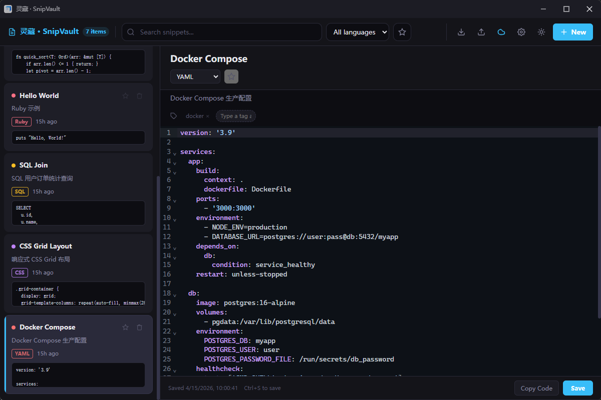
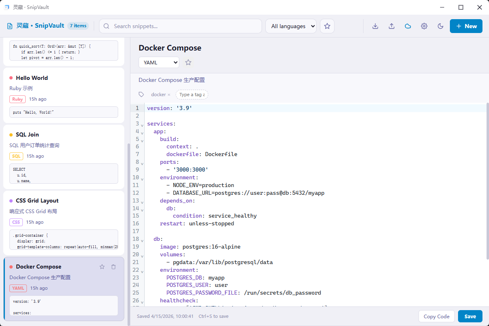
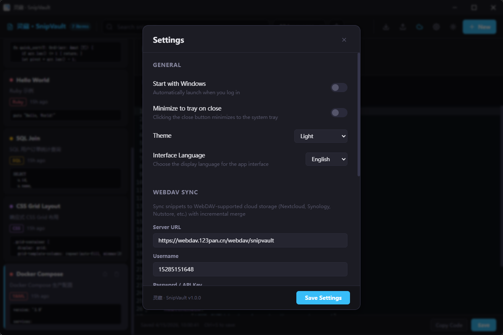
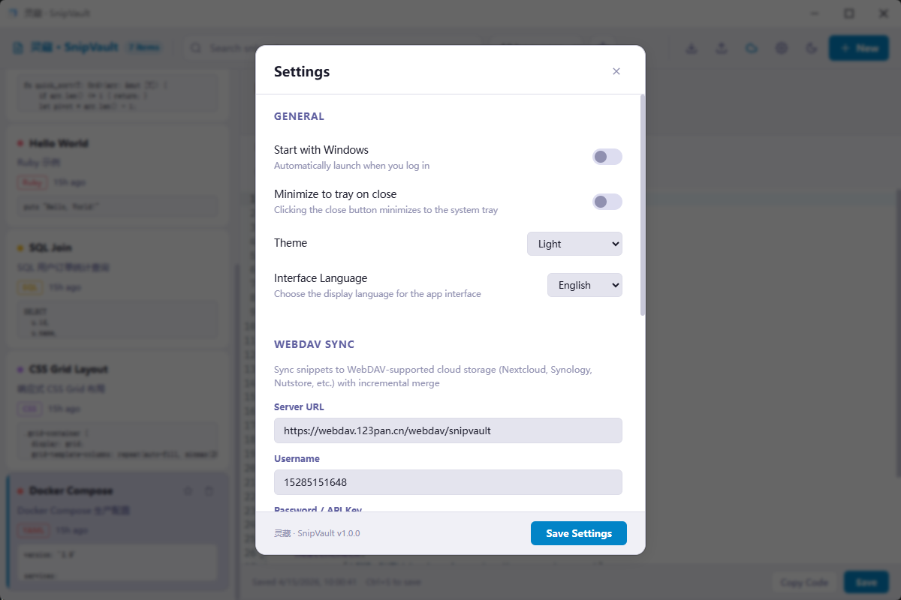

# 灵藏 · SnipVault

[](https://github.com/rainerosion/snipvault/releases)
[](LICENSE)
[](https://github.com/rainerosion/snipvault/releases)

> A local-first code snippet manager with multi-language syntax highlighting, WebDAV sync, and system tray integration.

[English](#english) · [中文](#中文)

---

## English

### Application Overview

SnipVault is a desktop snippet manager designed for developers to quickly capture, edit, and retrieve reusable code fragments.

It follows a focused two-pane workflow:
- Left pane: snippet list with full-text search, language filter, and favorites filter
- Right pane: syntax-highlighted editor with title/description, tag chips (Enter to create or choose from suggestions), favorite toggle, and one-click copy

The app is local-first by default (SQLite, fully usable offline). If you need multi-device usage, you can enable WebDAV two-way merge sync.

### Screenshots

| Home View (Dark Theme) | Home View (Light Theme) |
|---|---|
|  |  |

| Settings (Dark Theme) | Settings (Light Theme) |
|---|---|
|  |  |

### Features

- **Multi-language syntax highlighting** — JavaScript/TypeScript, Python, Rust, Java, C/C++/C#, PHP, SQL, HTML/CSS, JSON, Markdown, YAML, and more
- **Full-text search** — Search by title, content, description, or tags with language/tag filtering
- **Tag system** — Organize snippets with tag chips (press Enter to create or pick from suggestions)
- **Favorites** — Mark important snippets for quick access
- **Copy to clipboard** — One-click copy with system tray integration
- **Import/Export** — JSON format for backup and portability
- **Dark/Light/System theme** — Follow system preference or pick manually
- **WebDAV sync** — Bi-directional merge sync with any WebDAV-compatible cloud storage (Nextcloud, Synology, Nutstore, etc.)
- **Auto-sync** — Configurable background sync interval
- **System tray** — Minimize to tray, quick access menu, background operation
- **Auto-start** — Launch on system boot (Windows/macOS)
- **Offline-first** — All data stored locally in SQLite; works without internet

### Tech Stack

| Layer | Technology |
|-------|-----------|
| Framework | [Tauri 2](https://v2.tauri.app/) (Rust backend + WebView frontend) |
| Frontend | React 19 + TypeScript + Vite |
| Editor | CodeMirror 6 (`@uiw/react-codemirror`) |
| Database | SQLite via `rusqlite` (bundled) |
| Sync | WebDAV via `reqwest` (blocking HTTP) |

### Supported Languages

JavaScript · TypeScript · JSX/TSX · Python · Rust · Java · C · C++ · C# · PHP · SQL · HTML · XML · CSS · JSON · Markdown · YAML

### Getting Started

#### Build from Source

**Prerequisites**

- Node.js 18+
- Rust 1.70+ (`rustup default stable`)
- Windows: Visual Studio Build Tools with C++ workload

```bash
# Clone the repository
git clone https://github.com/rainerosion/snipvault.git
cd snipvault

# Install frontend dependencies
npm install

# Development mode
npm run tauri dev

# Production build
npm run tauri build
```

#### Download Pre-built

Download from the [Releases](https://github.com/rainerosion/snipvault/releases) page:

| Platform | Format | Notes |
|----------|--------|-------|
| Windows | `.msi` / `.exe` (NSIS) | x64 installer |
| macOS | `.dmg` | Universal binary (Intel + Apple Silicon) |
| Linux | `.deb` / `.AppImage` | amd64 |

#### Data Storage

| Mode | Location |
|------|----------|
| Portable (default) | `%LOCALAPPDATA%/SnipVault/` (Windows) |
| Installed (MSI/NSIS) | `<exe_dir>/data/` |

Files: `snippets.db` (SQLite), `settings.json`

### Configuration

#### WebDAV Sync

Configure any WebDAV-compatible server in **Settings → WebDAV Sync**:

- **Server URL** — e.g. `https://your-server.com/remote.php/dav/files/username/`
- **Username** / **Password or API Key**
- Enable **Auto-sync** and set the interval (5 min / 15 min / 30 min / 1 hour / 2 hours)

Sync is incremental: only newer snippets (by `updated_at`) are merged from both sides.

### Keyboard Shortcuts

| Shortcut | Action |
|----------|--------|
| `Ctrl+N` | New snippet |
| `Ctrl+S` | Save snippet |
| `Ctrl+E` | Export all snippets |

### Architecture

```
src-tauri/
  src/
    main.rs       — Entry point, tray, window management, auto-sync timer
    lib.rs        — Module root
    commands.rs   — All #[tauri::command] IPC handlers
    db.rs         — SQLite CRUD, merge logic, sync history
    settings.rs   — Settings struct + JSON persistence
    paths.rs       — Data dir detection (portable vs installed)
    webdav.rs     — WebDAV upload/download/merge
  Cargo.toml
  tauri.conf.json

src/
  main.tsx        — ThemeProvider context
  App.tsx         — Root layout, state management, keyboard shortcuts
  components/
    Toolbar.tsx     — Top bar: search, filters, sync, settings
    Sidebar.tsx     — Snippet list with language/favorite filtering
    SnippetEditor.tsx — CodeMirror 6 editor with syntax highlighting
    Settings.tsx     — Settings modal panel
    Dialog.tsx       — Alert/confirm/ask dialog
  hooks/
    useSnippets.ts   — CRUD + Tauri IPC
    useSettings.ts   — Settings + sync + autostart IPC
  utils/languages.ts  — Language config: colors, names, CM extensions

public/fonts/       — Bundled Outfit + JetBrains Mono fonts
```

### Contributing

Issues and pull requests are welcome! Please read the code conventions in `CLAUDE.md` before contributing.

### License

[MIT License](LICENSE)

---

## 中文

### 应用说明

灵藏 · SnipVault 是一款面向开发者的桌面代码片段管理工具，用于高效沉淀、检索和复用常用代码。

核心使用方式是双栏工作流：
- 左侧：片段列表，支持全文搜索、语言筛选、收藏筛选
- 右侧：语法高亮编辑区，支持标题/描述、标签 chip（回车创建或下拉建议选择）、收藏切换、一键复制

应用默认本地优先（SQLite 离线可用）；需要多端同步时可启用 WebDAV 双向合并同步。

### 截图展示

| 主页（深色主题） | 主页（浅色主题） |
|---|---|
|  |  |

| 设置（深色主题） | 设置（浅色主题） |
|---|---|
|  |  |

### 功能特性

- **多语言语法高亮** — JavaScript/TypeScript、Python、Rust、Java、C/C++/C#、PHP、SQL、HTML/CSS、JSON、Markdown、YAML 等
- **全文搜索** — 按标题、内容、描述、标签搜索，支持语言/收藏过滤
- **标签系统** — 支持标签 chip（回车创建或下拉建议选择）
- **收藏功能** — 标记重要片段快速访问
- **一键复制** — 代码片段复制到剪贴板，配合系统托盘使用
- **导入/导出** — JSON 格式备份与迁移
- **暗色/亮色/跟随系统** — 三种主题模式
- **WebDAV 同步** — 与任意 WebDAV 兼容云盘双向合并同步（Nextcloud、群晖、坚果云等）
- **自动同步** — 可配置后台同步间隔
- **系统托盘** — 最小化到托盘、快捷菜单、后台运行
- **开机自启** — 开机自动启动（Windows/macOS）
- **离线优先** — 数据全量存储在本地 SQLite，无网也能用

### 技术栈

| 层级 | 技术 |
|------|------|
| 框架 | [Tauri 2](https://v2.tauri.app/)（Rust 后端 + WebView 前端）|
| 前端 | React 19 + TypeScript + Vite |
| 编辑器 | CodeMirror 6（`@uiw/react-codemirror`）|
| 数据库 | SQLite（通过 `rusqlite`，bundled）|
| 同步 | WebDAV（通过 `reqwest`，blocking HTTP）|

### 支持语言

JavaScript · TypeScript · JSX/TSX · Python · Rust · Java · C · C++ · C# · PHP · SQL · HTML · XML · CSS · JSON · Markdown · YAML

### 快速开始

#### 从源码构建

**环境要求**

- Node.js 18+
- Rust 1.70+（`rustup default stable`）
- Windows：需要 Visual Studio Build Tools（C++ 工作负载）

```bash
# 克隆仓库
git clone https://github.com/rainerosion/snipvault.git
cd snipvault

# 安装前端依赖
npm install

# 开发模式
npm run tauri dev

# 生产构建
npm run tauri build
```

#### 下载预构建版本

从 [Releases](https://github.com/rainerosion/snipvault/releases) 下载：

| 平台 | 格式 | 说明 |
|------|------|------|
| Windows | `.msi` / `.exe` (NSIS) | x64 安装包 |
| macOS | `.dmg` | 通用二进制（Intel + Apple Silicon）|
| Linux | `.deb` / `.AppImage` | amd64 |

#### 数据存储位置

| 模式 | 路径 |
|------|------|
| 便携模式（默认） | `%LOCALAPPDATA%/SnipVault/`（Windows）|
| 安装模式（MSI/NSIS） | `<exe所在目录>/data/` |

存储文件：`snippets.db`（SQLite 数据库）、`settings.json`（配置文件）

### 配置说明

#### WebDAV 同步

在 **设置 → WebDAV 同步** 中配置：

- **服务器地址** — 例如 `https://your-server.com/remote.php/dav/files/username/`
- **用户名** / **密码或 API Key**
- 开启 **自动同步** 并设置间隔（5 分钟 / 15 分钟 / 30 分钟 / 1 小时 / 2 小时）

同步为增量合并：仅传输双方中较新的片段（按 `updated_at` 时间戳判断）。

### 快捷键

| 快捷键 | 功能 |
|--------|------|
| `Ctrl+N` | 新建片段 |
| `Ctrl+S` | 保存片段 |
| `Ctrl+E` | 导出所有片段 |

### 项目结构

```
灵藏 · SnipVault/
├── src-tauri/          # Rust 后端（Tauri 2）
│   ├── src/
│   │   ├── main.rs      # 入口，托盘，窗口关闭行为，自动同步定时器
│   │   ├── lib.rs       # 模块根
│   │   ├── commands.rs  # 所有 #[tauri::command] IPC 命令
│   │   ├── db.rs       # SQLite CRUD、合并逻辑、同步历史
│   │   ├── settings.rs  # 设置结构体与 JSON 持久化
│   │   ├── paths.rs     # 数据目录检测（便携 vs 安装模式）
│   │   └── webdav.rs   # WebDAV 上传/下载/合并
│   ├── Cargo.toml
│   ├── tauri.conf.json
│   └── icons/           # 应用图标
├── src/                 # React 前端
│   ├── main.tsx         # ThemeProvider 上下文
│   ├── App.tsx           # 根组件，状态管理，快捷键
│   ├── index.css         # 全局样式
│   ├── components/
│   │   ├── Toolbar.tsx    # 顶部工具栏
│   │   ├── Sidebar.tsx    # 片段列表
│   │   ├── SnippetEditor.tsx # CodeMirror 6 编辑器
│   │   ├── Settings.tsx   # 设置弹窗面板
│   │   └── Dialog.tsx     # 提示/确认/选择对话框
│   ├── hooks/
│   │   ├── useSnippets.ts  # CRUD + Tauri IPC
│   │   └── useSettings.ts  # 设置 + 同步 + 开机自启 IPC
│   └── utils/
│       └── languages.ts    # 语言配置：颜色、名称、CM 扩展映射
├── public/fonts/         # 本地字体（Outfit + JetBrains Mono）
├── CLAUDE.md             # Claude Code 开发指南
├── README.md             # 本文档
└── package.json
```

### 参与贡献

欢迎提交 Issue 和 Pull Request！贡献前请阅读 `CLAUDE.md` 中的代码规范。

### 开源许可

[MIT License](LICENSE)
