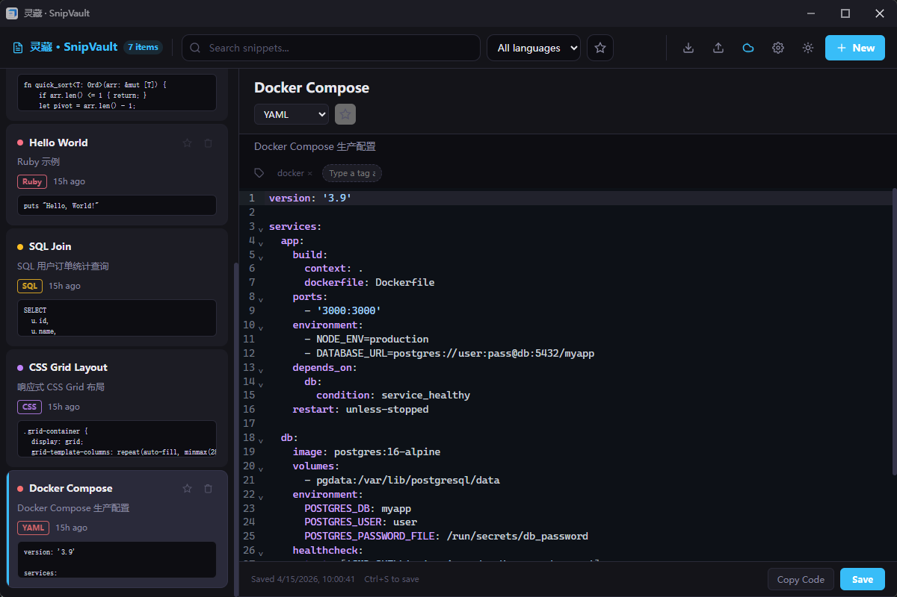
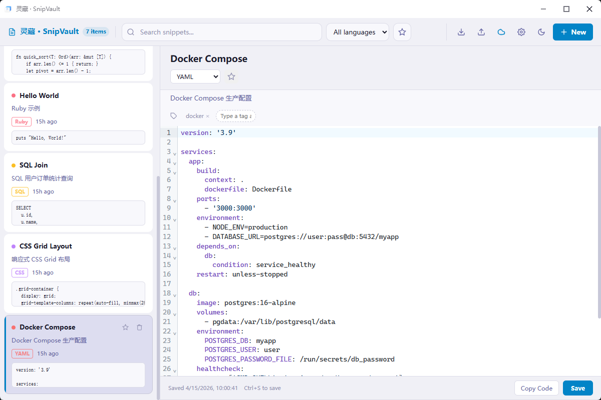
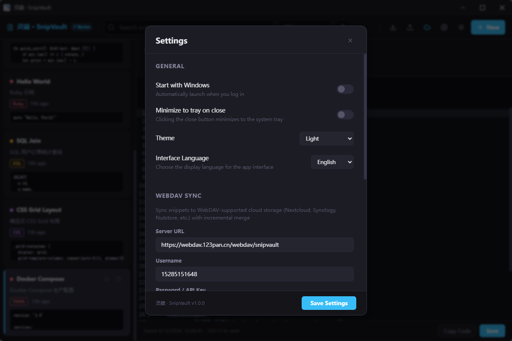
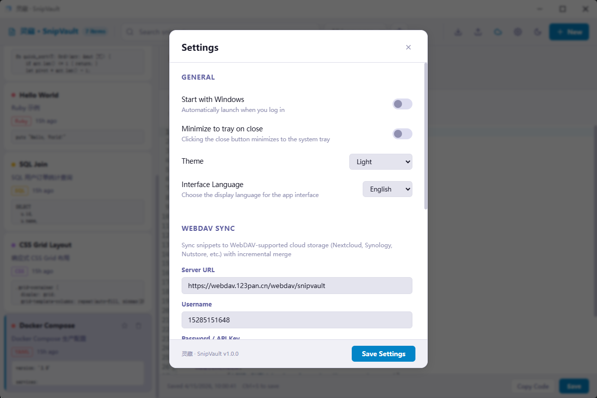

# 灵藏 · SnipVault

[](https://github.com/rainerosion/snipvault/releases)
[](LICENSE)
[](https://github.com/rainerosion/snipvault/releases)

> A local-first desktop code snippet manager with CodeMirror editing, JSON backup, revision-based WebDAV v2 synchronization, and system tray integration.

[English](#english) · [中文](#中文) · [Development documentation / 开发文档](docs/README.md)

---

## English

### Overview

SnipVault is a desktop snippet manager for capturing, editing, searching, and reusing code fragments. It uses a focused two-pane workflow:

- **Left pane:** paginated snippet summaries, substring-compatible search, language filter, and favorites filter.
- **Right pane:** title, description, tags, favorite state, CodeMirror editor, one-click copy, and a resizable Canvas codeglance minimap.

Snippet data is stored locally in SQLite and remains available offline. Optional WebDAV v2 synchronization stores a generation manifest, protocol marker, and immutable live/tombstone revision objects on a user-configured server.

### Screenshots

| Home View (Dark Theme) | Home View (Light Theme) |
|---|---|
|  |  |

| Settings (Dark Theme) | Settings (Light Theme) |
|---|---|
|  |  |

### Features

> **Release status:** v2.5.0 is the current release. It includes phase-one productivity workflows, phase-two recovery, local snapshots, the synchronization inbox, and the dedicated revision-history workspace described below.

- **Local snippet management** — Create, edit, delete, favorite, tag, browse, and select up to 200 currently loaded snippets for one all-or-nothing favorite, unfavorite, or delete action.
- **Scalable local search** — Backend-composed substring-compatible search over title, content, description, and tags, with language/favorites filters, selectable Recently Updated/Recently Used ordering, bounded summary pages, Load More, CJK support, and lazy full-detail loading.
- **CodeMirror editing** — Line numbers, bracket matching, completion, folding, light/dark highlighting, and persistent line wrapping.
- **Language labels** — Around 30 selectable language labels. Parser-backed highlighting covers JavaScript/TypeScript/JSX/TSX, Python, Rust, Go, Java, C/C++, C#, PHP, SQL, HTML, CSS, JSON, YAML, XML, Markdown, and Elixir. Ruby, Swift, Kotlin, Bash, Dockerfile, TOML, Lua, R, and Scala use legacy stream syntax highlighting rather than full Lezer parsers; plaintext intentionally has no parser.
- **Tags and favorites** — Add tags with an accessible keyboard/mouse combobox (Enter/comma, arrows, Escape), reuse suggestions, and mark important snippets.
- **Canvas codeglance** — Click to jump, drag the viewport, and resize the minimap.
- **Clipboard tools** — Copy the full snippet or use the custom text context menu for cut/copy/paste/select-all; explicitly capture non-empty clipboard text as a new plaintext snippet with `Ctrl/Cmd+Shift+V` or the tray menu.
- **Command palette** — Open `Ctrl/Cmd+K` to search and run existing create, save, export, sync, settings, search-focus, theme, and current-favorite actions from the keyboard.
- **JSON import/export** — Versioned exports include format/schema/app/time metadata and use collision-safe filenames; imports also accept legacy top-level arrays and merge by ID and `updated_at`.
- **Accessible interaction** — Semantic snippet lists, named controls, nested modal focus management/restoration, visible keyboard focus, reduced motion, and native context menus outside supported editable text targets.
- **Curated interface palettes** — Keep Dark/Light/System mode separate from six persistent curated palettes (Sky, Violet, Emerald, Amber, Rose, Minimal White). Minimal White restores the original neutral light/dark surfaces; every palette recolors the full application canvas, surfaces, text hierarchy, borders, titlebar, dialogs, controls, editor chrome, and codeglance while syntax and language colors remain stable.
- **Chinese/English UI** — Includes synchronized document language metadata.
- **WebDAV synchronization** — Auto, Basic, Digest, Bearer, and no-auth modes; revision ancestry, cross-device deletion tombstones, deterministic conflict copies, manifest CAS, HTTPS for remote servers, and OS credential-store protection for passwords/tokens.
- **Desktop integration** — Custom titlebar, system tray with quick capture, single-instance behavior, minimize-to-tray, autostart, a native quick-capture shortcut, and backend-controlled trusted-folder/repository opening.
- **Revision history and safe recovery** — Open or reuse a dedicated native workspace for a saved snippet’s compact immutable revision timeline; inspect syntax-highlighted live/tombstone states in a compact, read-only editor-chrome header with title, language, bounded tag summary, and historical favorite state; and review two live revisions in a Git/Beyond Compare-style, line-aligned diff with original line numbers. The selected revision keeps an editor-like surface with restrained change markers. Source never wraps to preserve alignment, but normal layouts do not force an outer horizontal scrollbar: only intrinsically long source lines scroll inside their own pane, and detailed live panes synchronize vertically only. Restore a historic live revision only as a new local descendant of the current head. The local diff is bounded and clearly falls back to complete side-by-side source for oversized or highly divergent pairs; historical objects are never rewritten, tombstones are not restorable, and restoration does not start a sync.
- **Verified local snapshots and full-vault restore** — Create a full local SQLite checkpoint now or enable daily/weekly snapshots with 7/30/90 retained checkpoints. Every candidate is verified before publication and restore first creates an emergency checkpoint, leaves Settings and OS credentials untouched, then pauses scheduled WebDAV synchronization until a later successful manual sync from the toolbar, Settings, or system tray.
- **Sync notification center** — A toolbar unread badge opens a persistent, de-identified local inbox for terminal synchronization outcomes. Entries can be marked read or dismissed, and retryable entries offer Sync Now; no server address, credential, snippet content, revision identifier, path, remote response, or free-form sync message is stored.
- **Sync history** — The latest 20 successful technical synchronization records, kept separately from the notification inbox.

> WebDAV v2 requires server support for strong ETags and conditional PUT. Its one-way cutover, immutable-object retention, conflict UI, and verification boundaries are documented in [Known limitations](docs/known-limitations.md). Keep an independent backup before activating a v1 directory and do not use old clients against it afterward.

### What's New in v2.5.0

- Skip clean saves for existing snippets, so the disabled Save actions and successful `Ctrl/Cmd+S` no-op do not create a timestamp, immutable revision, or synchronization outbox entry; new titled drafts remain creatable.
- Show seconds in the revision timeline while retaining the complete localized time on hover, making genuine nearby edits distinguishable.
- Distinguish paired line replacements from unpaired additions/removals in revision comparison: both aligned sides use a restrained `~` modification cue, summaries count modifications separately, and localized screen-reader labels identify previous versus selected source.

### What's New in v2.4.0

- Added a dedicated native revision-history review desk with a compact immutable timeline, compact read-only editor chrome, syntax-highlighted preview, aligned two-pane comparison, responsive one-pane comparison at narrow history-window widths, and safe descendant restore requests handled by the main window.
- Added verified local SQLite snapshots with manual or daily/weekly 7/30/90 retention, emergency checkpoints before full-vault restore, and a manual-sync confirmation latch after recovery.
- Added a persistent de-identified synchronization notification inbox with unread state, dismissal, and retryable Sync Now actions.
- Refined the history review hierarchy with neutral selection rails, restrained diff change rails/gutters, localized added/removed-line semantics for assistive technology, and source-pane-only horizontal scrolling.

### What's New in v2.3.0

- Added phase-one productivity workflows: native shortcut/tray clipboard quick capture, a keyboard command palette, batch favorite/unfavorite/delete for up to 200 loaded snippets, and local-only Recently Used ordering.
- Added phase-two recovery capabilities: immutable per-snippet history with syntax-highlighted, line-aligned comparison and descendant restore; verified local SQLite snapshots with daily/weekly 7/30/90 policy, emergency full-vault restore, and manual-sync confirmation; and a persistent de-identified sync notification center.
- Added a focused command-palette action that returns keyboard focus to the snippet search field after the modal closes.
- Kept the editor lazy-loaded while containing an unavailable editor module or render failure to the editor pane, with explicit retry after Vite development recovery.
- Split the production CodeMirror graph into editor-runtime, service, UI, and language-family chunks without increasing Vite's chunk warning threshold.

### What's New in v2.2.0

- Added six curated full-interface palettes: Sky, Violet, Emerald, Amber, Rose, and Minimal White.
- Made every palette recolor the application canvas, surfaces, titlebar, dialogs, controls, editor chrome, and Canvas Codeglance across Dark, Light, and System modes.
- Added Minimal White to restore the original neutral light/dark interface surfaces.
- Kept CodeMirror syntax highlighting and Codeglance token colors aligned and unchanged by palette selection.

### What's New in v2.1.3

- Made Canvas Codeglance consume the same CodeMirror syntax ranges and final token palette as the editor.
- Corrected CodeMirror highlighter cascade order so GitHub theme base classes cannot override the palette Codeglance measures.
- Keep whitespace geometry in Codeglance without drawing it as dark code bars.

### What's New in v2.1.2

- Added WebDAV auth mode selection: `Auto`, `Basic`, `Digest`, `Bearer`, and `None`.
- Added a direct “Open folder” action after export.
- Fixed CI context-menu focus restoration so the full frontend test suite is stable in GitHub Actions.
- Refined editor, toolbar brand, left-list width/code preview, and minimap sizing.

### Technology

| Layer | Technology |
|---|---|
| Desktop | [Tauri 2](https://v2.tauri.app/) |
| Frontend | React 19 + TypeScript + Vite |
| Editor | CodeMirror 6 (`@uiw/react-codemirror`) |
| Database | bundled SQLite via `rusqlite` |
| Sync | blocking WebDAV HTTP via `reqwest` |

### Build from Source

**Recommended environment**

- Node.js 20 (the release workflow uses Node 20)
- Stable Rust
- Platform prerequisites required by Tauri 2
- Windows: Visual Studio Build Tools with the C++ workload and WebView2

```bash
git clone https://github.com/rainerosion/snipvault.git
cd snipvault
npm ci

# Full Tauri development mode
npm run tauri:dev

# Production packages
npm run tauri:build
```

Other available commands are documented in [Development guide](docs/development.md).

### Download

Download artifacts from [GitHub Releases](https://github.com/rainerosion/snipvault/releases):

| Platform | Current workflow artifacts | Notes |
|---|---|---|
| Windows | `.msi`, NSIS `.exe`, portable `.exe` | Windows x64 workflow |
| macOS | Universal `.dmg` | Release workflow builds `universal-apple-darwin` and verifies `x86_64` + `arm64` with `lipo` |
| Linux | `.deb`, `.AppImage` | Ubuntu x64 workflow |

Tag releases attach `SHA256SUMS` and GitHub artifact attestations for published bundles. Manual release workflow runs are dry-run only and do not create a GitHub Release. SnipVault does not currently include an in-app updater; upgrades are downloaded manually from Releases.

### Data Storage

The authoritative behavior is implemented in [`paths.rs`](src-tauri/src/paths.rs):

| Mode | Location |
|---|---|
| Portable/default on Windows | Roaming `%APPDATA%\SnipVault` (`dirs::data_dir()/SnipVault`) |
| Detected Windows installation, writable EXE directory | `<exe_dir>\data` |
| Installed directory not writable | Roaming `%APPDATA%\SnipVault` fallback |
| macOS/Linux | Platform `dirs::data_dir()/SnipVault` directory |

Files:

- `snippets.db` — SQLite snippets, FTS, immutable revisions/outbox, synchronization state/history, de-identified notification inbox, and local snapshot catalog.
- `snapshots/snapshot-<opaque-uuid>.sqlite` — Backend-created and verified full-vault local SQLite checkpoints; the WebView receives only safe catalog metadata and opaque IDs.
- `settings.json` — non-secret settings only. WebDAV passwords/API keys/tokens are stored through the operating system credential service (Windows Credential Manager, macOS Keychain, or Linux Secret Service).

Older `settings.json` files containing `webdav_password` are migrated once. SnipVault removes that legacy field only after the credential is written securely; if migration cannot complete, it preserves the legacy file, does not use or expose its secret, and asks you to replace or clear the credential in Settings. Invalid settings files are quarantined, then SnipVault restores a valid backup or safe defaults and offers a controlled action to open the data folder.

Exports prefer `Downloads/SnipVault` and fall back to `<data_dir>/exports`. Export files use a versioned JSON envelope and collision-safe numeric suffixes, so repeated same-second exports are not overwritten. Before an existing schema-v0/v1/v2/v3/v4/v5/v6 database is automatically upgraded to schema v7, SnipVault creates and verifies one unique sibling `pre-v7` backup; the backup is retained for recovery. Schema v5 adds local-only `snippet_usage` metadata for Recently Used ordering; v6 adds the de-identified `sync_notifications` inbox; v7 adds the `local_snapshots` catalog. Usage metadata is not serialized in JSON export/import, revision objects, the outbox, or WebDAV, and existing snippets start without usage history after migration. A full local SQLite snapshot includes the database state—including history, inbox, catalog, device identity, and synchronization state—but never `settings.json` or operating-system credential-store secrets; snapshots are not JSON exports and are never sent to WebDAV.

### WebDAV Configuration

Configure a writable directory URL in **Settings → WebDAV Sync**:

- Server URL, such as `https://server.example/remote.php/dav/files/user/` (HTTPS is required except for `localhost`, `127.0.0.1`, or `::1` test servers)
- Username and password/API key/token; the credential field stays blank after loading/saving, and entering a value explicitly replaces the stored credential
- Auth mode: Auto (Digest → Basic), Basic, Digest, Bearer, or None
- Timeout, auto-sync, and interval

SnipVault creates or uses:

```text
<base>/snipvault/manifest.json
<base>/snipvault/protocol-v2.json
<base>/snipvault/objects/<revision_uuid>.json
```

The server must return **strong ETags** for `manifest.json` and honor conditional PUT with `If-Match` and `If-None-Match: *`; weak/missing ETags or unsupported conditional writes stop synchronization rather than falling back to unsafe overwrites. Synchronization publishes immutable live/tombstone revisions, updates the generation manifest with compare-and-swap, and creates deterministic conflict copies for concurrent branches; it does not perform semantic text merging or provide a complete conflict-resolution UI.

Activating a fresh or valid v1 directory is a **one-way v1-to-v2 cutover**. Existing v1 per-snippet payload files are left untouched but ignored after activation. Back up the local database and remote `snipvault/` directory first, upgrade every client sharing it, and never let an old v1 client continue synchronizing that directory. Tombstones and other immutable revision objects are retained indefinitely; no automatic remote garbage collection exists.

Passwords/tokens are not returned to the WebView or written to current `settings.json`; Settings exposes only whether a credential is configured and safe recovery status. Compatibility and transaction limits are described in [Known limitations](docs/known-limitations.md). V2 has protocol/engine unit verification plus loopback HTTP coverage for exact marker/object/manifest paths, conditional headers, parsed metadata, immutable collision recovery, and fresh engine bootstrap/exact acknowledgement. No real third-party WebDAV service test or production Tauri desktop smoke was performed for this activation.

### Keyboard Shortcuts

| Shortcut | Action |
|---|---|
| `Ctrl/Cmd+N` | New snippet |
| `Ctrl/Cmd+S` | Save the current snippet |
| `Ctrl/Cmd+E` | Export all snippets |
| `Ctrl/Cmd+K` | Open or close the in-app command palette |
| `Ctrl/Cmd+Shift+V` | Globally capture non-empty clipboard text as a new plaintext snippet; an unavailable shortcut never blocks the tray capture entry |

### Development Documentation

- [Documentation index](docs/README.md)
- [Architecture](docs/architecture.md)
- [Feature design](docs/feature-design.md)
- [Development guide](docs/development.md)
- [Known limitations](docs/known-limitations.md)

Feature design and development changes must update the relevant development documentation in the same change. See [CLAUDE.md](CLAUDE.md) for the repository-wide documentation gate.

### License

[MIT License](LICENSE)

---

## 中文

### 应用说明

灵藏 · SnipVault 是一款本地优先的桌面代码片段管理工具，用于沉淀、编辑、检索和复用代码：

- **左侧：** 分页片段摘要、子串兼容搜索、语言筛选和收藏筛选。
- **右侧：** 标题、描述、标签、收藏、CodeMirror 编辑器、一键复制和可调宽度的 Canvas codeglance。

片段默认存储在本地 SQLite 中，离线可用。可选的 WebDAV v2 同步会在用户配置的服务器中保存 generation manifest、协议 marker 和不可变 live/tombstone revision objects。

### 截图展示

| 主页（深色主题） | 主页（浅色主题） |
|---|---|
|  |  |

| 设置（深色主题） | 设置（浅色主题） |
|---|---|
|  |  |

### 功能特性

> **发布状态：**v2.5.0 是当前正式版本，包含下文所述的第一阶段效率工作流、第二阶段恢复、本地快照、同步收件箱，以及独立版本历史工作区。

- **本地片段管理** — 新建、编辑、删除、收藏、标签和 SQLite 持久化；可在当前已加载结果中选择最多 200 项，执行全有或全无的批量收藏、取消收藏或删除。
- **可扩展本地搜索** — 后端组合标题、代码、描述和标签的子串兼容搜索与语言/收藏筛选；工具栏将筛选与排序分开显示，默认按“最近更新”排序，也可切换“最近使用”，并提供有界摘要页、加载更多、CJK 支持和完整详情懒加载。
- **CodeMirror 编辑器** — 行号、括号匹配、补全、折叠、深浅主题和持久化自动换行。
- **语言标签与高亮** — UI 可选择约 30 种语言；JavaScript/TypeScript/JSX/TSX、Python、Rust、Go、Java、C/C++、C#、PHP、SQL、HTML、CSS、JSON、YAML、XML、Markdown、Elixir 使用对应 parser-backed 扩展。Ruby、Swift、Kotlin、Bash、Dockerfile、TOML、Lua、R、Scala 使用 legacy stream 语法着色而非完整 Lezer parser；plaintext 有意不使用 parser。
- **标签与收藏** — 使用支持键盘/鼠标的可访问 combobox 添加标签（Enter/逗号、方向键、Escape）、复用已有建议和收藏标记。
- **Canvas Codeglance** — 点击跳转、拖拽视窗和调整宽度。
- **剪贴板工具** — 一键复制完整代码，以及文本区域剪切/复制/粘贴/全选右键菜单；可通过 `Ctrl/Cmd+Shift+V` 或托盘菜单显式将非空剪贴板文本捕获为新的 plaintext 片段。
- **命令面板** — 按 `Ctrl/Cmd+K` 搜索并通过键盘执行既有的新建、保存、导出、同步、设置、聚焦搜索、切换主题和当前片段收藏操作。
- **JSON 导入/导出** — 版本化导出包含格式/schema/应用/时间元数据并使用防冲突文件名；导入兼容旧顶层数组，按 ID 和 `updated_at` 合并。
- **无障碍交互** — 语义片段列表、具名控件、嵌套模态焦点约束/恢复、可见键盘焦点、减少动画，以及在非受支持编辑目标上保留原生右键菜单。
- **主题与语言** — 暗色、亮色、跟随系统的深浅模式，与可持久化的天空蓝、紫罗兰、翡翠绿、琥珀金、玫瑰红、简约白精选界面配色独立配置；简约白会恢复最初版本的中性深浅界面。每种配色会改变完整应用的背景、面板、文字层级、边框、标题栏、弹窗、控件、编辑器 chrome 和 codeglance，语法和语言颜色保持稳定。中文和英文界面同步文档语言元数据。
- **WebDAV 同步** — Auto、Basic、Digest、Bearer、无认证；基于 revision ancestry 合并、跨设备删除 tombstone、确定性冲突副本、manifest CAS，远端服务器要求 HTTPS，并通过操作系统凭据库保护密码/token。
- **桌面集成** — 自定义标题栏、含快速捕获入口的系统托盘、单实例、最小化到托盘、开机自启、原生快速捕获快捷键，以及后端受控打开可信目录/仓库。
- **版本历史与安全恢复** — 从主编辑器打开或复用独立原生工作区，浏览已保存片段紧凑的 immutable revision 时间线、在包含标题、language、受限 tag 摘要和历史 favorite 状态的紧凑只读 editor chrome 中检视带语法高亮的 live/tombstone 状态，并以 Git/Beyond Compare 风格的原始行号逐行对齐方式比较两个 live 版本；所选版本保持编辑器式中性 surface，以克制 marker 标识变化。代码不自动换行以保持对齐，但正常布局不强制产生外层横向滚动，只有真正超出其 source pane 的长行可在该 pane 内横向滚动，详细双栏只同步纵向滚动。只能把历史 live revision 恢复为当前 head 的新本地 descendant。超出本地大小或差异计算上限时会明确退回完整并排源码；历史对象不被改写，tombstone 不可恢复，恢复也不会自动同步。
- **已验证本地快照与完整恢复** — 可立即创建完整本地 SQLite checkpoint，或启用 daily/weekly 与 7/30/90 保留策略。候选在发布前均需验证；恢复会先创建 emergency checkpoint，保持设置和 OS 凭据不变，并暂停计划 WebDAV 同步，直到之后从工具栏、设置或系统托盘成功完成一次手动同步。
- **同步通知中心** — 工具栏未读徽标打开持久、去标识化的本地同步收件箱，可标为已读、关闭，且 retryable 条目支持 Sync Now；不会保存服务器地址、凭据、片段内容、revision 标识、路径、远端响应或自由文本同步消息。
- **同步历史** — 仍单独保留最近 20 条成功同步技术记录，与通知收件箱分离。

> WebDAV v2 要求服务器支持 strong ETag 和 conditional PUT。单向升级、不可变对象保留、冲突 UI 与验证边界见[已知限制](docs/known-limitations.md)。激活 v1 目录前请保留独立备份，激活后不要再让旧客户端访问该目录。

### v2.5.0 更新内容

- 对已有干净片段跳过保存：禁用的 Save 操作与成功的 `Ctrl/Cmd+S` no-op 不会创建时间戳、immutable revision 或同步 outbox 条目；带标题的新草稿仍可创建。
- 版本历史时间线显示秒，并保留悬停时的完整本地化时间，使相邻的真实编辑可以区分。
- 版本比较将成对的逐行替换与未配对新增/删除区分：两侧对齐行均使用克制的 `~` 修改提示，摘要单独统计修改，并通过本地化屏幕阅读器文本区分之前版本与所选版本的源代码。

### v2.4.0 更新内容

- 新增独立原生版本历史 review desk：包含紧凑 immutable 时间线、紧凑只读 editor chrome、语法高亮预览、逐行对齐的双 pane 对比、窄历史窗口下的单 pane 对比，以及始终由主窗口处理的安全 descendant 恢复请求。
- 新增已验证本地 SQLite 快照：支持手动或 daily/weekly、7/30/90 保留；完整 vault 恢复前创建 emergency checkpoint，并在恢复后要求一次成功手动同步确认。
- 新增持久、去标识化的同步通知收件箱：支持未读状态、关闭和可重试的 Sync Now 操作。
- 优化历史审阅层级：使用中性选中 rail、克制的 diff 变更 rail/gutter、面向辅助技术的本地化新增/删除行语义，并将横向滚动限制在 source pane 内。

### v2.3.0 更新内容

- 新增第一阶段效率工作流：原生快捷键/托盘剪贴板快速捕获、键盘命令面板、当前已加载最多 200 项的批量收藏/取消收藏/删除，以及仅本机的“最近使用”排序。
- 新增第二阶段恢复能力：片段 immutable 历史、带语法高亮的逐行对齐比较与 descendant 恢复；支持 daily/weekly、7/30/90 的已验证本地 SQLite 快照、emergency 完整 vault 恢复和手动同步确认；并提供持久、去标识化的同步通知中心。
- 命令面板新增聚焦搜索动作，会在模态层关闭后将键盘焦点放回代码片段搜索框。
- 编辑器继续按需加载；若开发期编辑器模块不可用或渲染失败，错误被限制在编辑器 pane 内，并在 Vite 恢复后提供显式重试。
- 将生产 CodeMirror 依赖拆分为 editor runtime、服务、UI 与语言族 chunks，未提高 Vite chunk 警告阈值。

### v2.2.0 更新内容

- 新增六种精选完整界面配色：天空蓝、紫罗兰、翡翠绿、琥珀金、玫瑰红和简约白。
- 各配色会在深色、浅色与跟随系统模式下同步调整应用画布、面板、标题栏、弹窗、控件、编辑器 chrome 与 Canvas Codeglance。
- 新增简约白，用于恢复最初版本的中性深浅界面表面。
- 保持 CodeMirror 语法高亮与 Codeglance token 配色对齐，且不随界面配色选择而改变。

### v2.1.3 更新内容

- Canvas Codeglance 现在复用编辑器的 CodeMirror 语法范围与最终 token 配色。
- 调整 CodeMirror highlighter 级联顺序，避免 GitHub 主题基础 class 覆盖 Codeglance 所测量的配色。
- Codeglance 保留空白的水平几何位置，但不再将空白绘制为深色代码条。

### v2.1.2 更新内容

- 新增 WebDAV 认证方式选择：`Auto`、`Basic`、`Digest`、`Bearer`、`None`。
- 导出成功后可直接“打开目录”。
- 修复 CI 中文本右键菜单焦点恢复时序，确保 GitHub Actions 全量前端测试稳定通过。
- 调整编辑器、工具栏品牌区、左侧列表宽度/代码预览和 minimap 默认布局。

### 技术栈

| 层级 | 技术 |
|---|---|
| 桌面运行时 | [Tauri 2](https://v2.tauri.app/) |
| 前端 | React 19 + TypeScript + Vite |
| 编辑器 | CodeMirror 6（`@uiw/react-codemirror`）|
| 数据库 | `rusqlite` bundled SQLite |
| 同步 | `reqwest` blocking WebDAV HTTP |

### 从源码构建

**推荐环境**

- Node.js 20（发布工作流使用 Node 20）
- Stable Rust
- Tauri 2 对应平台依赖
- Windows：Visual Studio Build Tools C++ workload 和 WebView2

```bash
git clone https://github.com/rainerosion/snipvault.git
cd snipvault
npm ci

# 完整 Tauri 开发模式
npm run tauri:dev

# 生产安装包
npm run tauri:build
```

其余命令见[开发指南](docs/development.md)。

### 下载

从 [GitHub Releases](https://github.com/rainerosion/snipvault/releases) 下载：

| 平台 | 当前工作流产物 | 说明 |
|---|---|---|
| Windows | `.msi`、NSIS `.exe`、portable `.exe` | Windows x64 工作流 |
| macOS | Universal `.dmg` | Release workflow 构建 `universal-apple-darwin`，并用 `lipo` 校验 `x86_64` + `arm64` |
| Linux | `.deb`、`.AppImage` | Ubuntu x64 工作流 |

Tag 发布会附带 `SHA256SUMS` 和 GitHub artifact attestations。手动 release workflow 只做 dry-run，不创建 GitHub Release。当前没有应用内更新器，升级需手动从 Releases 下载。

### 数据存储位置

实际逻辑以 [`paths.rs`](src-tauri/src/paths.rs) 为准：

| 模式 | 路径 |
|---|---|
| Windows 便携/默认模式 | Roaming `%APPDATA%\SnipVault`（`dirs::data_dir()/SnipVault`）|
| 检测为 Windows 安装版且 EXE 目录可写 | `<exe所在目录>\data` |
| 安装目录不可写 | 回退到 Roaming `%APPDATA%\SnipVault` |
| macOS/Linux | 平台对应的 `dirs::data_dir()/SnipVault` |

文件：

- `snippets.db`：SQLite 片段、FTS、不可变 revisions/outbox、同步状态/历史、去标识化通知收件箱和本地快照 catalog。
- `snapshots/snapshot-<opaque-uuid>.sqlite`：后端创建并验证的完整 vault 本地 SQLite checkpoint；WebView 仅接收安全 catalog metadata 和 opaque ID。
- `settings.json`：只保存非敏感设置。WebDAV 密码/API Key/token 通过操作系统凭据服务保存（Windows Credential Manager、macOS Keychain 或 Linux Secret Service）。

旧 `settings.json` 中若含 `webdav_password`，应用会执行一次迁移：只有凭据安全写入成功后才移除旧字段；迁移失败时保留旧文件，但不使用或暴露其中 secret，并要求用户在设置中替换或清除凭据。损坏设置会先隔离，再恢复有效备份或安全默认值，设置页可通过受控命令打开数据目录。

导出优先写入 `Downloads/SnipVault`，不可写时回退到 `<data_dir>/exports`。导出文件使用版本化 JSON envelope 和防冲突数字后缀，同一秒重复导出不会覆盖。既有 schema v0/v1/v2/v3/v4/v5/v6 数据库自动升级到 schema v7 前会创建并验证一个唯一同级 `pre-v7` 备份，并保留用于恢复。Schema v5 增加只在本机保存的 `snippet_usage` 元数据用于“最近使用”；v6 增加去标识化 `sync_notifications` inbox；v7 增加 `local_snapshots` catalog。使用元数据不进入 JSON 导入导出、revision objects、outbox 或 WebDAV；迁移后的既有片段没有使用历史。完整本地 SQLite snapshot 覆盖数据库状态（包括历史、inbox、catalog、device identity 和同步状态），但绝不包括 `settings.json` 或操作系统凭据库的 secret；快照不是 JSON export，也不会发送到 WebDAV。

### WebDAV 配置

在 **设置 → WebDAV 同步** 中配置可写目录 URL：

- 服务器地址，例如 `https://server.example/remote.php/dav/files/user/`（除 `localhost`、`127.0.0.1`、`::1` 测试服务器外必须使用 HTTPS）
- 用户名和密码/API Key/token；凭据输入在加载/保存后保持空白，只有输入新值才显式替换已存凭据
- 认证方式：Auto（Digest → Basic）、Basic、Digest、Bearer 或 None
- 超时、自动同步和间隔

远端布局：

```text
<base>/snipvault/manifest.json
<base>/snipvault/protocol-v2.json
<base>/snipvault/objects/<revision_uuid>.json
```

服务器必须为 `manifest.json` 返回 **strong ETag**，并正确支持 `If-Match` 与 `If-None-Match: *` 的 conditional PUT；缺失/weak ETag 或不支持条件写时，同步会停止，不会回退为不安全覆盖。同步先发布不可变 live/tombstone revisions，再以 compare-and-swap 更新 generation manifest；并发 branches 会生成确定性冲突副本，但不会执行语义级正文合并，也没有完整冲突解决 UI。

Fresh 或合法 v1 目录的激活是**单向 v1→v2 切换**。既有 v1 逐片段 payload 文件保持原样，但激活后忽略。首次激活前应备份本地数据库和远端 `snipvault/`，并升级所有共享客户端；不要再让旧 v1 客户端同步该目录。Tombstone 和其他不可变 revision objects 无限期保留，目前没有自动远端垃圾回收。

密码/token 不会返回 WebView，也不会写入当前格式的 `settings.json`；设置读取只暴露是否已配置凭据和安全恢复状态。兼容性与事务限制详见[已知限制](docs/known-limitations.md)。V2 已有 protocol/engine 单元验证，以及覆盖精确 marker/object/manifest 路径、条件请求头、解析元数据、不可变对象碰撞恢复和 fresh engine bootstrap/exact acknowledgement 的 loopback HTTP 测试。本次激活没有执行真实第三方 WebDAV 服务测试或 production Tauri desktop smoke。

### 快捷键

| 快捷键 | 功能 |
|---|---|
| `Ctrl/Cmd+N` | 新建片段 |
| `Ctrl/Cmd+S` | 保存当前片段 |
| `Ctrl/Cmd+E` | 导出所有片段 |
| `Ctrl/Cmd+K` | 打开或关闭应用内命令面板 |
| `Ctrl/Cmd+Shift+V` | 在全局范围捕获非空剪贴板文本为新的 plaintext 片段；快捷键不可用时托盘捕获入口仍可使用 |

### 开发文档

- [文档索引](docs/README.md)
- [架构设计](docs/architecture.md)
- [功能设计](docs/feature-design.md)
- [开发指南](docs/development.md)
- [已知限制](docs/known-limitations.md)

后续功能设计和功能开发必须在同一变更中同步维护相关开发文档。仓库级门禁见 [CLAUDE.md](CLAUDE.md)。

### 开源许可

[MIT License](LICENSE)
