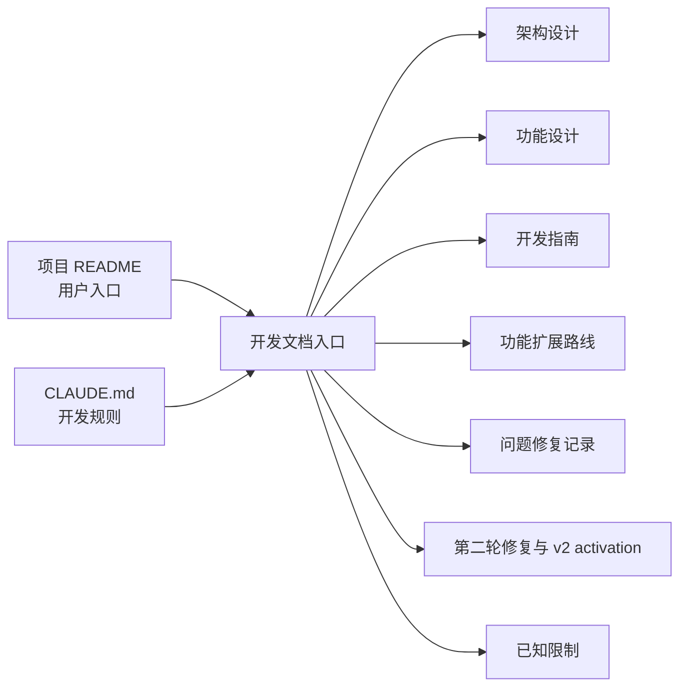

# SnipVault 开发文档

> 本目录面向 SnipVault 的维护者和功能开发者，记录当前 v2.5.2 功能与后续 schema-v8 恢复功能开发状态。它不是产品愿景，也不表示已知问题已经修复。

- 核对日期：2026-08-25
- 发布基线：2.5.2
- 当前工作树：schema-v8 冲突与设备恢复功能开发
- 主要技术：Tauri 2、React 19、TypeScript、CodeMirror 6、Rust、SQLite、WebDAV
- 事实来源：仓库源码；当文档与源码冲突时，以源码为准，并应在同一变更中修正文档

## 文档导航

| 文档 | 内容 |
|---|---|
| [架构设计](architecture.md) | 系统边界、模块职责、启动和窗口生命周期、IPC、持久化、WebDAV、权限与发布架构 |
| [功能设计](feature-design.md) | 当前所有用户功能的入口、交互、状态流、调用链和实现边界 |
| [开发指南](development.md) | 环境、构建命令、常见扩展路径、开发约束和文档影响评估 |
| [功能扩展路线](feature-roadmap.md) | 当前行为与规划中功能的边界、优先级和设计约束 |
| [问题修复记录（2026-07-31）](remediation-2026-07-31.md) | 架构审查发现的问题、影响、根因、解决方案、兼容行为和验证 |
| [第二轮修复](remediation-round-2.md) | 前端质量工具、结构化错误、共享 SettingsProvider、同步/托盘、凭据/设置安全、CSP、可测试 WebDAV v1 engine、SQLite v3/v4 foundation、production protocol-v2 activation，以及发布链路硬化的历史检查点记录 |
| [已知限制](known-limitations.md) | 修复后仍存在的安全风险、缺失能力和候选遗留项 |
| [项目 README](../README.md) | 面向用户的项目介绍、安装和基本使用说明 |
| [Claude Code 指南](../CLAUDE.md) | 仓库级开发约束和文档同步门禁 |

## 阅读顺序

首次参与开发时，建议依次阅读：

1. [架构设计](architecture.md)：先了解 React、Tauri IPC、Rust 模块、SQLite 和 WebDAV 的边界。
2. [功能设计](feature-design.md)：了解当前 UI 实际提供什么能力，以及每项能力如何落到源码。
3. [已知限制](known-limitations.md)：避免把现有缺陷误当成设计约束或可靠保证。
4. [开发指南](development.md)：按现有工程能力进行修改、验证和文档同步。

## 状态标记约定

文档使用以下概念区分事实和结论：

- **当前行为**：源码中已经存在、通过现有入口可以触发的行为。
- **已知限制**：源码中可验证的问题、风险或能力缺口；不等于已经排期修复。
- **候选遗留项**：当前文本搜索和模块关系中未发现有效引用，但尚未删除，不能直接断言可以安全移除。
- **非目标**：仓库当前没有实现，本文也不作支持承诺的能力。

## 文档维护规则

所有后续功能设计和功能开发都必须执行文档影响评估，并在同一任务或同一变更中同步维护开发文档：

| 变更类型 | 至少检查的文档 |
|---|---|
| 模块职责、数据流、生命周期、权限 | [架构设计](architecture.md) |
| 用户入口、交互、可见行为、快捷键 | [功能设计](feature-design.md) |
| 环境、命令、开发模式、扩展规范 | [开发指南](development.md) |
| 新问题、未完成能力、安全风险；或已修复限制 | [已知限制](known-limitations.md) |
| 安装、平台、存储位置、用户配置 | [项目 README](../README.md) |

具体门禁以 [CLAUDE.md](../CLAUDE.md) 为准。文档没有同步时，不应将功能任务标记为完成。

## 编写原则

1. **先核对源码，再描述行为。** 不沿用旧文案中未经验证的能力承诺。
2. **当前实现与理想设计分开。** 未实现方案不得写进“当前功能”。
3. **限制集中记录。** 功能和架构文档只简要链接到限制文档，避免同一缺陷多份描述漂移。
4. **保留源码入口。** 重要结论至少链接一个主要实现文件；重构时同步检查链接。
5. **更新流程图。** 模块关系、生命周期或同步顺序变化时，应同时修改对应 Mermaid 图。
6. **修复后清理限制。** 修复问题时必须更新或删除 [已知限制](known-limitations.md) 中的条目，并同步补充新的当前行为。
