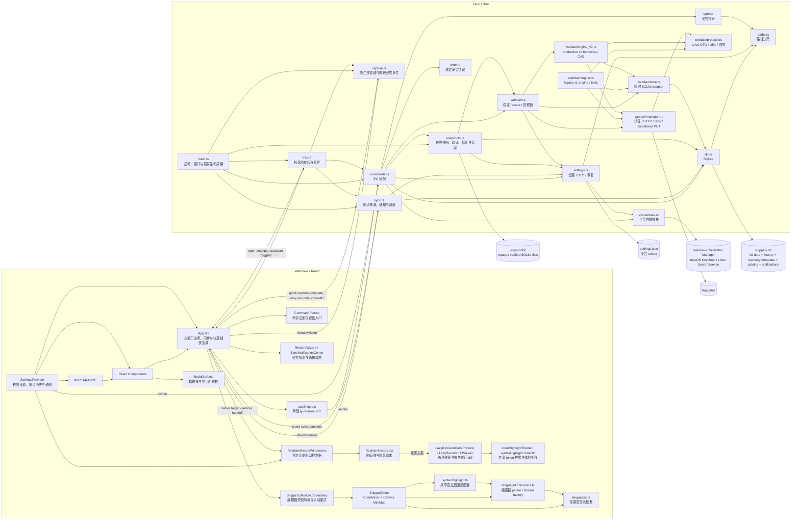
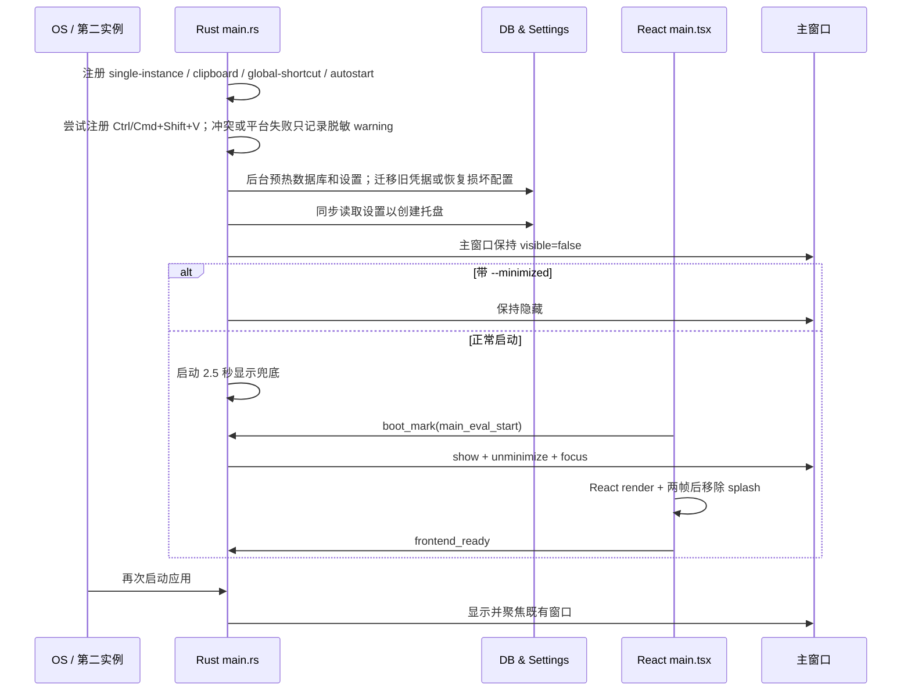
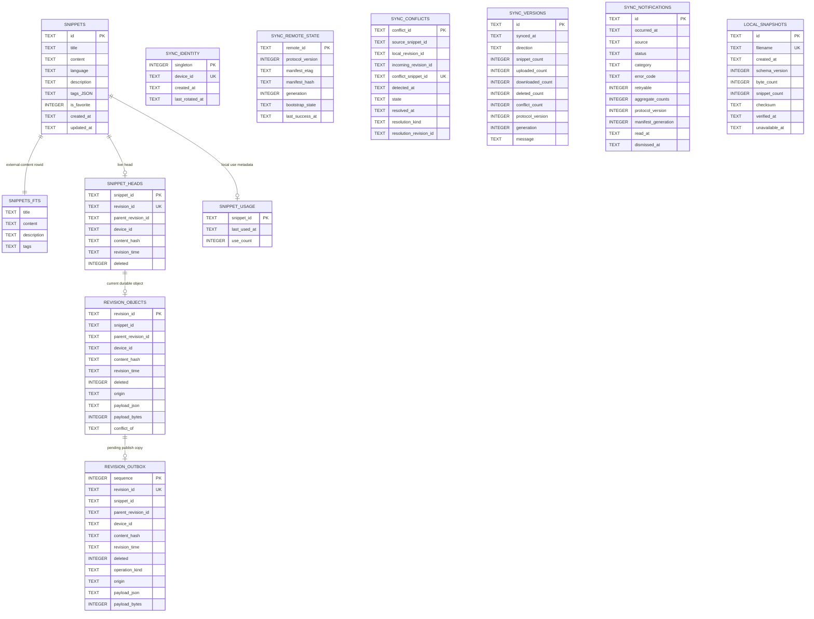
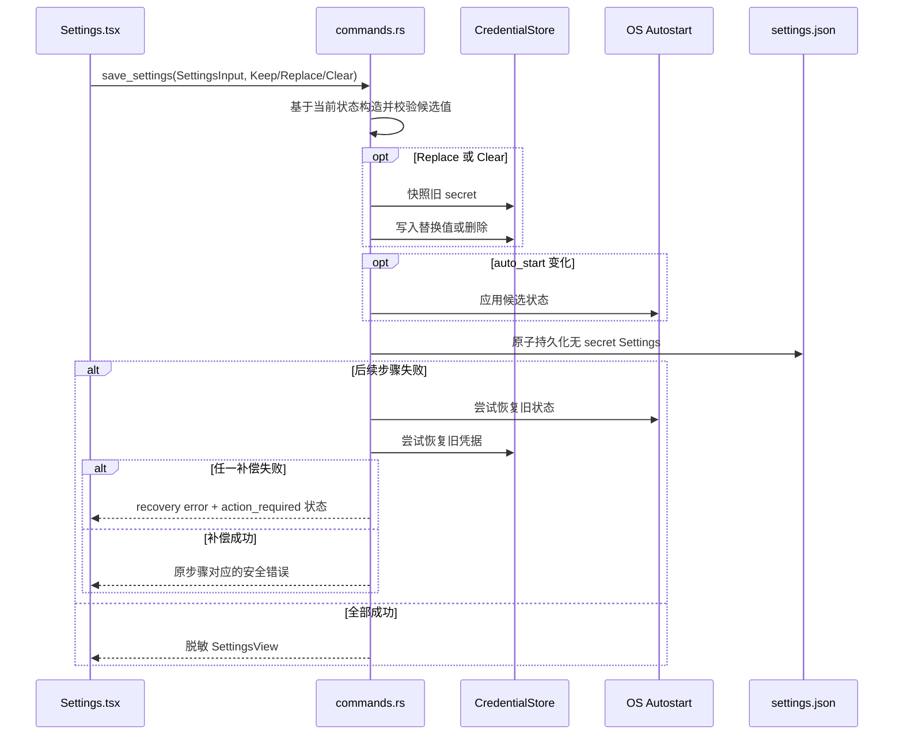
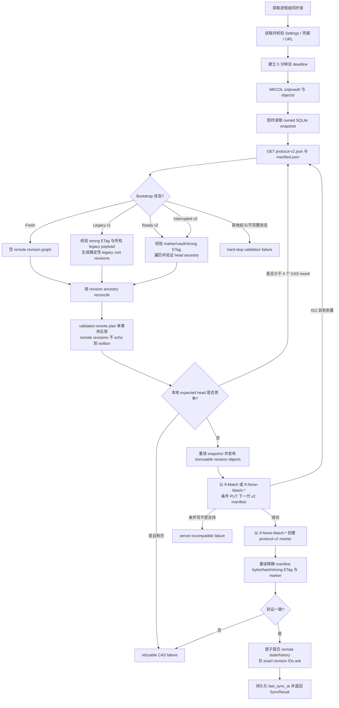
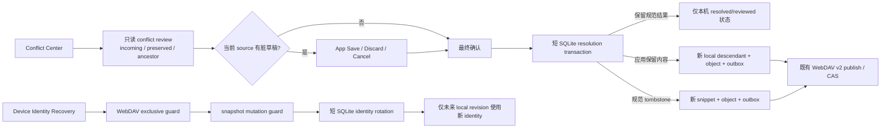

# SnipVault 架构设计

> 本文描述当前 v2.5.1 架构，截至 2026-08-20。已发现但尚未修复的问题集中记录在 [已知限制](known-limitations.md)。

## 1. 系统定位与边界

SnipVault 是一个本地优先的桌面代码片段管理器。应用的主要业务数据保存在本地 SQLite 中，网络仅用于用户主动配置的 WebDAV 同步。

| 层级 | 当前技术与职责 |
|---|---|
| 桌面运行时 | Tauri 2；创建 WebView 窗口、注册 IPC、托盘、单实例和系统插件 |
| 前端 | React 19 + TypeScript + Vite；负责界面、交互和运行时状态 |
| 编辑器 | CodeMirror 6 + `@uiw/react-codemirror`；语法解析、编辑、选区和滚动 |
| 后端 | Rust；负责 IPC、数据库、设置文件、路径、WebDAV 和系统生命周期 |
| 本地数据 | `rusqlite` bundled SQLite；片段、不可变 revision、同步状态/历史、脱敏通知与快照目录 catalog |
| 设置 | Rust 内存缓存 + 校验、临时文件/备份替换的无 secret `settings.json`；含本地快照策略与恢复后同步确认锁 |
| 凭据 | `keyring` 抽象；生产环境使用平台凭据库，测试使用内存/失败 fake |
| 远端同步 | `reqwest::blocking` + WebDAV；进程级互斥、v2 marker/manifest、不可变 revision objects 与条件发布 |
| 发布 | GitHub Actions 构建 Windows、macOS、Linux 产物并创建 GitHub Release |

主要配置来源：

- [package.json](../package.json)
- [Cargo.toml](../src-tauri/Cargo.toml)
- [tauri.conf.json](../src-tauri/tauri.conf.json)
- [default capability](../src-tauri/capabilities/default.json)
- [revision-history capability](../src-tauri/capabilities/revision-history.json)

## 2. 总体组件关系



前端和后端没有共享的代码生成协议层。TypeScript 类型、IPC 参数和 Rust 结构需要开发者手动保持一致。

## 3. 前端架构

### 3.1 入口和 Context

[main.tsx](../src/main.tsx) 负责：

- 创建 React Root。
- 以单次 `getBootSettings()` promise 同时初始化根级 `SettingsProvider`、主题和语言，避免为三个入口重复读取设置。
- 在 `SettingsProvider` 之内提供运行时 `ThemeContext` 和 [LanguageProvider](../src/context/LanguageProvider.tsx)；设置 Context 本身不依赖主题或语言 Context，因此没有 provider cycle。
- [theme.ts](../src/theme.ts) 统一严格的主题/界面配色 allowlist、启动缓存键和对 `documentElement`、`#root` 的 `data-theme` / `data-accent` 写入；[ThemeProvider](../src/main.tsx) 消费根级 `SettingsProvider` 的权威 `SettingsView`，因此首次读取、保存成功和后台刷新只经一条外观更新路径。
- 使用 `localStorage` 镜像持久主题偏好、其解析后的有效主题和精选界面配色，降低启动时外观闪烁。`system` 在启动和运行时通过 `matchMedia` 解析为 `dark` 或 `light`；工具栏深浅切换是 session-only override，不写入 Rust 设置或启动缓存，并会在权威主题偏好改变时清除。
- 上报启动性能阶段，移除 HTML splash，并调用 `frontend_ready`。

主题外观分为三层：

- **持久深浅偏好**：`dark`、`light`、`system`，来自后端设置。
- **当前有效主题**：`dark` 或 `light`，由偏好、系统主题与仅限当前会话的工具栏 override 共同解析。
- **持久精选界面配色**：`sky`、`violet`、`emerald`、`amber`、`rose`、`white`（界面名称“简约白”）；与深浅模式正交。`white` 在 light/dark 下复现初始版本的中性界面，其余每个值定义完整的 background/surface/text/border/action/editor/minimap token 矩阵；旧 JSON 缺省为 `sky`。启动时的 localStorage 只是一份经过 allowlist 归一化的反闪烁镜像，最终事实源仍是后端 `SettingsView`。

[LanguageContext.tsx](../src/context/LanguageContext.tsx) 定义运行时 `zh` / `en` 契约；[LanguageProvider.tsx](../src/context/LanguageProvider.tsx) 负责异步启动语言、i18next 和文档 `lang` 同步，使 provider 可脱离 `main.tsx` 的启动副作用测试。

### 3.2 根状态和流程编排

[App.tsx](../src/App.tsx) 是当前前端的应用控制器，集中管理：

- 当前选中片段、是否新建、表单和原始表单快照。
- 保存状态与脏数据检测；已有干净表单在 `App` 保存协调器中成功 no-op，不触发更新 IPC、revision 或 outbox。
- 搜索词、语言筛选、收藏筛选、排序、分页请求和当前已加载项的批量选择。
- 设置模态层、快照恢复、设备身份恢复、冲突解决中心、通知中心、命令面板、同步状态和全局 Dialog。
- 冲突中心从 `sync_conflicts` 读取最小摘要并按需加载保留本地副本、规范 incoming revision 与可用共同祖先；所有 action 由 `App` 先完成同一 source 的 dirty guard/最终确认，再以普通 local descendant/outbox（或 tombstone 情况下的新 snippet）提交。
- 以 `open_revision_history` 打开或复用原生 `revision-history` 子窗口；从该窗口 pull restore request 并在主窗口复用 dirty guard、确认 Dialog 与权威 reconcile。
- `Ctrl/Meta+N/S/E/K` WebView 快捷键，以及 Rust 原生 `Ctrl/Meta+Shift+V` 快速捕获完成协调。
- 自定义文本右键菜单和剪贴板操作。
- `sync-complete`、`quick-capture-complete`、`open-settings`、`autostart-toggled` 和 `revision-history-restore-request` 窗口事件。
- `SnippetEditorLoadBoundary` 只包围懒加载编辑器的 `Suspense`/editor 子树。pending import 显示 pane 内 loading；rejected import 或 editor render error 被隔离为本地化的 `role="alert"` 与显式 Retry，不会卸载侧栏、工具栏、设置、Dialog 或 App 持有的选择/草稿状态。Retry 只递增 App 的加载尝试号；`LazySnippetEditor` 为每个尝试生成新的 lazy identity，开发环境使用带尝试 query 的绝对 Vite `/src` module URL 绕过已拒绝 import 的浏览器缓存，生产仍使用静态可分析的 editor import。边界不会自动轮询、重启或诊断 Vite。
- CodeMirror view 只在编辑器右键菜单动作中按需解析，不进入初始应用依赖图。

[RevisionHistoryWindow.tsx](../src/components/RevisionHistoryWindow.tsx) 是动态创建的 `revision-history` WebView 的唯一根控制器。它沿用共享 Settings/Theme/Language providers，但不装载 `App`、编辑器、全局快捷键或主窗口 ready 流程；通过 `get_revision_history_target` 在挂载和重新获得焦点时拉取 Rust 端权威 target，并将 `revision-history-target-changed` 仅作为已装载窗口的加速刷新信号。target 仅包含 opaque `snippet_id`、`current_revision_id` 和 generation，不含正文、路径、远端地址、凭据或诊断。generation 变更会重置时间线/预览/比较请求，避免迟到结果展示到另一片段。

历史窗口不能直接执行恢复 mutation。它只提交 `{ generation, target_revision_id }`；Rust 在 label-gated command 中核验窗口身份、target generation、revision 归属、历史 live 状态与非当前 head，且 `restore_snippet_revision` 同样只接受 `main` 调用，保留一份 bounded pending request 后通知 `main`。`App` 监听事件并 pull pending request（事件先后顺序不会丢失请求），显示、解除最小化并聚焦主窗口，在相同编辑目标 dirty 时复用 Save/Discard/Cancel、在任何 target 上复用确认 Dialog、重新读取权威 current head 后调用既有 descendant restore IPC。无关的 dirty 草稿不会被导航或覆盖。主窗口完成后只回传 `succeeded | cancelled | failed` 和 generation；成功才隐藏历史窗口。

项目没有 Redux、Zustand、React Query 或前端路由。状态由组件局部 state、Context 和 Tauri 后端持久化共同组成。

### 3.3 Hook 与 IPC 边界

[useSnippets.ts](../src/hooks/useSnippets.ts) 封装：

- 分页摘要查询（`updated` / `recent` 独立 cursor）、按 ID 懒加载完整片段、创建、更新、删除、收藏、使用记录、最多 200 ID 的全有或全无批量收藏/删除，以及 paginated immutable revision timeline、正文/tombstone inspection、双 revision 比较和安全 descendant restore。
- JSON 字符串导出、文件导出和导入。
- 本地 `SnippetSummary[]`、总数/cursor、独立首屏与 Load More loading/error、标签元数据状态。
- 以 generation + 查询 key/cursor 抑制迟到的旧查询或旧追加响应；筛选变化总是从第一页重新请求。

[useSettings.ts](../src/hooks/useSettings.ts) 定义根级 `SettingsProvider`，封装：

- 一份由所有消费者共享的权威设置状态；`App`、`SettingsPanel` 和编辑器换行入口不再各自维护独立 Hook state。
- 设置读取、非敏感设置保存、显式 secret action、WebDAV 同步、成功技术历史、脱敏通知收件箱、快照策略、系统主题与系统语言 API。
- 通知收件箱只持久化固定来源/状态/类别、稳定错误码/可重试性、计数与 protocol 元数据以及已读/关闭状态；不保存 URL、用户名、secret、远端响应、路径、片段正文或 revision 标识。
- 读取协议 `SettingsView` 只含非敏感设置、`webdav_secret_configured` 和安全恢复状态；保存协议由 `SettingsDraft` 与 `SecretAction = Keep | Replace(value) | Clear` 组成，持久 secret 不进入 WebView。
- `SettingsDraft` 显式选择用户可编辑的非敏感字段，把后端维护的 `last_sync_at`、凭据状态和恢复状态排除在外。
- reload/save request ID，防止较旧 reload 覆盖较新的成功保存；并以 active counter 统一多个同步请求的 `syncing` 状态。
- `SyncCompletionEvent` 协议：来源为 `toolbar | settings | tray | background`，状态为 `result | error | busy`，携带 `SyncResult` 或结构化 `CommandError`。
- 可注入 `SettingsApi` 和初始设置，供组件测试复用同一生产状态路径。

[useSnippets.ts](../src/hooks/useSnippets.ts) 仍维护片段列表的局部 Hook 状态。前端没有 Redux、Zustand 或 React Query；持久事实源仍是 Rust 设置缓存、`settings.json` 和 SQLite，但设置在 React 运行时只有一个权威 provider 实例。

### 3.4 组件职责

| 组件 | 当前职责 |
|---|---|
| [Titlebar.tsx](../src/components/Titlebar.tsx) | 自定义无边框标题栏、拖动、最小化、最大化/还原、关闭 |
| [Toolbar.tsx](../src/components/Toolbar.tsx) | 搜索、独立语言/收藏筛选、紧凑的 `updated` / `recent` 排序图标、新建、导入导出、命令面板、同步、持久通知未读徽标、主题临时切换、设置入口 |
| [RevisionHistoryWindow.tsx](../src/components/RevisionHistoryWindow.tsx) | 独立原生历史窗口的 target pull / event refresh、direct revision IPC 与 restore-request 状态协调；不挂载 App 主流程 |
| [RevisionHistory.tsx](../src/components/RevisionHistory.tsx) | 已保存片段 immutable revision 时间线、只读 live/tombstone 检视、对比与仅请求式的安全恢复 UI |
| [LazyRevisionCodePreview.tsx](../src/components/LazyRevisionCodePreview.tsx)、[LazyRevisionDiffViewer.tsx](../src/components/LazyRevisionDiffViewer.tsx) | 仅在用户检视 live 版本或实际启动比较时加载 syntax/diff renderer，避免将 parser/highlighter 提前纳入 App 初始依赖图 |
| [RevisionCodeView.tsx](../src/components/RevisionCodeView.tsx)、[RevisionDiffViewer.tsx](../src/components/RevisionDiffViewer.tsx)、[lineDiff.ts](../src/components/lineDiff.ts) | 安全的只读 DOM token 渲染；受限本地两路逐行对齐将配对 `replace` 行作为独占的修改计数、未配对行作为新增/删除；两侧保留 replace 身份并提供本地化的之前版本/所选版本修改语义提示，新增/删除提示只用于未配对行（装饰 marker/行号保持隐藏）；双版本 gutter/滚动工作区和 tombstone 无正文状态 |
| [codeHighlightTheme.ts](../src/components/codeHighlightTheme.ts) | 编辑器/历史检视共享 dark/light `HighlightStyle`、token 色和 plain-DOM 的 `StyleModule` 注册 |
| [RestoreWizard.tsx](../src/components/RestoreWizard.tsx) | 已验证本地 SQLite 快照列表、手动创建、受控目录打开、完整 vault 范围说明与确认恢复 |
| [SyncNotificationCenter.tsx](../src/components/SyncNotificationCenter.tsx) | 脱敏同步结果收件箱、未读/已读/关闭、可重试手动同步入口 |
| [Settings.tsx](../src/components/Settings.tsx) | 通用设置、WebDAV、成功同步历史、本地快照策略与关于信息 |
| [SnippetList.tsx](../src/components/SnippetList.tsx) | 语义列表项、独立选择/收藏/删除按钮、当前已加载项的复选选择/批量操作、相对时间和代码预览 |
| [CommandPalette.tsx](../src/components/CommandPalette.tsx) | 基于共享 ModalSurface 的本地命令过滤、方向键/Home/End/Enter 操作与焦点恢复 |
| [LazySnippetEditor.tsx](../src/components/LazySnippetEditor.tsx) | 将按尝试生成的 React.lazy editor identity 保持在组件边界；开发 retry 使用独立 Vite query URL |
| [SnippetEditorLoadBoundary.tsx](../src/components/SnippetEditorLoadBoundary.tsx) | 仅隔离懒加载编辑器的 import/render 失败；保留 App 草稿并提供显式 retry |
| [SnippetEditor.tsx](../src/components/SnippetEditor.tsx) | 表单、可访问标签 combobox、CodeMirror、主题高亮、复制、Canvas minimap |
| [languageExtensions.ts](../src/components/languageExtensions.ts) | 编辑器专用的 parser-backed、StreamLanguage 和 plaintext 扩展分类/factory |
| [ModalSurface.tsx](../src/components/ModalSurface.tsx) | 共享模态栈、topmost Tab/Escape、背景 inert/ARIA、初始与恢复焦点 |
| [Dialog.tsx](../src/components/Dialog.tsx) | 基于共享模态 surface 的 Promise 化 `alert`、`confirm`、`ask` 对话框 |

[ModalSurface.tsx](../src/components/ModalSurface.tsx) 维护模块级模态栈和唯一 capture-phase `keydown` listener。Settings panel、Promise Dialog 与 CommandPalette 都通过它注册：只有栈顶处理 Tab/Escape；打开时按显式初始目标、标记目标、首个可聚焦元素、容器的顺序决定焦点；祖先分支的背景 sibling 临时设为 `inert` 与 `aria-hidden`；关闭后恢复先前状态和触发器焦点。嵌套 Settings Dialog 因此不会与外层面板建立竞争的 document trap，且保留原有 Save/Discard/Cancel 关闭 guard。

### 3.5 CodeMirror 和 MiniMap

编辑器实际 DOM 外层为：

```text
.cm-editor-split
├── .cm-main-pane
│   └── .snippet-codemirror
└── .minimap-wrap
```

CodeMirror 的语言扩展由 [languageExtensions.ts](../src/components/languageExtensions.ts) 隔离：它从轻量 [languages.ts](../src/utils/languages.ts) 的 `LanguageId` 建立 exhaustively typed 分类和 factory；元数据文件不导入编辑器包。`buildMainExtensions()` 继续负责换行、GitHub 主题、`EditorView.theme()` 和来自 [codeHighlightTheme.ts](../src/components/codeHighlightTheme.ts) 的共享 `HighlightStyle`，并先注册项目复合 highlighter、后注册 UIW GitHub 主题，以确保项目复合样式是编辑器中实际生效的 token 色彩来源。编辑器 surface、gutter、光标、选区和匹配括号使用 [index.css](../src/index.css) 的完整界面配色语义 token，而不改变 syntax token palette。[syntaxHighlight.ts](../src/components/syntaxHighlight.ts) 使用同一语言 factory、受限 `ensureSyntaxTree()` 和共享 `HighlightStyle` 导出有序 token 范围；[SnippetEditor.tsx](../src/components/SnippetEditor.tsx) 的 `MiniMap` 再读取编辑区实际计算的 class 前景色绘制 Canvas，并从 minimap pane 读取计算后的 surface token 作为 Canvas 背景。因此编辑区和 codeglance 共用语法语义与最终颜色，解析未完成、无 token 与 plaintext 区域统一使用编辑器默认前景色；MiniMap viewport 同样使用语义 token，仍只负责 Canvas 几何、主滚动同步和 viewport 拖拽。

历史 live preview 与 revision comparison 不挂载第二个可编辑 CodeMirror view。它们经 `LazyRevisionCodePreview` / `LazyRevisionDiffViewer` 才请求 parser/highlighter chunk；`RevisionCodeView` 在 plain DOM 中以 React text/span 安全渲染 token，先通过 `StyleModule.mount()` 注册共享 `HighlightStyle.module`。`lineDiff.ts` 仅消费 already-validated 的两份 `RevisionComparison` 内容，不增加 IPC：在字符、行数、matrix、渲染行数和短工作时间上限内生成二路逐行对齐；超限时明确退回为有行号、语法高亮、无自动换行的并排完整源代码，而不是无限计算或伪造 partial diff。历史窗口是由 chronology rail、固定 review command/context band 和剩余高度唯一 code stage 组成的 owned-height workspace；live preview 以只读 editor-chrome header 显示标题、language badge、受限 passive tag summary 和不可变 favorite state，不提供该处 mutation，时间线和 source panes 各自承担正常纵向滚动，不再有右侧外层 document scroll。紧凑时间线使用与主列表一致的中性 active surface/边框与左侧 accent rail；宽度至少 1200px 的比较使用弹性双 pane，1000–1199px 的最小窗口区间改用不重新 fetch/recompute 的 Baseline / Selected 单 pane 呈现，inactive pane 以 `display: none` 离开交互和辅助技术树。代码本身从不自动换行，只有单个真实长行在其所属 source pane 内可以横向滚动；双 pane 详细对齐模式只同步两侧的垂直滚动。

语言 factory 分三类：官方/维护包提供的 parser-backed 扩展；基于 `@codemirror/legacy-modes` 的 `StreamLanguage` 语法着色；以及 plaintext 的显式空扩展。Stream mode 只提供 token stream 高亮，不是完整 Lezer parser，不能假定具备 parser-backed 折叠、结构选择或语言服务语义。

CodeMirror 的编辑 DOM 由库管理，但当前实现并不依靠 Shadow DOM 隔离。选择、光标、滚动和 token 颜色通过 CodeMirror 扩展配置更稳定；全局 CSS 仍负责布局和部分 `.cm-*` 规则。生产构建将 editor runtime、services、UI 以及 web/data/单语言/legacy parser family 输出为有界独立 chunk：它们只在 `SnippetEditor` 首次进入时加载，语言 factory 仍是 editor 内部同步契约，不能因 chunk 拆分而变为异步。`App` 不再静态引用 `EditorView`；仅当用户从 `.cm-editor` 文本菜单执行操作时按需解析 view。`SnippetEditorLoadBoundary` 处于 `App` 与 lazy editor 之间：它不会处理 Suspense 的 pending state，但会截获 rejected import 或 editor render error。`LazySnippetEditor` 在组件边界为每次手动 retry 创建新的 lazy identity；开发 retry 请求新的带 query 绝对 Vite `/src` URL，生产加载路径仍是静态 import。该 remount 继续接收 App 持有的 `selected` 和 controlled `form`，所以草稿不丢失，但 CodeMirror 的 cursor、selection、undo history、minimap 宽度与暂存标签输入等 editor-local 状态会重建。`EditorView.scrollDOM` 仍是唯一主滚动源；自研 minimap/canvas/viewport 对辅助技术隐藏，不取代可键盘滚动的 CodeMirror 编辑器。

## 4. 后端架构

### 4.1 模块边界

| 模块 | 当前职责 |
|---|---|
| [main.rs](../src-tauri/src/main.rs) | Tauri Builder、插件、单实例、主/历史窗口显示/关闭协调、全局快捷键注册、worker 启动和命令注册 |
| [capture.rs](../src-tauri/src/capture.rs) | 原生 `Ctrl/Cmd+Shift+V`、托盘快速捕获服务、Clipboard Manager 文本读取、普通 revisioned snippet 写入和脱敏完成事件 |
| [tray.rs](../src-tauri/src/tray.rs) | 托盘句柄、菜单构造/刷新、快速捕获/同步/设置菜单与图标事件、窗口唤醒和 `open-settings` / `autostart-toggled` 通知 |
| [sync.rs](../src-tauri/src/sync.rs) | 来源标记的同步完成事件、所有终态的脱敏通知持久化、托盘同步适配、自动同步 scheduler、busy 快速重试和失败退避 |
| [snapshots.rs](../src-tauri/src/snapshots.rs) | 后端派生的本地 SQLite 在线快照、完整验证/catalog、保留策略、恢复前紧急快照、在活动连接中恢复及快照 worker |
| [commands.rs](../src-tauri/src/commands.rs) | `#[tauri::command]` IPC 边界、Rust-owned singleton history-window target/request/outcome 与 label-gated window commands、main-only conflict review/resolution 与 device identity recovery、revision history/restore 和 snapshot/notification 适配、后端时间戳、usage/bulk/capture completion 适配、设置/凭据/自启动事务、受控 URL/目录打开、托盘状态刷新、导出文件、内部错误映射和启动打点 |
| [error.rs](../src-tauri/src/error.rs) | 可序列化 `CommandError`、稳定错误码（含 `snapshot`）、安全 fallback、retryable 与可选安全 details |
| [db.rs](../src-tauri/src/db.rs) | SQLite v8 顺序迁移、通用升级前备份/失败恢复、严格解码、FTS5、revision head/tombstone/durable objects/outbox/remote state、local-only conflict lifecycle/review/resolution、future-only device identity rotation、revision history/compare/descendant restore、local-only usage、snapshot catalog、脱敏通知、双排序分页摘要/详情、原子 mutation/import、v2 sync seams 与成功技术历史 |
| [settings.rs](../src-tauri/src/settings.rs) | 无 secret `Settings`、snapshot policy、post-restore `sync_confirmation_required` latch、`SettingsView` / `SettingsInput`、显式 secret action、旧 JSON 迁移、损坏文件恢复和原子持久化 |
| [credentials.rs](../src-tauri/src/credentials.rs) | 可注入 `CredentialStore`、稳定 service/account、平台 keyring 实现和测试内存 fake |
| [paths.rs](../src-tauri/src/paths.rs) | 安装模式判断、数据库/设置/导出/后端派生快照路径 |
| [webdav.rs](../src-tauri/src/webdav.rs) | 稳定同步 facade、`SyncResult` / structured native failure、进程级互斥、设置/凭据装配，以及 v2 engine 调用与 `last_sync_at` 提交 |
| [webdav/protocol.rs](../src-tauri/src/webdav/protocol.rs) | 显式 v1/v2 manifest、protocol marker、immutable revision DTO，ID/时间/hash/大小校验，以及安全 URL/path 构造 |
| [webdav/transport.rs](../src-tauri/src/webdav/transport.rs) | 可注入 `RemoteTransport` / `Clock`、reqwest 认证、有界响应读取、strong ETag 校验、conditional PUT 与 retry/deadline |
| [webdav/engine_v2.rs](../src-tauri/src/webdav/engine_v2.rs) | 当前生产同步状态机：fresh/v1/v2 bootstrap、revision ancestry reconcile、immutable object publication、manifest CAS、marker activation、publication verification 与 exact acknowledgement |
| [webdav/engine.rs](../src-tauri/src/webdav/engine.rs) | 保留的 v1 reconcile 实现与相关测试辅助；production facade 不再调用它 |
| [webdav/store.rs](../src-tauri/src/webdav/store.rs) | 可注入 store traits 与生产 SQLite adapter；snapshot、validated remote apply 与 published-revision commit 每次独立获取并释放数据库 mutex |
| [webdav/error.rs](../src-tauri/src/webdav/error.rs) | 内部同步错误类别、安全静态诊断与 retryable 元数据 |
| [lib.rs](../src-tauri/src/lib.rs) | 声明当前有效后端模块 |

当前真实的片段协议模型是 [db.rs](../src-tauri/src/db.rs) 中的 `Snippet`；未导出、未引用的旧 `models.rs` 已删除。

### 4.2 全局状态模型

后端使用 `once_cell` 单例：

- 数据库：`OnceCell<Mutex<Connection>>`
- 设置：`OnceCell<Mutex<Settings>>`
- 数据目录和安装模式：`OnceCell`
- 托盘句柄：由 [tray.rs](../src-tauri/src/tray.rs) 持有的 `OnceCell<Arc<Mutex<Option<TrayIcon>>>>`
- 启动计时：`OnceCell<Instant>` + `AtomicBool`
- 同步协调：`Lazy<Mutex<()>>`，覆盖工具栏、设置、托盘和自动同步完整流程，并与完整 vault 恢复互斥
- 快照协调：`snapshots.rs` 的 `SNAPSHOT_LOCK` 串行创建、验证、catalog 修剪与恢复；`RESTORE_WRITE_LOCK` 使 restore、设置保存与整个同步流程（含完成后的 restore confirmation latch 更新）以及所有生产 SQLite mutation 串行

SQLite 只有一个连接，所有数据库操作通过 `with_db()` / `with_db_mut()` 和 Mutex 串行执行。v2 同步引擎只通过 `V2SyncStore` 调用短时 snapshot、validated remote-plan apply 和 published-revision commit；每次调用返回前已释放连接 guard，随后才可能执行 HTTP，因此网络请求不会持有 DB mutex。同一进程的完整 WebDAV 同步由独立 mutex 排他执行；完整 vault restore 的锁序固定为 snapshot serialization → WebDAV operation → restore/write gate → DB mutex；单独的 device identity rotation 固定为 WebDAV exclusive guard → snapshot mutation guard → short DB transaction。restore/write gate 也覆盖 Settings 保存及完整 sync 的最终状态提交，防止恢复后的 manual-sync confirmation latch 被旧设置写回，或被恢复前已经完成的同步错误清除。所有普通 snippet mutation、quick capture、conflict resolution、remote plan/commit 以及 notification 写/读/关闭都会先取得 restore/write gate，因此 emergency checkpoint 与活动数据库替换之间不会丢失已提交写入。恢复使用 SQLite `Backup` 将经过 `SQLITE_OPEN_NOFOLLOW` 预验证的来源写入活动连接，绝不以文件替换打开中的数据库；每次 reopen/copy 前还会重新比较 catalog 的 SHA-256，验证后发生的文件替换会中止 restore。restore 期间 catalog 先重新插入恢复前可见条目和 emergency 条目，再 best-effort 修剪 retention，避免旧 snapshot 覆盖 catalog 后使可用文件不可见。不同设备依靠远端 manifest 的 strong ETag 与 conditional PUT 进行乐观并发控制。

## 5. 启动、窗口和托盘生命周期



### 5.1 窗口

[tauri.conf.json](../src-tauri/tauri.conf.json) 定义主窗口：

- label：`main`
- 默认 1200×800，最小 700×500
- `decorations: false`
- `visible: false`

前端尽早发出 `boot_mark("main_eval_start")`，Rust 收到后显示窗口；2.5 秒线程是前端未发信号时的兜底。

### 5.2 独立版本历史窗口

编辑器的 History 入口通过 `open_revision_history` 动态创建或复用 label 为 `revision-history` 的无边框原生窗口；它不在 [tauri.conf.json](../src-tauri/tauri.conf.json) 静态声明，因此不会在启动时创建第二个 WebView。Rust 先在受 Mutex 保护的 state 写入 opaque target 和递增 generation，再异步构造/显示窗口并发送刷新事件，避免 Windows 同步 command 创建 WebView 的死锁边界。窗口默认约 1280×760、最小 1000×620：默认宽度使用时间线、review command/context band 和双代码 pane 的 review desk；1000–1199px 则用同一已加载比较的显式 Baseline / Selected 单 pane 模式，避免压缩非换行源代码。

关闭历史窗口会被拦截并隐藏，以便下一次 History 快速复用；普通最小化保持原生行为。主窗口因 `minimize_to_tray` 隐藏时也隐藏历史窗口；主窗口实际关闭前销毁它，避免残留独立 WebView。托盘/第二实例只唤醒主窗口，不会意外重新显示历史窗口。历史窗口使用单独的 [revision-history capability](../src-tauri/capabilities/revision-history.json)，只允许其标题栏实际所需的 core/window 控制（含 `start_dragging`）；主窗口 capability 另显式允许 show、unminimize 和 focus 以承接恢复确认。不含 clipboard、show/hide 或 main-only scope。

### 5.3 单实例和自启动

- `tauri-plugin-single-instance` 阻止创建第二个业务实例，第二次启动只唤醒既有窗口。
- `tauri-plugin-autostart` 注册开机自启，附加 `--minimized` 参数。
- `--minimized` 启动时主窗口保持隐藏，用户通过托盘或第二次启动唤醒。

### 5.4 托盘

Rust 托盘菜单当前固定为中文：

1. 打开灵藏 SnipVault
2. 从剪贴板快速捕获
3. 立即同步
4. 设置
5. 开机自启（复选项）
6. 退出

左键点击托盘图标会显示主窗口。快速捕获与原生快捷键复用 [capture.rs](../src-tauri/src/capture.rs)：只在显式触发时读取非空文本、在后台建立普通 plaintext snippet 和 usage；不会抢占前台窗口，也不会记录或 emit 正文/标题。完成事件只含 source/success/ID；已挂载的前端刷新权威列表且保留 dirty draft，listener 尚未就绪时可经 `take_quick_capture_completion` 取走最近一次结果。捕获失败或快捷键冲突不阻止应用和托盘入口运行。托盘同步在线程中运行，完成后由 [sync.rs](../src-tauri/src/sync.rs) emit 来源为 `tray` 的 typed `sync-complete`；托盘设置通过受支持的 `open-settings` 窗口事件打开 overlay，不再使用 `window.eval()` 或 WebView 全局函数。前端通过 Tauri 2 `Window.listen(...)` 注册 `sync-complete`、`quick-capture-complete`、`open-settings` 和 `autostart-toggled`，并保存/清理每个 unlisten 回调。设置保存或托盘切换自启动后都会按 OS plugin 状态（失败时回退持久设置）重建复选菜单。

### 5.5 关闭和自动同步

窗口 `CloseRequested` 每次触发时读取最新 `minimize_to_tray`，因此保存后无需重启即可改变关闭行为。

有效配置首次被观察时即在该轮尝试，因而启用后仍保持“下一次 poll window 内首次尝试”的语义；成功后恢复配置间隔，`sync_busy` 在 15 秒后快速重试，其他失败按 15、30、60 秒指数退避并封顶 15 分钟。`sync_confirmation_required` 在完整 vault restore 后阻止 scheduler，直到工具栏、设置或托盘的一次成功手动同步清除该锁；关闭、URL 为空或该锁生效时 scheduler 重置。scheduler 不保存 secret，实际同步开始时才从凭据库读取。所有尝试与手动入口共用同步 mutex；凭据迁移或补偿恢复未完成时读取被阻止，因此持久自动同步不会使用遗留明文。独立快照 worker 每 15 分钟读取当前无 secret policy：启用时立即补齐缺失快照，随后按 daily/weekly 最小间隔创建，失败后最多等待一小时再试。

```mermaid
sequenceDiagram
    participant Source as Toolbar / Settings / Tray / Worker
    participant Sync as sync.rs / IPC
    participant DAV as webdav facade / lock
    participant Engine as V2SyncEngine
    participant Store as V2SyncStore / SQLite
    participant Remote as RemoteTransport / WebDAV
    participant App as App.tsx
    participant State as Snippets + SettingsProvider
    participant Inbox as SQLite sync_notifications

    alt toolbar 或 settings
        Source->>Sync: direct sync_upload(source)
        Sync->>DAV: sync_merge()
        DAV->>Engine: run(deadline)
        Engine->>Store: load owned sync snapshot / validated apply / exact commit
        Engine->>Remote: MKCOL / GET + strong ETag / immutable PUT / conditional PUT
        DAV-->>Source: SyncResult / CommandError
        Sync->>Inbox: one redacted terminal record
        Source->>App: source-tagged local completion
    else tray 或 background
        Source->>Sync: run_and_emit / scheduler attempt
        Sync->>DAV: sync_merge()
        DAV->>Engine: run(deadline)
        Engine->>Store: load owned sync snapshot / validated apply / exact commit
        Engine->>Remote: MKCOL / GET + strong ETag / immutable PUT / conditional PUT
        DAV-->>Sync: result / structured failure / busy
        Sync->>Inbox: one redacted terminal record
        Sync-->>App: typed sync-complete event
    end
    App->>State: successful refreshAfterSync()
    State->>State: reload snippets + settings + history + notifications
    State->>State: preserve dirty editor; refresh clean selection
    Note over App,Inbox: Failure/busy reloads inbox only; tray may show Dialog, background stays non-modal
```

只有成功结果触发权威刷新；busy/失败仍更新统一非模态状态。后台同步不会打开 modal，托盘同步可以显式提示用户。

## 6. IPC 契约

所有命令在 [main.rs](../src-tauri/src/main.rs) 的 `generate_handler!` 中注册，在 [commands.rs](../src-tauri/src/commands.rs) 实现。

| 域 | 命令 | 当前用途 |
|---|---|---|
| 片段 | `query_snippets` | 返回 `sort = updated | recent` 的有界 `SnippetSummary` 页、对应 cursor 和过滤总数；工具栏默认显式传递 `updated`，`updated` 按 `(updated_at DESC, id DESC)`，`recent` 先列有 usage 项再按 `(last_used_at DESC, updated_at DESC, id DESC)`；组合搜索/语言/收藏/精确标签 |
| 片段 | `get_snippet_revision` | 严格校验并返回指定 immutable revision 的受限 live 预览或 tombstone 元数据；请求必须匹配片段 ID |
| 片段 | `list_snippet_revisions` | 返回按 `(revision_time, revision_id)` 的有界 revision metadata 页与 cursor，不在列表返回正文 |
| 片段 | `compare_snippet_revisions` | 读取并验证同一片段的两个 immutable revision，用于只读比较；tombstone 保持显式 deleted 状态 |
| 片段 | `restore_snippet_revision` | 仅对历史 live revision 执行 optimistic-concurrency restore；创建当前 head 的新 local descendant/object/outbox，不重写历史、不自动同步 |
| 冲突恢复 | `list_sync_conflicts` / `get_sync_conflict_review` | 仅主窗口读取 local-only `sync_conflicts` 摘要及其服务端绑定的 incoming、保留副本与有界共同祖先；通知收件箱仍不含片段/revision 标识 |
| 冲突恢复 | `resolve_sync_conflict` | 仅主窗口，使用 expected current head 与短 transaction：保留规范结果不造 no-op revision；应用保留内容生成普通 descendant/outbox；tombstone 情况只能新建片段；已过期记录可本地标记 reviewed |
| 身份恢复 | `get_device_identity_status` / `rotate_device_identity` | 仅主窗口；不暴露原始 UUID，rotation 以 WebDAV exclusive guard → snapshot mutation guard → 短 SQLite transaction 顺序，仅影响未来本地 revision |
| 片段 | `record_snippet_usage` | 仅本机写入打开/复制后的 usage，不更改 snippet `updated_at` 或 revision/outbox |
| 片段 | `set_snippets_favorite` | 接受最多 200 个已规范化 ID，以全有或全无 transaction 设为收藏/取消收藏；只有实际变化项写 revision/object/outbox |
| 片段 | `delete_snippets` | 接受最多 200 个 ID，先验证全部 live row，再在单一 transaction 写各自 tombstone；任一失败完整回滚 |
| 片段 | `get_snippet` | 按 ID 返回包含完整正文的 `Snippet`，供选择后懒加载 |
| 片段 | `take_quick_capture_completion` | 取走最近一个早于 WebView listener 注册的脱敏快速捕获完成结果 |
| 片段事件 | `quick-capture-complete` | Rust 仅 emit `{ source: global_shortcut | tray, success, snippet_id? }`；绝不包含剪贴板正文、标题或错误细节 |
| 片段 | `get_snippet_tags` | 返回去重标签元数据，不读取正文 |
| 片段 | `get_snippets` | 兼容/内部全量接口；主列表不使用 |
| 片段 | `create_snippet` | 后端生成创建/更新时间并返回最终 `Snippet` |
| 片段 | `update_snippet` | 在同一 transaction 中检查 `base_revision_id`、保留创建时间、写片段/FTS/head/outbox，并返回带新 `revision_id` 的最终 `Snippet`；过期基础返回 `stale_revision` |
| 片段 | `delete_snippet` | 原子删除 live row/FTS、写 tombstone head 和 durable outbox，并返回删除 revision head |
| 片段 | `search_snippets` | 兼容的全详情搜索入口；主界面使用 `query_snippets` |
| 片段 | `toggle_favorite` | 原子切换收藏并写新 revision/head/outbox，返回权威 `Snippet` |
| 导入导出 | `export_snippets` | 返回 pretty JSON 字符串 |
| 导入导出 | `export_snippets_to_file` | 写入导出目录，只返回是否写入 Downloads，不返回本地路径 |
| 导入导出 | `import_snippets` | 接受版本化 envelope 或旧顶层数组，先校验再在 transaction 中按 ID/时间合并并返回计数 |
| 设置 | `get_settings` | 返回脱敏 `SettingsView`：非敏感设置、是否已配置凭据和安全恢复状态 |
| 设置 | `save_settings` | 接受非敏感 `SettingsInput` 与 tagged `SecretAction`，协调凭据/autostart/设置提交与补偿，返回脱敏视图 |
| 自启动 | `set_auto_start` | 兼容的原生命令入口；当前 Settings UI 通过 `save_settings` 协调自启动 |
| 自启动 | `is_auto_start_enabled` | 查询 OS 自启动状态 |
| 受控打开 | `open_project_repository` | 只打开 Rust 固定的项目仓库 HTTPS URL |
| 受控打开 | `open_trusted_directory` | 只打开后端从 `paths.rs` 派生的数据、导出或 snapshots 目录，不返回绝对路径 |
| 快照 | `get_snapshot_status` | 返回不含 filename/checksum/path 的有界本地快照摘要与当前 policy |
| 快照 | `create_local_snapshot` | 从活动 SQLite 连接创建并独立验证一个完整本地 checkpoint |
| 快照 | `restore_local_snapshot` | 只接受 opaque catalog ID；验证目标并创建 emergency checkpoint 后，在活动连接恢复完整 vault |
| 快照 | `update_snapshot_policy` | 保存经 allowlist 校验的 enabled、daily/weekly 与 7/30/90 retention 策略 |
| 同步 | `sync_upload` | 工具栏/设置来源的手动双向合并；托盘/后台来源由原生流程调用 |
| 同步 | `sync_download` | 同上，保留兼容方向名称 |
| 同步 | `get_sync_versions` | 返回最近 20 条成功技术历史 |
| 同步通知 | `list_sync_notifications` | 返回最多 100 条未关闭的去标识化终态记录，默认 50 |
| 同步通知 | `mark_sync_notification_read` / `dismiss_sync_notification` / `mark_all_sync_notifications_read` | 更新本地 notification inbox 的已读或关闭状态 |
| 系统 | `get_system_theme` | 返回主窗口的系统明暗主题 |
| 系统 | `get_system_locale` | 映射为 `zh` 或 `en` |
| 启动 | `frontend_ready` | 前端阶段通知并尝试显示窗口 |
| 启动 | `boot_mark` | 记录前端启动阶段；特定阶段显示窗口 |

`sync_upload` 和 `sync_download` 的命名保留了旧的方向概念，但当前两者都是同一个双向合并过程。

### 6.1 结构化命令错误

所有活跃的 fallible Tauri command 在 [commands.rs](../src-tauri/src/commands.rs) 边界返回 [error.rs](../src-tauri/src/error.rs) 的可序列化 `CommandError`：

```text
{
  code: validation | not_found | stale_revision | outbox_full | database |
        settings | network | sync_busy | sync_cas_conflict |
        sync_legacy_changed | import | export | autostart | credential |
        recovery | snapshot | open | unknown,
  message: safe fallback string,
  retryable: boolean,
  details?: safe string map
}
```

字段沿用 Rust/TypeScript 的 snake_case 约定，`details` 缺失时不序列化。数据库与设置模块仍可保留各自内部错误；WebDAV 则以 `SyncError` / `SyncFailure` 将 busy 和 retryable 元数据一直保留到 command/event adapter。adapter 负责映射稳定 code、安全英文 fallback、retryable 和显式安全 details，只在原生侧记录内部原因。认证、授权、配置、远端格式/普通 4xx validation 是非 retryable；busy、transient network、deadline、retry-limit、收敛耗尽和本地成功标记持久化失败按其内部分类映射。任何公开映射都不会回显 WebDAV credential、完整敏感 URL、远端响应体、SQL 诊断或本地文件路径。

前端 [commandErrors.ts](../src/utils/commandErrors.ts) 校验 object 或 JSON string 形态，并按稳定 code 映射同步的中英文资源。未知 code、普通字符串、`Error` 和 malformed rejection 都降级为 `unknown`，不会把原始 rejection 文本直接显示给用户。

### 6.2 权威重载和编辑器协调

[useSnippets.ts](../src/hooks/useSnippets.ts) 的 `load()` 成功时返回同一份权威 `SnippetQueryResult`，失败时保留已有摘要列表、记录规范化错误并重新抛出。摘要不含完整 `content`，只含最多 768 UTF-8 bytes 的 `content_preview`；用户选择卡片后才通过 `get_snippet` 获取正文。首屏/刷新错误与空结果分离，追加错误保留已加载卡片并可重试；独立 append request/in-flight guard 防止同一 cursor 被重复并发加载。[App.tsx](../src/App.tsx) 的共享 reload/reconcile 流程在每次权威第一页加载后执行：干净的已选表单按 ID 重新读取并刷新到后端状态；dirty editor 永不被覆盖，并显示非模态“有新数据”状态；干净选择若已不存在则清空。保存请求原有的 request/target/form race guard 保留。

### 6.3 分页查询与详情 IPC 流

```mermaid
sequenceDiagram
    participant UI as Toolbar / Sidebar
    participant Hook as useSnippets
    participant Cmd as commands.rs
    participant DB as SQLite + FTS5
    participant Editor as App / Editor

    UI->>Hook: query / language / favorite / sort (updated | recent) 改变
    Hook->>Cmd: query_snippets(sort, cursor=null, limit=100)
    Cmd->>DB: literal search + filters + sort-specific stable cursor page
    DB-->>Hook: SnippetSummary[] + next_cursor + total
    Hook-->>UI: replace page and clear loaded-item bulk selection if generation still current
    opt Load More
        UI->>Hook: loadMore()
        Hook->>Cmd: query_snippets(same sort/current cursor)
        Cmd-->>Hook: next summary page
        Hook-->>UI: append if generation/query/cursor still current
    end
    opt 已加载项批量整理
        UI->>Editor: dirty selected target is included
        Editor-->>UI: Save / Discard / Cancel guard
        UI->>Hook: setManyFavorite / removeMany (≤200 IDs)
        Hook->>Cmd: one transaction
        Cmd-->>Hook: requested/changed/unchanged
        Hook-->>UI: one authoritative reload
    end
    UI->>Cmd: get_snippet(id) after selection
    Cmd->>DB: strict full row decode
    DB-->>Editor: full Snippet body
    Note over Hook,Editor: List IPC never returns full content; dirty detail survives authoritative refresh
```

### 6.4 同步完成协议与前端协调

Rust [sync.rs](../src-tauri/src/sync.rs) 与 TypeScript [useSettings.ts](../src/hooks/useSettings.ts) 手动维护同一 event shape：

```text
{
  source: toolbar | settings | tray | background,
  status: result | error | busy,
  result?: SyncResult,
  error?: CommandError
}
```

工具栏和设置面板直接调用 IPC，由 `App` 在本地构造来源标记，避免 Rust event 与 command result 导致重复刷新或重复 Dialog。托盘与 worker 由 Rust emit `sync-complete`。`sync.rs` 对每个成功、失败或 busy 终态至多写入一条脱敏 `sync_notifications` 记录；`App` 成功时用 `refreshAfterSync()` 并行刷新片段、共享设置、成功技术历史和 notification inbox，失败/busy 仅刷新 inbox。dirty editor 仍不被覆盖；只有托盘允许 modal，后台只写入非模态状态和持久 inbox。完整 vault restore 置位后，自动 worker 不会尝试同步；工具栏、设置或托盘的下一次成功手动同步会清除该锁。

## 7. 数据模型和持久化

### 7.1 SQLite



`snippets.tags` 是 JSON 字符串数组，不是独立标签表。时间使用 RFC 3339 字符串；所有活跃行解码会严格检查必需列类型、0/1 boolean、标签 JSON 数组、字段边界、revision token 和时间，损坏数据显式失败，原生诊断不包含完整正文。`Snippet` 与 `SnippetSummary` 都向 WebView 暴露当前 `revision_id`；v2 wire 通过显式 `RevisionObjectV2` DTO 固定 revision 元数据和可选 live payload，避免本地 domain struct 演进静默改变远端格式。

`snippet_usage` 是 schema v5 的本机派生表：成功打开详情、复制完整正文和快速捕获时写入 `last_used_at`/`use_count`，删除 live snippet 的 trigger 会清理对应行。它既不修改 `snippets.updated_at`，也不连接到 `revision_objects`、`revision_outbox`、remote state 或 WebDAV；JSON 导入/导出同样不包含它，因此不同设备的“最近使用”互不影响。v5 migration 只创建空表，既有片段在升级后没有 usage 历史。

每个本地 create/update/favorite/delete 和每个获胜 import item 都在单个 transaction 中同时更新 live `snippets`、FTS trigger、`snippet_heads`、`revision_objects`，并按需写入 `revision_outbox`。删除移除 live row 并把 head 改为 tombstone；head 因此不依赖 live row 外键。`revision_objects` 保存 canonical JSON、SHA-256、parent/device/time/deleted/origin 元数据，UPDATE trigger 禁止原地修改；outbox 只保存尚未发布确认的 pending copy，待处理上限为 10,000 条或 64 MiB，单 payload 受正文上限加固定余量约束。v2→v3 backfill 按 live row 的稳定字段生成 `legacy-<sha256>` head，不把历史库全部塞入 outbox；v3→v4 从 pending outbox、当前 live heads 和 tombstones 回填 durable objects。

v2 同步 seam 包括一致 snapshot、完整预验证的 remote plan no-echo apply、确定性 conflict copy/index，以及 exact revision-ID publish commit。snapshot 会携带当前 head/outbox 所需的 durable revision-object ancestry；remote apply 不写 outbox但会写入 durable object；publish commit 只删除明确列出的 outbox revision ID，不删除 `revision_objects`，所以较晚本地编辑不会被旧上传确认误清，已确认 ancestry 仍可继续参与后续发布/验证。`sync_remote_state` 与 apply/ack transaction 记录 protocol、strong ETag/hash、generation、bootstrap 和 last-success；这些边界现在由 production `V2SyncEngine` 使用。

`snippets_fts` 是 FTS5 external-content 索引，由 `snippets` 的 insert/update/delete trigger 与 CRUD、导入和 WebDAV merge 事务同步。v2 首选 trigram tokenizer；运行时不支持时记录 `unicode61` fallback，并对所有非空查询使用有界、转义的 LIKE 以保持子串语义。trigram 可用且规范化查询至少 3 字符时使用字面量化 MATCH；短查询使用 LIKE。搜索不做相关度排序：`updated` 固定按 `updated_at DESC, id DESC`，`recent` 仅为本机 usage 回访而先按是否使用、`last_used_at DESC`、`updated_at DESC`、`id DESC`；两个模式各自编码 cursor，避免跨排序 cursor 重复或漏项。`%`、`_`、引号和反斜线均按字面值处理，CJK 受测试覆盖。

`sync_versions` 每次成功同步写一条记录，随后只保留按 `synced_at DESC, id DESC` 排序的最近 20 条；v3 起记录上传、下载、删除、冲突、protocol version 和 manifest generation。当前 production v2 成功记录使用 protocol 2 和实际发布 generation。

`sync_notifications` 是独立于成功技术历史的本地 operational inbox：成功、pending、conflict、failure、busy 与 full-vault restore 都只保存固定来源/状态/类别、稳定错误码与可重试性、聚合计数、protocol/generation、发生时间和 read/dismiss 状态。它不保存自由文本消息、URL、用户名、secret、远端响应、本地路径、snippet 内容或 revision/hash。写入 transaction 后按 `(occurred_at, id)` 只保留最新 200 条；IPC 列表只返回未关闭项，默认 50、最多 100。完整 SQLite snapshot 因为覆盖整个数据库而会包含这份本地 inbox，但它不被 JSON export 或 WebDAV 上传。

`sync_conflicts` 保留 v2 reconcile 产生的 immutable revision references；v8 的 `state`、`resolved_at`、`resolution_kind` 与 `resolution_revision_id` 只描述本机 review lifecycle，不进入 revision payload/outbox/WebDAV。Conflict Center 先以 cursor 读取摘要，再按 conflict ID 加载 incoming、冲突副本 root 和有界共同祖先。resolution transaction 从 conflict record 导出所有 snippet/revision reference 并再次验证 current source head：保留 canonical 或 deletion 只更新 lifecycle；live canonical 可以产生带 canonical parent 的 local descendant；canonical tombstone 只可从保留内容创建 fresh snippet。source 已前进时不得覆盖，只能 reviewed；lifecycle update 必须恰好影响一个 open row。缺失、损坏、循环或超过对象/字节上限的 ancestor 只会让比较显示不可用，绝不推断 merge base。

`sync_identity` 仍是数据库 singleton，普通 local mutation 在写 revision 时读取 current ID。v8 轮换不接受 WebView UUID，也不公开旧/新 UUID；只在 `webdav::try_exclusive_operation_guard() → snapshots::mutation_guard() → short SQLite transaction` 中更新 singleton 当前 ID 和 `last_rotated_at`。既有 head/object/outbox、revision ID/parent/time 和 remote manifest/marker/vault identity 不改写、不产生 synthetic revision、不自动同步或发 HTTP，所以下一个真实 local mutation 才使用新 attribution。

`local_snapshots` 是 schema v7 的 catalog，不向 WebView 返回 filename/checksum/path。`snapshots.rs` 只接受 native 生成的 UUID/catalog ID，并要求 canonical `snapshot-<uuid>.sqlite` filename。在线 backup 先写入 snapshots directory 的 pending file，独立的 read-only/no-follow connection 验证 integrity、唯一 `sync_identity`、live count、size 和 SHA-256 后才 rename 发布并写 catalog：当前 v8 snapshot 必须是 exact v8；在唯一紧邻过渡中，先前已验证的 v7 snapshot 也可保持在 catalog。恢复 v7 source 时，`Backup` 写入活动连接后通过 `db::migrate_connection_to_current()` 受控升级到 v8，并重新进行 current-schema 验证；更旧、未来或损坏 schema 仍拒绝。恢复前重新验证目标，创建/验证 emergency checkpoint，置位 settings 中后端拥有的 sync latch，以 `Backup` 写入活动 SQLite connection 并验证；后续 failure 会尝试用 emergency checkpoint 恢复。快照是完整数据库 checkpoint，覆盖 snippets、FTS、revision/outbox/remote/conflict state、usage、identity、sync history/catalog/notifications，但不覆盖 `settings.json` 或 OS credential-store contents。

数据库通过 `PRAGMA user_version` 维护 schema 版本，当前为 v8。`initialize_connection()` 严格按 v0→v1→v2→v3→v4→v5→v6→v7→v8 顺序迁移：v0→v1 创建业务表并保留“真正新库才 seed”的规则；v1→v2 严格扫描并建立 FTS；v2→v3 创建稳定 device identity、heads/outbox/remote/conflict side tables，扩展 history，并确定性回填 live heads；v3→v4 创建 `revision_objects` 并从 pending outbox、当前 live heads 和 tombstones 回填 durable immutable revision objects；v4→v5 创建 local-only `snippet_usage`、recent 索引和删除清理 trigger；v5→v6 创建脱敏 `sync_notifications` inbox；v6→v7 创建 `local_snapshots` catalog；v7→v8 给 `sync_conflicts` 增加本机 state/resolution metadata，并为 `sync_identity` 增加 `last_rotated_at`。任何既有磁盘 v0/v1/v2/v3/v4/v5/v6/v7 文件在第一步写入前都通过 SQLite online backup 创建和验证唯一 `pre-v8` 同级备份；链中任一步失败会 rollback、保留失败数据库副本并恢复/校验原始版本。新建库和重复打开 v8 不创建升级备份，未来 `user_version` 会在不写入的情况下拒绝。

### 7.2 设置、凭据与恢复模型

[settings.rs](../src-tauri/src/settings.rs) 的持久 `Settings` 不含 WebDAV secret：

| 类别 | 字段 |
|---|---|
| 通用 | `auto_start`, `minimize_to_tray`, `theme`, `accent_preset`, `language` |
| WebDAV 非敏感配置 | `webdav_url`, `webdav_username`, `webdav_auth_mode`, `webdav_timeout_secs` |
| 自动同步 | `auto_sync`, `sync_interval_minutes`, `last_sync_at` |
| 本地快照策略 | `local_snapshot_enabled`, `local_snapshot_frequency` (`daily | weekly`), `local_snapshot_retention` (`7 | 30 | 90`) |
| 恢复后同步状态 | 后端拥有的 `sync_confirmation_required`，不进入 Settings draft |
| 编辑器 | `editor_line_wrap` |
| 后端元数据 | `credential_revision`, `credential_recovery_status`, `settings_recovery_status` |

持久凭据由 [credentials.rs](../src-tauri/src/credentials.rs) 的 `CredentialStore` 管理。稳定身份为 service `cn.rainss.snipvault.webdav`、account `default`；`keyring` 的平台实现对应 Windows Credential Manager、macOS Keychain 和 Linux Secret Service。单元测试只注入内存/失败 fake，不访问开发机凭据库。

Rust 使用三个不同边界：

- `Settings`：后端内存和 JSON 的无 secret 模型，包含严格 allowlist 的 `theme` 与 `accent_preset`；`theme` 为 `system | dark | light`，`accent_preset` 为 `sky | violet | emerald | amber | rose | white` 的完整精选界面配色，其中 `white` 的用户界面名称为“简约白”，并恢复初始中性界面。
- `SettingsView`：返回 WebView 的只读脱敏 DTO，包含非敏感字段、`webdav_secret_configured`、`credential_status`、`settings_recovery_status` 与只读 `sync_confirmation_required`。
- `SettingsInput` + `SecretAction`：WebView 保存时提交的非敏感候选值以及 `Keep`、`Replace(value)` 或 `Clear`；`last_sync_at` 和 restore latch 继续由后端所有。



设置 JSON 继续采用 candidate-before-commit：JSON 写入唯一临时文件并 `sync_all`，旧文件改名为 `.bak`，新文件安装成功后才更新内存。启动时：

- 发现旧 `webdav_password` 字段时，只通过兼容结构读取；先把非空 secret 写入凭据库，成功后才重写无 secret JSON。
- 迁移失败时保留遗留文件，不加载/暴露遗留 secret，标记 `migration_required` 并阻止凭据读取；用户必须在设置中 Replace 或 Clear 才能恢复。
- 主设置 JSON 损坏时先改名为唯一、非覆盖的隐藏 `.corrupt` 同级文件，再尝试有效 `.bak`；否则写入安全默认值。`SettingsView` 以 `backup_restored` 或 `defaults_loaded` 提示，并提供受控打开数据目录的操作。
- credential/autostart/设置提交的补偿失败会在当前进程标记 `compensation_required` 并阻止 Keep/同步，要求 Replace 或 Clear；该状态跨崩溃持久性仍有边界，见 [已知限制](known-limitations.md#42-凭据库和补偿恢复仍依赖平台与进程状态)。

### 7.3 实际数据路径

路径以 [paths.rs](../src-tauri/src/paths.rs) 为准：

| 场景 | 数据目录 |
|---|---|
| Windows portable/default | `dirs::data_dir()/SnipVault`，通常是 Roaming `%APPDATA%\SnipVault` |
| Windows 检测为安装版且 EXE 目录可写 | `<exe_dir>\data` |
| 安装目录不可写 | 回退到 `dirs::data_dir()/SnipVault` |
| macOS/Linux | 当前安装检测返回 portable，使用平台 `dirs::data_dir()/SnipVault` |

文件：

- `<data_dir>/snippets.db`
- `<data_dir>/settings.json`
- `<data_dir>/snapshots/snapshot-<opaque-uuid>.sqlite`（仅后端生成/验证；WebView 从不取得文件名或绝对路径）
- 导出优先写入 `<Downloads>/SnipVault`
- Downloads 不可写时回退 `<data_dir>/exports`

“portable”描述的是安装检测分支，不表示数据保存在 EXE 相邻目录。

## 8. 导入与导出架构

### 8.1 导出

数据库把完整片段包装为稳定版本化 envelope：

```json
{
  "format_id": "snipvault.snippets",
  "schema_version": 1,
  "app_version": "2.1.2",
  "exported_at": "RFC3339 timestamp",
  "snippets": []
}
```

文件导出以本地秒级时间生成 stem `snipvault-backup-YYYY-MM-DD_HH-MM-SS`，再通过 `OpenOptions::create_new(true)` 原子占用 `.json` 文件；冲突时依次尝试 `-1`、`-2`，因此不会覆盖同秒导出。后端只返回 `saved_in_downloads`，不把导出文件或目录的绝对路径发送到 WebView。用户选择打开目录时，前端调用 `open_trusted_directory("export")`，Rust 再从 [paths.rs](../src-tauri/src/paths.rs) 派生并打开受信目录。

### 8.2 导入

前端通过 HTML file input 读取 `.json`，先用 `JSON.parse()` 检查语法，再将原始文本交给 `import_snippets`。后端兼容当前版本化 envelope 和遗留顶层 `Snippet[]`。Envelope 的 format ID、schema version、应用版本非空性和 RFC 3339 导出时间会在任何数据库写入前验证；未知或 malformed 版本整体拒绝。随后校验总体积、条目数、重复 ID、字段边界和片段 RFC 3339 时间，再在单个 transaction 中合并：

- ID 不存在：插入。
- ID 已存在且导入记录时间较新：`ON CONFLICT DO UPDATE`。
- 其他：跳过。

返回 `input_count / inserted / updated / skipped`。FTS trigger 与 merge 在同一 SQLite transaction 中生效。

## 9. WebDAV 架构

### 9.1 远端布局与单向激活

```text
<base>/snipvault/
├── manifest.json                 # 激活后为 ManifestV2
├── protocol-v2.json              # v2 marker：version + vault_id
├── objects/
│   ├── <revision_uuid>.json      # immutable live revision
│   └── <revision_uuid>.json      # immutable tombstone revision
├── <legacy-snippet-id>.json      # v1 遗留 payload；保留但激活后忽略
└── ...
```

`manifest.json` 在相同路径从 v1 被条件替换为 v2；v2 manifest 保存 `version`、`vault_id`、单调递增 `generation` 和每个 snippet 的 head revision。`protocol-v2.json` 是升级判别 marker，不复制 generation/hash；`objects/<revision_uuid>.json` 保存带 parent、device、changed-at、deleted、content-hash、conflict metadata 和可选 live snippet 的不可变对象。

激活是**单向 v1→v2 cutover**：首次看到完整合法 v1 manifest 时，engine 读取并校验它引用的所有 v1 payload，把它们确定性映射为 legacy root revisions，再发布 v2 objects/manifest/marker。旧的逐片段 v1 JSON 不改名、不删除、不覆盖，激活后也不再作为事实源。应用没有 v2→v1 downgrade 或双写；旧版客户端不得继续对同一已激活目录同步。切换前应备份本地数据库与远端 `snipvault/` 目录。

Bootstrap 判定严格如下；除表中唯一的 interrupted-activation 恢复外，歧义状态 hard-stop，不猜测也不自动修复：

| Marker | Manifest | 行为 |
|---|---|---|
| 缺失 | 缺失 | fresh vault：以 `If-None-Match: *` 创建第一代 v2 manifest，随后创建 marker |
| 缺失 | 合法 v1 | legacy activation：要求 v1 manifest strong ETag，以 `If-Match` 条件替换后创建 marker |
| 存在 | 合法 v2，且 `vault_id` 一致 | ready：按 v2 generation/ancestry 合并并以 strong ETag CAS 发布下一代 |
| 缺失 | 合法 v2 | interrupted activation recovery：要求 strong ETag；如已有本地 vault identity 则必须匹配。把 manifest 作为 ready state 条件发布下一代，再以 `If-None-Match: *` 补建 marker |
| 存在 | 缺失或 v1 | hard-stop：marker/manifest 冲突 |
| 存在 | v2 但 `vault_id` 不同 | hard-stop：vault identity 冲突 |

此外，某个本地 remote identity 已提交过 v2 后，如果远端 manifest/marker 都消失或被替换成 v1，engine 也会 hard-stop；它不会把已激活 vault 当成 fresh/legacy 重建。

### 9.2 认证、HTTP 与服务器要求

支持：

- `Auto`：先发无认证请求；遇 Digest challenge 时尝试 Digest，失败或持续 401 时回退 Basic。
- `Basic`
- `Digest`
- `Bearer`：优先使用安全凭据库中的 secret，未配置时仍兼容使用 username 字段。
- `None`

生产传输位于 [transport.rs](../src-tauri/src/webdav/transport.rs)，使用 `MKCOL`、`GET` 与 `PUT`。Base URL 要求 HTTPS；仅本机测试允许 `http://localhost`、`http://127.0.0.1` 或 `http://[::1]`。URL 拒绝 userinfo、query 和 fragment；marker、manifest、objects 与旧 payload 路径都通过 URL API 构造。

v2 对 WebDAV 服务端有不可选的并发语义要求：

- GET v1/v2 `manifest.json` 必须返回可用的 **strong ETag**；缺失、格式错误或 `W/` weak ETag 都会 hard-stop。
- 服务必须对既有 manifest 支持 `If-Match: <strong-etag>` 条件 PUT，对 fresh manifest 和 marker 支持 `If-None-Match: *`；412 表示 CAS 竞争并触发有界重试，428/拒绝条件写表示服务器不兼容并失败。
- PUT 响应没有 strong ETag 时不会直接被信任；engine 重读精确 manifest bytes/hash、marker 和 GET 响应 strong ETag 后才提交成功。
- Revision object 以 UUID 路径不可变发布。丢失 PUT 响应时只 GET 并比对精确对象，不盲目重写；同 revision ID 内容不同视为 validation failure。

GET/PUT 的 transport retry、request timeout 与完整 5 分钟同步 deadline 都有界；认证、授权、validation 和普通 4xx 不盲重试。`Clock`、`RemoteTransport` 与 `V2SyncStore` 可在测试中注入；production store 不在 HTTP 期间持有 SQLite mutex。

### 9.3 当前同步顺序



最多执行 4 个 CAS rounds，所有步骤共用 5 分钟 deadline。不可变对象先于 manifest，marker 后于 v2 manifest；因此 marker 一旦可见即表示 v2 manifest 已发布。任何对象、manifest、marker、远端验证、本地 apply/commit/history 或 `last_sync_at` 失败均不得返回成功。HTTP 与 SQLite 不能形成跨系统原子事务；已发布但尚未本地确认的对象由 durable outbox 与后续幂等调用继续收敛。

### 9.4 Reconcile、删除与冲突语义

- 同一 revision：直接收敛并只确认仍在 pending outbox 中的确切 revision ID。
- 一端 head 是另一端祖先：后代获胜；远端后代通过带 expected-local-revision guard 的 validated plan 应用，本地后代发布为新 remote head。
- 无祖先关系的并发分支：已发布的远端 original 确定性保留为 canonical head；本地落败 revision 仍作为 immutable object 发布，并在 manifest durable 后按 exact revision ID 确认。
- 远端覆盖本地且落败分支仍是 live 内容时，本地事务用 source snippet + 两端 revision 生成幂等 conflict copy/index；本地 tombstone 没有正文可复制。冲突中心以本地 `sync_conflicts` lifecycle 记录待处理/已解决/已查看状态，读取保留副本、规范 incoming revision 与有界共同祖先；它不进行属性级/语义 merge，也不跨设备同步行政状态。应用保留分支会生成以当前规范 head 为 parent 的普通 local descendant/outbox；规范 tombstone 获胜时只能显式新建片段，绝不暗中复活原片段。
- Delete 是 `deleted: true`、无 live snippet、带 canonical tombstone hash 的普通 immutable revision。同步后删除会传播并保留 ancestry；tombstone 和其他 revision objects 当前无限期保留，没有远端 GC/compaction。
- Manifest 只指向每个 snippet 的当前 head，但 engine 会沿 parent links 验证完整 ancestry；缺失对象、cycle、snippet-ID 不一致或 hash/payload 不一致均 hard-stop。

立即 `SyncResult` 契约使用 `protocol_version` 与 `manifest_generation`，并携带 uploaded/downloaded/deleted/conflict/pending/total 计数；Settings 成功状态结构化显示 protocol/generation、所有计数和 pending。`sync_versions` history 使用 `protocol_version` 与 `generation`，保存除 pending 外的业务计数，并本地化 `publish`、兼容历史 `merge` 与未知方向。完整限制见 [已知限制](known-limitations.md#1-webdav-v2-协议与多设备并发)。

### 9.5 冲突与设备身份恢复数据流



冲突 lifecycle 是 `sync_conflicts` 内的本机行政元数据，不进入 v2 wire；产生的普通 revision 才会进入既有 outbox。身份轮换同样不访问网络、不改变 remote vault identity 或重写既有 head/object/outbox。v2 没有此图中的 remote delete/GC 分支：安全 compaction 仍要求未来独立协议版本。

## 10. Tauri 权限与安全边界

[default capability](../src-tauri/capabilities/default.json) 只绑定 `main` 窗口，开放现有窗口的关闭、最小化、最大化/还原、显示/隐藏/解除最小化/聚焦/查询最大化状态，以及剪贴板文本读写。构建期 [build.rs](../src-tauri/build.rs) 为全部注册的应用 command 生成 `__app-acl__` permission manifest；main 显式获授其现有 command 集合（包括 conflict review/resolution 与 identity recovery），避免“已注册即所有 WebView 可调用”。[revision-history capability](../src-tauri/capabilities/revision-history.json) 只获授 titlebar 所需的窗口控制、启动 Settings/语言读取，以及 `get_revision_history_target` / `get_revision_history_restore_outcome` / history metadata、内容、比较读取和 `request_revision_history_restore`。它不拥有 conflict/identity、任何 snippet/settings/sync/snapshot/import/export/notification/受控打开 mutation 或读取权限；`WebviewWindow.label()` 检查仍是 history handoff 的第二道边界。WebView 不再拥有 Shell open、窗口创建/改标题或直接 autostart enable/disable/query 权限。

通用前端 Shell API 与 Rust/前端 Shell 依赖已移除。外部打开只有两个 IPC 边界：

- `open_project_repository` 使用 Rust 中固定的 `https://github.com/rainerosion/snipvault`。
- `open_trusted_directory` 只接受 `data | export | snapshots` enum，并在后端通过 [paths.rs](../src-tauri/src/paths.rs) 派生真实目录；绝对路径不返回 WebView。

[tauri.conf.json](../src-tauri/tauri.conf.json) 设置 `withGlobalTauri: false`，CSP 为：本地脚本、精确 Tauri IPC scheme、现有 asset/data/blob 图片与 data font；`object-src`、`frame-src`、`base-uri` 和 `form-action` 禁用，且没有 `unsafe-eval` 或远端脚本。`style-src 'unsafe-inline'` 暂时保留，因为 CodeMirror/React 运行时会生成 inline style。

[index.html](../index.html) 不再包含 inline `<style>` 或可执行 inline `<script>`。启动样式和主题 anti-flash 分别位于 Vite 管理的 [boot.css](../src/boot.css) 与 [boot.ts](../src/boot.ts)，splash 节点和既有 frontend-ready 时序保持不变。

持久 WebDAV secret 只在 Rust 凭据边界内读取；`SettingsView`、公开错误、导出结果和受控打开命令均不返回 secret 或绝对路径。平台凭据库可用性和补偿恢复的剩余边界见 [已知限制](known-limitations.md#4-安全与隐私)。

## 11. 构建与发布架构

普通 [ci.yml](../.github/workflows/ci.yml) 在 push/pull request 上执行 Ubuntu full gate：前端 format/lint/typecheck/test/build、Markdown links、版本一致性、图标完整性，以及 Rust fmt/check/clippy/test。它不打包或发布产物。

[release.yml](../.github/workflows/release.yml) 在 `v*` tag 上发布，在手动触发时只执行 dry-run artifact build/校验并上传临时 artifact，不创建 GitHub Release。发布前的 validate job 要求 tag 与内部版本一致，并复用版本和图标门禁。

| 平台 | 当前产物 |
|---|---|
| Windows | MSI、NSIS EXE、复制的 portable EXE |
| macOS | Universal `x86_64` + `arm64` DMG；workflow 用 `lipo -info` 校验 app executable |
| Linux | DEB、AppImage |

Release job 只有在所有平台构建成功后才继续；下载完整 artifact set 后生成 `SHA256SUMS`，拒绝缺失平台产物和 `.app` 目录 asset。Tag 发布会用 GitHub artifact attestations 生成 provenance，再通过 `softprops/action-gh-release` 发布 MSI/EXE/DMG/DEB/AppImage 和 checksum。手动 workflow dispatch 不发布，只保留 dry-run artifact set。

图标链路以 [assets/app-icon.png](../assets/app-icon.png) 为唯一 canonical source；`npm run icons` 调用 Tauri icon generator 输出 [src-tauri/icons/](../src-tauri/icons/)，`npm run icons:check` 校验 PNG/ICO/ICNS magic、关键尺寸、`tauri.conf.json` 引用和旧重复生成器/输出是否已清理。前端标题栏也从同一 canonical source 通过 Vite asset import 获取图标。

仓库当前仍没有应用内 updater，也没有完整 Windows Authenticode、macOS Developer ID signing/notarization 或真实签名产物验证；这些能力需要维护者提供真实密钥/证书和外部发布环境。普通 CI full gate 仍只运行于 Linux；release workflow 的 Universal/checksum/attestation 路径需要在 GitHub Actions tag 或 dry-run 中实际验证。
