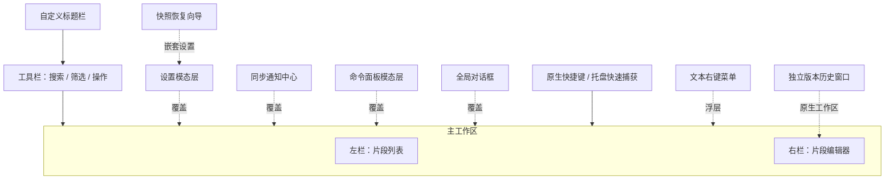
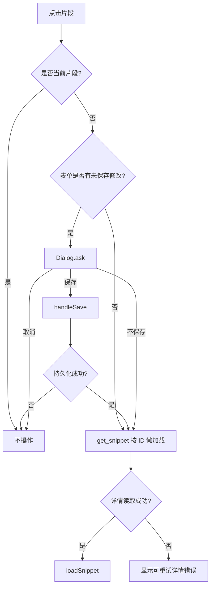
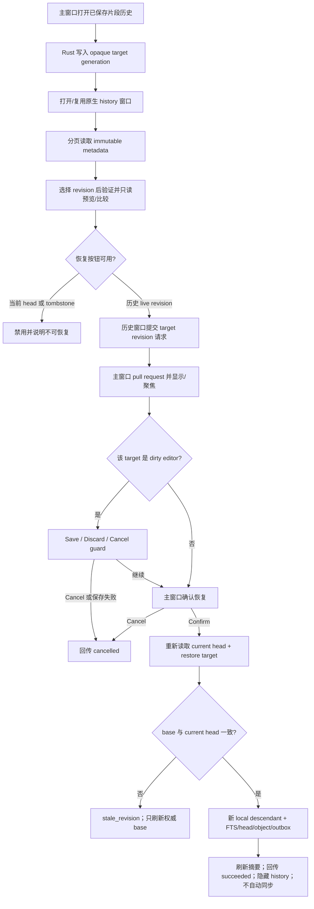
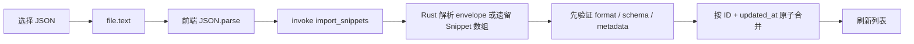
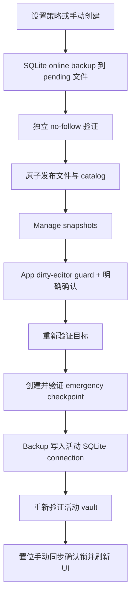
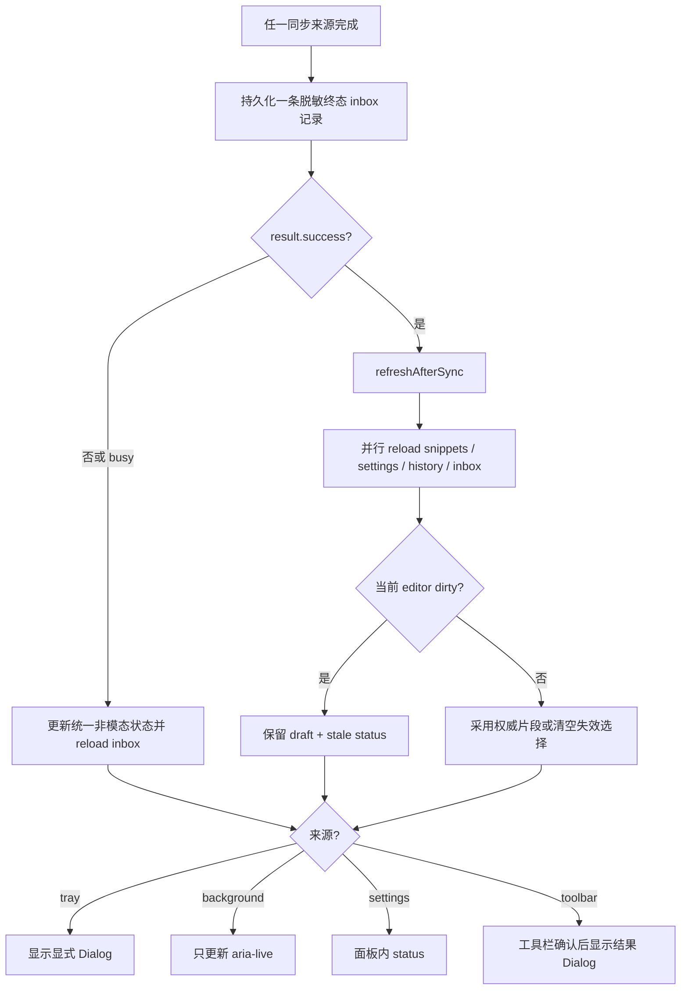

# SnipVault 功能设计

> 本文按用户能力描述当前 v2.5.1 实现，截至 2026-08-20。异常行为和能力缺口统一链接到 [已知限制](known-limitations.md)，不在本文中包装为预期设计。

## 1. 产品信息架构

SnipVault 使用单窗口双栏布局：



- 左栏固定显示当前过滤结果；结果使用语义 list/listitem，每个片段有独立打开详情按钮、复选框以及同级收藏和删除按钮，不产生嵌套交互元素。复选框不打开详情；批量操作只针对当前已加载的至多 200 项。
- 右栏在无选择时显示空状态；选择片段或新建草稿时懒加载编辑器。
- 设置在同一个 WebView 中以 overlay 方式显示，不创建第二个系统窗口。
- 设置、快照恢复、通知中心与全局 Dialog 共享模态栈，提供 dialog/alertdialog 语义、确定性初始焦点、焦点约束、背景隔离和关闭后焦点恢复；嵌套时只有最上层响应 Tab/Escape。版本历史是独立原生窗口，不属于该 DOM 模态栈：关闭会隐藏窗口以便复用，恢复确认和 Save/Discard/Cancel 始终回到主窗口处理。

主要编排位于 [App.tsx](../src/App.tsx)，视觉样式位于 [index.css](../src/index.css)。

## 2. 功能矩阵

| 功能 | 用户入口 | 当前行为 | 主要实现 |
|---|---|---|---|
| 浏览片段 | 左侧列表 | 工具栏将语言下拉、收藏星标和排序图标保持为紧凑独立控件；默认“最近更新”按 `(updated_at DESC, id DESC)`，排序图标可切换到“最近使用”，将有本机 usage 的项按 `(last_used_at DESC, updated_at DESC, id DESC)` 置顶，未使用项稳定置底。鼠标悬停或键盘聚焦排序图标时，会在布局外的本地化视觉 tooltip 中显示当前排序和切换提示；该视觉层 `aria-hidden`，按钮本身的完整可访问名称仍说明当前排序及下一次激活的目标；不把全部正文加载到 WebView | [SnippetList.tsx](../src/components/SnippetList.tsx)、[db.rs](../src-tauri/src/db.rs) |
| 批量整理 | 左侧列表操作条 | 仅选择当前已加载的最多 200 项；可设为收藏、取消收藏或确认后删除，后端全有或全无，成功后仅权威 reload 一次 | [App.tsx](../src/App.tsx)、[SnippetList.tsx](../src/components/SnippetList.tsx)、[db.rs](../src-tauri/src/db.rs) |
| 搜索 | 顶部搜索框 | 150ms 防抖的后端子串兼容搜索，组合语言/收藏筛选并重置分页 | [App.tsx](../src/App.tsx)、[useSnippets.ts](../src/hooks/useSnippets.ts)、[db.rs](../src-tauri/src/db.rs) |
| 语言筛选 | 工具栏下拉框 | 精确匹配 `snippet.language` | [Toolbar.tsx](../src/components/Toolbar.tsx)、[App.tsx](../src/App.tsx) |
| 收藏筛选 | 工具栏星标 | 在“全部”和“只看收藏”之间切换 | [Toolbar.tsx](../src/components/Toolbar.tsx) |
| 新建 | 新建按钮、空状态、`Ctrl/Meta+N` | 创建本地草稿，保存时前端生成 UUID | [App.tsx](../src/App.tsx)、[useSnippets.ts](../src/hooks/useSnippets.ts) |
| 编辑与保存 | 编辑器、`Ctrl/Meta+S` | 保存标题、代码、语言、描述、标签、收藏；已有片段仅在表单有修改时可保存，干净表单不发起持久化或产生新 revision，新草稿仍可创建 | [SnippetEditor.tsx](../src/components/SnippetEditor.tsx)、[App.tsx](../src/App.tsx)、[commands.rs](../src-tauri/src/commands.rs) |
| 版本历史与恢复 | 已保存片段编辑器的 History | 打开或复用独立原生窗口，分页检查 immutable revision、以紧凑时间线/语法预览/并排比较审阅两个版本；只可将历史 live 内容恢复为新的 descendant revision，tombstone 不可恢复、不会自动同步 | [RevisionHistoryWindow.tsx](../src/components/RevisionHistoryWindow.tsx)、[RevisionHistory.tsx](../src/components/RevisionHistory.tsx)、[commands.rs](../src-tauri/src/commands.rs) |
| 未保存保护 | 切换、新建、取消 | 显示“保存 / 不保存 / 取消”三选一 Dialog | [Dialog.tsx](../src/components/Dialog.tsx)、[App.tsx](../src/App.tsx) |
| 删除 | 列表卡片删除按钮 | 确认后按 ID 删除，并在必要时清空编辑区 | [App.tsx](../src/App.tsx)、[db.rs](../src-tauri/src/db.rs) |
| 收藏 | 列表星标或编辑器星标 | 列表立即持久化；编辑器仅修改表单，保存后持久化 | [SnippetList.tsx](../src/components/SnippetList.tsx)、[SnippetEditor.tsx](../src/components/SnippetEditor.tsx) |
| 标签 | 编辑器标签行 | Enter/逗号添加、Backspace 删除末项、已有标签建议 | [SnippetEditor.tsx](../src/components/SnippetEditor.tsx) |
| 代码编辑 | 右侧 CodeMirror | 语法解析、行号、括号、折叠、补全、选择匹配和换行 | [SnippetEditor.tsx](../src/components/SnippetEditor.tsx) |
| Codeglance | 编辑器右侧 | Canvas 预览、点击跳转、拖拽 viewport、调节宽度 | [SnippetEditor.tsx](../src/components/SnippetEditor.tsx) |
| 复制 | 编辑器复制按钮 | 将完整代码写入系统剪贴板，显示 2 秒成功状态，并 best-effort 更新本机 usage | [SnippetEditor.tsx](../src/components/SnippetEditor.tsx)、[App.tsx](../src/App.tsx) |
| 快速捕获 | `Ctrl/Meta+Shift+V`、托盘 | 显式读取非空剪贴板文本，立即创建可继续编辑的 plaintext snippet；快捷键注册失败不阻止托盘入口 | [capture.rs](../src-tauri/src/capture.rs)、[tray.rs](../src-tauri/src/tray.rs) |
| 命令面板 | `Ctrl/Meta+K`、工具栏 | 搜索已有新建、保存、导出、同步、设置、聚焦搜索、主题与当前片段收藏动作；复用业务 handler，不执行脚本 | [CommandPalette.tsx](../src/components/CommandPalette.tsx)、[App.tsx](../src/App.tsx) |
| 文本右键菜单 | input、textarea、CodeMirror | 剪切、复制、粘贴、全选；编辑器额外切换换行 | [App.tsx](../src/App.tsx) |
| JSON 导入 | 工具栏上传按钮 | 读取 `.json`，按 ID 和时间戳合并，再刷新列表 | [Toolbar.tsx](../src/components/Toolbar.tsx)、[db.rs](../src-tauri/src/db.rs) |
| JSON 导出 | 工具栏下载按钮、`Ctrl/Meta+E` | 后端写文件，成功后可通过受控命令打开后端派生的导出目录 | [commands.rs](../src-tauri/src/commands.rs)、[paths.rs](../src-tauri/src/paths.rs) |
| 设置 | 工具栏或托盘 | 使用共享权威脱敏设置、可编辑非敏感 draft、显式凭据操作、恢复状态、local SQLite snapshot 策略/管理、外部更新提示和未保存关闭保护 | [Settings.tsx](../src/components/Settings.tsx)、[useSettings.ts](../src/hooks/useSettings.ts) |
| 本地快照与完整恢复 | 设置的 Manage snapshots | 创建/列出后端验证的本地 SQLite checkpoint；恢复前创建 emergency checkpoint，完整恢复活动 vault，设置/OS 凭据不变并暂停自动同步 | [RestoreWizard.tsx](../src/components/RestoreWizard.tsx)、[snapshots.rs](../src-tauri/src/snapshots.rs) |
| 手动同步 | 工具栏、设置、托盘 | 三个入口执行同一个 WebDAV 合并；每个终态写一条脱敏通知，成功时统一刷新片段、设置、成功历史和 inbox | [App.tsx](../src/App.tsx)、[sync.rs](../src-tauri/src/sync.rs) |
| 同步通知 | 工具栏铃铛 | 持久、去标识化的终态 inbox，显示未读、已读、关闭和可重试的 Sync now；background 不弹 modal | [SyncNotificationCenter.tsx](../src/components/SyncNotificationCenter.tsx)、[db.rs](../src-tauri/src/db.rs) |
| 同步历史 | 设置页展开项 | 显示后端最近 20 条成功技术记录；与通知 inbox 分离 | [Settings.tsx](../src/components/Settings.tsx)、[db.rs](../src-tauri/src/db.rs) |
| 托盘 | 系统托盘 | 显示窗口、从剪贴板快速捕获、同步、设置、自启、退出 | [tray.rs](../src-tauri/src/tray.rs) |
| 单实例 | 再次启动程序 | 唤醒并聚焦已有窗口 | [main.rs](../src-tauri/src/main.rs) |
| 国际化 | 设置语言 | 中文/英文运行时切换并保存 | [LanguageContext.tsx](../src/context/LanguageContext.tsx)、[i18n](../src/i18n/index.ts) |
| 主题 | 工具栏或设置 | 工具栏临时切换有效深浅模式；设置保存 `system` / `dark` / `light` 与六种完整精选界面配色，保存成功后通过权威 provider 生效 | [main.tsx](../src/main.tsx)、[theme.ts](../src/theme.ts)、[Settings.tsx](../src/components/Settings.tsx) |

## 3. 片段列表

### 3.1 数据加载与排序

应用挂载后，[useSnippets.ts](../src/hooks/useSnippets.ts) 调用 `query_snippets` 请求最多 100 条摘要。工具栏以独立的语言下拉和收藏星标组合当前搜索、语言、收藏或标签条件；紧邻收藏的排序图标默认选择“最近更新”，以 `sort = updated` 请求。图标本身会随 `updated` / `recent` 改变；悬停或键盘聚焦时，组件会通过 body portal 显示不受工具栏裁切的简短视觉 tooltip（当前排序和切换提示）。该层为 `aria-hidden`，而按钮的完整本地化可访问名称仍说明当前排序和下一次激活会选择的排序。后端 [db.rs](../src-tauri/src/db.rs) 按：

```sql
ORDER BY updated_at DESC, id DESC
```

返回 `items / next_cursor / total`。选择“最近使用”时，使用仅本机的 `snippet_usage`，按：

```sql
ORDER BY (last_used_at IS NULL) ASC, last_used_at DESC, updated_at DESC, id DESC
```

有 usage 的项优先，未使用项位于稳定的后半段。后端只有 `updated` 与 `recent` 两种排序模式，并采用包含模式与排序字段的独立 cursor；不能把任一模式的 cursor 用于另一模式，因此分页不会因排序切换重复或遗漏。`snippet_usage` 不更改 `updated_at`、不进入 revision/outbox/WebDAV/JSON，迁移后的既有片段也不凭空获得使用历史。所有列表排序都不是搜索相关性排名。

每个 `SnippetSummary` 仅含 metadata 和最多 768 UTF-8 bytes 的 `content_preview`，不含完整正文。后端 page cap 为 200；主 UI 使用 100 条页并在存在 cursor 时显示 Load More。搜索、语言、收藏或排序改变从第一页重新开始，同时清除当前已加载项的批量选择；迟到的旧首屏或追加响应不能覆盖当前查询。

左栏和工具栏品牌区共用固定宽度变量；列表卡片内边距、标题操作区和代码预览按该宽度排布。代码预览占满卡片可用宽度，使用等宽字体、最多约三行内容和隐藏溢出，不横向滚动。

列表卡片显示：

- 语言颜色点。
- 勾选当前已加载项的可访问复选框；达到 200 项上限时未选项目禁用。
- 标题。
- 非空描述。
- 语言标签。
- 相对更新时间。
- 最多约三行代码预览。
- 带片段标题的收藏按钮和删除按钮；收藏暴露 `aria-pressed`。
- 当前选择高亮；选择按钮可用原生 Enter/Space 激活并暴露选择状态。

加载中显示 loading 状态；初始数据库/IPC 失败显示与空数据库不同的错误状态和“重试”操作。重试成功后使用 `load()` 返回的权威页；已有列表的刷新失败会保留当前可见数据，并在列表顶部显示可重试提示。Load More 有独立 loading/error 状态，追加失败不会移除已经加载的卡片。

### 3.2 相对时间

[SnippetList.tsx](../src/components/SnippetList.tsx) 内部手写 `timeAgo()`，按当前语言输出：

- 刚刚 / now
- 分钟
- 小时
- 天
- 月

该逻辑由 [SnippetList.tsx](../src/components/SnippetList.tsx) 内部实现，没有引入日期工具依赖，也没有复用 locale 中已有的全部相对时间键。

### 3.3 选择行为

点击卡片打开详情会调用 `App.handleSelect()`；勾选复选框只改变批量选择，不读取详情也不触发当前脏草稿的导航确认：



详情请求期间右栏显示 loading 状态；失败后保留目标摘要和重试按钮，不伪装成“未选择”。`loadSnippet()` 更新：

- `selected`
- `isNew = false`
- `form`
- `originalFormRef`

只有 `handleSave()` 返回成功后才继续加载目标片段；标题校验或 IPC 保存失败会停留在当前表单。

## 4. 搜索和筛选

### 4.1 当前主界面搜索

主界面经 [useSnippets.ts](../src/hooks/useSnippets.ts) 调用 `query_snippets`，不会先把全部正文送入 WebView：

- 防抖：150ms。
- 搜索字段：标题、代码正文、描述、标签值。
- 语言：精确匹配。
- 收藏：`null` 表示不过滤，`true` 表示只看收藏。
- 排序：工具栏在收藏星标后提供独立的两态图标，可在 `updated`（默认）与 `recent` 之间切换；悬停或键盘聚焦显示当前排序和切换提示的 `aria-hidden` 视觉 tooltip，按钮完整的本地化可访问名称仍说明当前与下一次激活的排序，`recent` 只是本机回访顺序，不是相关度。
- 搜索、语言、收藏、排序和可选精确标签条件使用 AND 组合。
- `%`、`_`、双引号和反斜线按字面值，不作为用户可控 MATCH/LIKE 语法。
- 规范化查询至少 3 字符且 SQLite 支持 trigram 时使用字面量化 FTS5；短查询和 tokenizer fallback 使用转义 LIKE，继续提供子串语义和 CJK 支持。
- 结果按所选稳定更新时间或本机最近使用顺序分页，不提供或声称相关度排名。

工具栏左侧品牌区显示装饰性叠片图标、应用名称、本地代码片段库副标题和数量徽标；数量徽标显示后端返回的当前过滤总数，不是已加载页长。

### 4.2 请求与分页协调

每次首屏查询递增 generation，并绑定规范化 query key（包含排序）。搜索、语言、收藏或排序变化会取消旧分页语义、清除追加错误和批量选择，并从 cursor `null` 开始；只有 generation、query key 和 cursor 仍一致的响应才能替换或追加列表。Load More 按 ID 去重，并通过独立 append request/in-flight guard 立即阻止同一 cursor 的重复并发请求。

### 4.3 过滤后的选择

筛选、搜索或排序改变会清除批量选择；Load More 保留已经选择的已加载项。当前 `selected` 详情不会因筛选变化自动清除：即使片段不再出现在左侧结果中，右侧编辑器仍可继续显示和编辑它。

## 5. 新建、编辑和保存

### 5.1 表单模型

前端 [types/index.ts](../src/types/index.ts) 定义：

- `Snippet`：包含 ID、业务字段和创建/更新时间。
- `SnippetForm`：只包含可编辑业务字段。

空表单 `EMPTY_FORM`：

- 标题、内容、描述为空。
- 语言为 `plaintext`。
- 标签为空。
- 不收藏。

### 5.2 新建

入口：

- 工具栏“新建”。
- 空状态入口。
- `Ctrl+N` / macOS `Meta+N`。

`startNewSnippetDraft()` 清空选择、设置 `isNew = true` 并重置表单。编辑器标题输入自动聚焦。

保存新建片段时：

1. 前端要求标题 `trim()` 后非空。
2. [useSnippets.ts](../src/hooks/useSnippets.ts) 使用 `crypto.randomUUID()` 生成 ID。
3. IPC 调用 `create_snippet`。
4. [commands.rs](../src-tauri/src/commands.rs) 生成 UTC RFC 3339 时间，使 `created_at == updated_at`。
5. [db.rs](../src-tauri/src/db.rs) 插入 SQLite。
6. 后端返回最终 `Snippet`；前端将它设为当前选择、重建表单快照并刷新列表。

创建成功后编辑器保持在刚创建的片段。

### 5.3 编辑

可编辑字段：

- 标题。
- 代码内容。
- 语言。
- 描述。
- 标签。
- 收藏。

CodeMirror 是受控输入：`form.content → CodeMirror value → onChange → App.setForm`。

### 5.4 脏数据检测

`isFormDirty()` 逐项比较当前表单和 `originalFormRef`：

- 标题、内容、语言、描述、收藏直接比较。
- 标签通过 `JSON.stringify()` 比较，因此顺序变化也算修改。

脏状态用于：

- 编辑器未保存圆点和文本。
- 已有干净片段的编辑器 Save 按钮和命令面板 Save 动作禁用；`Ctrl/Meta+S` 仍拦截 WebView 默认行为，但经 `handleSave()` 成功 no-op，不触发 IPC、时间戳、revision 或 outbox 写入。新草稿不受此 no-op 规则限制。
- 切换片段前提示。
- 新建前提示。
- 取消编辑前提示。
- 控制取消按钮显示。

### 5.5 更新

当前更新调用链：

```text
App.handleSave
→ useSnippets.update(id, selected.revision_id, form)
→ invoke("update_snippet", baseRevisionId)
→ commands::update_snippet 校验输入
→ db::update_snippet 在同一 transaction 读取并比较 head、保留 created_at、生成 updated_at/revision_id、写 snippet+FTS+head+outbox
→ 返回最终 Snippet 并刷新列表
```

`Snippet` 与列表 `SnippetSummary` 都携带 SQLite head 的 `revision_id`。已有片段只有当前表单与 `originalFormRef` 存在实际差异时才会进入更新调用链；干净表单的 Save 是成功 no-op，不校验标题、不生成时间戳/revision/outbox，也不刷新列表。正常保存以所选详情的 revision 作为 base；若数据库 head 已变化，Rust 返回结构化 `stale_revision` 和安全的当前 revision ID，不写入任何 partial row/outbox。前端保持当前 form/formRef（包括保存等待期间的新编辑），尝试读取最新权威详情只更新 selected base，不覆盖草稿，并显示“有新数据、已保留编辑”；用户需要再次明确保存。保存请求期间如果用户继续编辑或切换，完成回调仍不会用已提交的旧表单覆盖较新的 UI 状态。

本地 revision/head/outbox 是当前 WebDAV v2 的持久同步基础。待处理 outbox 超过 10,000 条、64 MiB 或单 revision payload 上限时，mutation 以 `outbox_full` 整体拒绝；同步成功只按精确 revision ID 确认已经发布且仍 pending 的条目。

## 6. 版本历史、比较与安全恢复

已保存片段的编辑器头部提供“历史”入口。它调用主窗口专用 `open_revision_history`，动态创建或复用 [RevisionHistoryWindow.tsx](../src/components/RevisionHistoryWindow.tsx) 的独立原生工作区；该窗口只通过 Rust state pull opaque target 和 generation，不把 ID 放进 URL、标题或浏览器存储，也不持有正文、路径、WebDAV URL、凭据或诊断。时间线以有界 cursor page 读取该片段已有的 immutable `revision_objects`，而不建立第二份 history 表；选择一项后才请求经过 hash/payload/片段归属验证的只读 live preview 或 tombstone 元数据。

- 历史按 revision time/id 倒序分页；当前 head 与 local/import/remote origin 在 UI 中可辨认。紧凑时间线使用主列表一致的中性 active surface、边框和左侧 accent rail，而非完整 accent-dim diff 卡片；可见时间使用运行时 locale 并精确到秒，受限宽度中截断时可通过悬停 title 取得完整本地化时间。
- 两个同片段 revision 可在紧凑的 review desk 中比较：左侧时间线轨道，右侧固定的已选 revision 上下文/比较/恢复命令带，以及占据剩余高度的唯一代码 stage。时间线选中态保持中性 active surface，以清晰的 accent rail 和边框标示，不使用整行 accent 填充；命令带保持低权重 utility chrome，使代码 stage 成为视觉焦点。live revision 预览使用一个紧凑、只读的 editor-chrome header：标题为主信息，language badge、最多两个 passive tag chip 与 `+N` 溢出摘要、以及不可交互的历史收藏状态为低权重上下文；没有标签时不显示占位行，长标题和 tag 在各自边界内截断，完整值可通过辅助标签或悬停访问。左侧是可任意选择的“比较基线”，右侧是所选版本；live 内容按原始行号对齐，显示新增/删除/替换 marker 及编辑器同款语法颜色。成对的替换行在两侧都以中性的 `~`、accent 窄 rail 和低强度 accent gutter 标示为“修改”，并在摘要中只计入“修改”；未配对新增/删除才分别计入 `+新增`/`−删除`，仍使用绿色/红色窄 rail 与低强度 gutter。所选版本保持中性编辑器 surface，不使用整行 Git 红绿填充。视觉 `~`/`+`/`−` marker 和行号不向辅助技术重复朗读；真实替换行会按左右侧提供本地化的“之前版本/所选版本”提示，未配对新增/删除源代码行提供本地化方向提示。代码 review 一律不自动换行；窗口宽度至少 1200px 时采用弹性双栏，不产生外层横向滚动，只有单个真实长行会在其所属 source pane 内横向滚动。历史窗口最小宽度的 1000–1199px 范围会显示明确的“比较基线 / 所选版本”单 pane 切换按钮，默认所选版本；切换只改变已加载比较的呈现，不重新请求或重新计算，也会用 `display: none` 移除未显示 pane 的键盘与辅助技术焦点。每一侧按该历史 revision 自身的 language 着色，语言变更不会错误继承当前编辑器语言；双栏详细对齐时仅同步两侧垂直滚动。Comparison 只在 stage 中显示一次并保留一个 `h2`；内部工具栏仅显示比较摘要和窄宽度 pane 切换控件。
- 比较是前端本地、受限的两路逐行 diff：只在总字符/行数、matrix/渲染行数和短计算预算内执行；超限或高度差异时明确退回为有行号、语法高亮、无自动换行的完整并排源代码，绝不冻结界面、生成部分结果或伪造差异。它不是 word-level/semantic diff、三方 merge 或冲突解决 UI。
- tombstone 仍明确显示为“无源代码”的删除状态；与 live revision 对比时不会把 tombstone 伪装为空文件，两个 tombstone 不绘制伪造代码 diff。
- 浏览/比较不改变当前 editor draft。历史窗口关闭时隐藏以便复用，主窗口不会因关闭/托盘/第二实例而被错误切换；主窗口隐藏到托盘时历史窗口也隐藏。
- 当前 revision 与 tombstone 都不可恢复。选择历史 live revision 后，历史窗口只提交 generation 和 target revision ID；Rust 验证后持久保留 pending request 并通知主窗口，且直接 descendant restore IPC 同样拒绝非 main window，从协议边界阻断 child 绕过确认。App 显示、解除最小化并聚焦主窗口，只在该 target 正好是当前 dirty draft 时复用 Save/Discard/Cancel guard，任何 target 都需要主窗口确认后才重新读取 current head 并调用 restore。
- Rust 在同一 transaction 比较 current head 与 `base_revision_id`。成功时保留片段 ID 和原 `created_at`，以**当前 head 为 parent**创建一条新的 local descendant revision、更新 live row/FTS/head/object，并像普通编辑一样写 pending outbox。任何历史 object/head 都不改写、不重定向，也不会自动同步。
- 如果 restore 发现 stale base，App 只在当前显示该 target 时刷新权威 selected base，绝不覆盖 dirty form；成功才刷新列表、向历史窗口回传成功并隐藏它。取消/失败只回传稳定状态，不传草稿或原始诊断。



## 7. 删除和收藏

### 7.1 删除

列表删除按钮阻止卡片选择事件，调用 `handleDelete(id)`：

1. 全局 Dialog 请求确认。
2. IPC `delete_snippet` 在一个 transaction 中删除 live SQLite row；FTS delete trigger 同步移除搜索文档；`snippet_heads` 改为带 parent/device/hash/time 的 tombstone；同一 immutable revision 写入 durable outbox。
3. 只有 IPC 成功后，如果删除的是当前片段才清空编辑状态；失败时保留 selection、form 和 dirty snapshot，并显示本地化错误。
4. 成功后重新加载列表；若删除已完成但权威 reload 失败，明确提示“更改已保存但刷新失败”，不会把它表述为删除失败。

SQLite v5 的 tombstone 由 production WebDAV v2 作为不可变 deletion revision 上传，并同时保存在本地 durable `revision_objects` 中。其他设备把该 tombstone 作为 head 时会删除对应 live row/FTS 并保留删除 ancestry；本地和远端 tombstone 当前无限期保留。历史时间线会将 tombstone 明确标为已删除并允许只读检视/比较，但第一版不允许恢复 tombstone，也不提供自动 GC 或完整冲突解决 UI。

### 7.2 批量整理

操作条只选择当前已经加载在 WebView 中的摘要，最多 200 个，不隐式匹配或修改未加载的搜索结果。用户可以选择“设为收藏”“取消收藏”或“删除”：收藏操作是幂等 set，不是对混合状态的歧义 toggle；删除先显示选择数量确认。

后端对每个批量请求排序/去重并校验边界，先读取并验证全部 ID 都是 live snippets，再在一个 SQLite transaction 中执行。实际改变的每条收藏和每条删除各自产生 immutable revision/object/outbox（删除为 tombstone）；已经满足目标收藏状态的片段不产生 revision。任一 ID 不存在、已删除、outbox 满或任意写入失败时，整个 transaction 回滚，绝不会部分成功。前端若当前 dirty 编辑片段被包含，先复用 Save/Discard/Cancel guard；取消或保存失败不执行 mutation。成功只做一次权威 reload，reload 失败明确报告“更改已保存、刷新失败”。

### 7.3 收藏的两种单项语义

| 入口 | 行为 |
|---|---|
| 列表卡片星标 | 调用 `toggle_favorite`；后端在一个 transaction 中切换值、生成 `updated_at/revision_id` 并写 head/outbox，返回权威 `Snippet` 后 reload/reconcile |
| 编辑器头部星标 | 只修改 `form.is_favorite`；需要点击保存才写数据库 |

列表收藏 IPC 失败时 Hook 不做 optimistic 更新，当前可见收藏状态保持不变并显示本地化错误。成功后的权威 reload 会刷新干净的已选表单；如果编辑器已有未保存修改，表单不会被覆盖，右侧显示非模态“有新数据、已保留编辑”状态。reload 自身失败会准确提示收藏更改已经保存、仅刷新失败。

## 8. 标签系统

标签存储在片段的 `tags: string[]`，后端以 JSON 字符串保存在 SQLite TEXT 字段。

### 8.1 添加和删除

- 在标签输入框按 Enter 或逗号提交。
- 输入为空时按 Backspace 删除最后一个标签。
- 点击标签上的 × 删除指定标签。
- 完全相同的标签不会重复添加。
- 比较区分大小写，因此 `React` 和 `react` 是不同标签。

### 8.2 建议

`useSnippets` 通过轻量 `get_snippet_tags` IPC 从 SQLite 的 `json_each(tags)` 读取去重、排序后的标签元数据，不读取完整正文。编辑器：

- 排除当前片段已有标签。
- 按输入做不区分大小写的包含匹配。
- 最多展示 8 个建议。
- 用 ArrowUp/ArrowDown 循环移动活动建议，Enter 优先选择活动项；没有活动建议时才创建原始输入。
- Escape 关闭建议；点击输入或重新聚焦可再次打开。
- 鼠标点击建议在 pointer down 阶段保持输入焦点协调，不依赖延时 blur timer。
- 控件暴露 combobox/listbox/option、expanded、controls、autocomplete 和 active-descendant 语义。
- 点击建议后添加。

标签建议失败属于补充元数据错误：保留上次成功值，不覆盖主列表的权威错误/空状态。

## 9. CodeMirror 编辑器

### 9.1 加载策略

[LazySnippetEditor.tsx](../src/components/LazySnippetEditor.tsx) 使用 `React.lazy()` 延迟加载 `SnippetEditor`：只有选择片段或新建草稿才请求编辑器模块；无选择的浏览、搜索、同步和设置流程不会在空闲时预加载 CodeMirror。生产构建将 editor runtime、UI/services 和语言 parser family 分为有界独立 chunk，使首次进入编辑流程并行加载所需依赖，而不保留单个超大 editor chunk。

### 9.2 编辑器加载失败与恢复

`Suspense` 只负责等待 editor module 的下载；如果懒加载模块请求被拒绝，或编辑器首次 render 抛出异常，`SnippetEditorLoadBoundary` 会把故障限制在右侧编辑器 pane，而不会让整个 WebView 白屏。右侧显示本地化的 `role="alert"`、明确的“重试加载编辑器”按钮；侧栏、工具栏、设置、Dialog、当前选择和 App 持有的 `form` 草稿继续可用。

Retry 只在用户明确点击后发生：App 递增加载尝试号，`LazySnippetEditor` 在组件边界为该尝试创建新的 lazy component identity；开发环境从绝对 Vite `/src` module URL 附加一次性 query 以避免重用已经 rejected 的浏览器 import promise；不会自动重试、轮询端口、重新请求详情、刷新页面或清空草稿。生产仍使用静态可分析的 lazy import 与既有 editor chunk。成功 retry 会用当前选中片段和受控 form 重建编辑器；标题、正文、描述、语言、标签、收藏及脏状态保留，但 CodeMirror cursor/selection/undo history、minimap 宽度和尚未提交的标签输入等编辑器局部临时状态会重置。

在开发模式里，如果 Vite server 已停止，提示会要求先恢复 Vite 后再重试；该 UI 只防止应用白屏，不负责重启或解释 Vite 进程为何退出，详见[已知限制](known-limitations.md#62-vite-开发服务器中断仍需单独诊断)。

### 9.3 基础能力

当前 `basicSetup` 开启：

- 行号。
- Selection 绘制。
- 当前行高亮。
- 选中内容匹配高亮。
- 自动完成。
- 括号匹配和自动闭合。
- 代码折叠 gutter。
- 输入缩进。

### 9.4 主题和高亮

编辑器组合：

- `githubDark` / `githubLight`。
- 自定义 GitHub 风格 `HighlightStyle`。
- `EditorView.theme()` 设置高度、字体、滚动、光标、选区和换行；完整界面配色通过语义 token 同时控制编辑器 surface、gutter、active gutter、光标、选区、匹配括号和 Canvas viewport。Canvas 背景从 minimap pane 的计算 token 读取；syntax token 颜色不随界面配色变化。

主题由当前有效 `dark` / `light` 值驱动，而不是直接读取持久化的 `system` 偏好。

### 9.5 自动换行

`editor_line_wrap` 是持久设置。当前可见入口位于编辑器右键菜单，而不是设置页：

- 开启换行时增加 `EditorView.lineWrapping`，隐藏横向滚动并允许断词。
- 关闭时保留 `pre`、`max-content` 和横向滚动。

切换会从共享 provider 读取脱敏设置视图，只修改非敏感 `SettingsDraft`，并以 `SecretAction.Keep` 调用 `save_settings`；持久凭据不会进入该流程。

## 10. 语言选择和解析器能力

### 10.1 UI 可选择语言

[utils/languages.ts](../src/utils/languages.ts) 定义语言选项和颜色。当前 UI 包含：

| 类别 | 语言 ID |
|---|---|
| Web / JS | `javascript`, `typescript`, `jsx`, `tsx`, `html`, `css`, `php` |
| 系统 / 通用 | `rust`, `go`, `java`, `cpp`, `c`, `csharp`, `swift`, `kotlin` |
| 脚本 | `python`, `ruby`, `bash`, `lua`, `r` |
| 数据与配置 | `sql`, `json`, `xml`, `yaml`, `toml`, `dockerfile` |
| 文档及其他 | `markdown`, `scala`, `elixir`, `plaintext` |

### 10.2 编辑器语言扩展分类

编辑器专用 [languageExtensions.ts](../src/components/languageExtensions.ts) 与 UI 元数据 [languages.ts](../src/utils/languages.ts) 分离；后者不导入 CodeMirror 包。分类由 `Record<LanguageId, LanguageSupportKind>` 穷尽约束，并由测试保证每个可选择 ID 都有明确策略。

| 类型 | 语言 ID |
|---|---|
| parser-backed | `javascript`, `typescript`, `jsx`, `tsx`, `python`, `rust`, `go`, `java`, `cpp`, `c`, `csharp`, `php`, `sql`, `html`, `css`, `json`, `yaml`, `xml`, `markdown`, `elixir` |
| StreamLanguage 语法着色 | `ruby`, `swift`, `kotlin`, `bash`, `dockerfile`, `toml`, `lua`, `r`, `scala` |
| 有意纯文本 fallback | `plaintext` |

HTML 使用 `@codemirror/lang-html`，Go 使用官方 `@codemirror/lang-go`，C# 使用维护的 `@replit/codemirror-lang-csharp`，Elixir 使用 `codemirror-lang-elixir`。StreamLanguage 映射来自 `@codemirror/legacy-modes`，提供词法流式语法着色，**不是完整 Lezer parser**；因此不能承诺与 parser-backed 语言相同的结构折叠、语法树导航或语言服务能力。未知旧持久 ID 安全回退 plaintext。

## 11. Canvas Codeglance MiniMap

MiniMap 是 [SnippetEditor.tsx](../src/components/SnippetEditor.tsx) 内的自研 Canvas 实现；仓库不依赖第三方 minimap 包。

### 11.1 绘制

- 将内容按行拆分，每行默认 4px 高。
- 复用 CodeMirror 的语言扩展、语法树和 `HighlightStyle` 取得 token 范围，并读取编辑器实际计算后的颜色；无 token、纯文本或受限解析预算未完成的部分使用编辑器默认前景色。
- 使用行长度的 Q1/Q3/IQR 识别异常长行，避免单行把整个预览压缩得过窄。
- 空白字符仅保留水平几何位置，不绘制色条，避免缩略视图把缩进或分隔空格误读为深色代码。
- Canvas 宽度由用户拖动决定，高度至少覆盖内容。

Canvas 仍只压缩代码的几何形状，但语义 token 和颜色与当前 CodeMirror 编辑区共用同一条语言/高亮管线：parser-backed 语言可覆盖嵌入式和跨行 token，StreamLanguage 则匹配编辑区自身产生的词法着色。

### 11.2 滚动同步

CodeMirror 的 `view.scrollDOM` 是主滚动源：

- 主编辑器滚动时更新 minimap pane 和 viewport。
- 点击 minimap 按比例滚动主编辑器。
- 拖动 viewport 更新主编辑器 `scrollTop`。
- 主内容不可滚动时隐藏 viewport。
- Canvas、minimap wrapper 和 viewport 对辅助技术隐藏；CodeMirror 本体保持可聚焦、可编辑和键盘滚动。
- 分隔拖拽只调整非必要的视觉 codeglance 宽度，标记为装饰性，不改变编辑器内容访问。

### 11.3 宽度

- 默认 96px。
- 最小 96px。
- 最大 360px，同时不超过整个 split 宽度约 45%。
- 宽度只保存在组件 state，切换片段或重启不持久化。

## 12. 剪贴板和文本右键菜单

### 12.1 复制完整代码

编辑器“复制”按钮调用 Tauri Clipboard 插件的 `writeText(form.content)`；成功后按钮显示“已复制”两秒，同时以 best-effort `record_snippet_usage` 写入本机 usage；usage 失败不会阻断复制或提示错误。普通复制和文本右键菜单不是快速捕获，不会创建新片段。

### 12.2 快速捕获

`Ctrl/Meta+Shift+V` 是 Rust 原生注册的全局快捷键，托盘“从剪贴板快速捕获”是其可见替代入口。二者仅在用户显式触发时调用原生 Clipboard Manager 读取文本：空白、非文本、读取失败或字段校验/写入失败时不创建任何片段，前端只显示脱敏失败反馈，Rust 日志、公开事件和错误都不包含剪贴板正文、派生标题、token 或绝对路径。全局快捷键因 OS 冲突、权限或平台限制注册失败只记录通用 warning，不阻止启动，托盘入口仍可使用。

成功时后台线程从首个非空行生成受字段边界限制的标题，立即创建普通 plaintext snippet、对应 revision/object/outbox 和一条本机 usage；它会按用户已有 WebDAV 配置正常参与同步。完成事件只含 `source`、`success` 和可选 `snippet_id`，不会自动抢占或唤醒隐藏主窗口；若 WebView 已打开，前端刷新列表但不覆盖 dirty 草稿，并给出短暂状态反馈。listener 尚未就绪时，前端用 `take_quick_capture_completion` 消费最近一次结果。快速触发期间原生服务只处理一个捕获，避免重复创建。

### 12.3 全局右键菜单

`App` 在 window 上监听 `contextmenu`，只对以下可编辑文本目标显示自定义菜单：

- 支持文本编辑的 input 类型和 `textarea`
- `[contenteditable=true]`
- CodeMirror `.cm-editor`

在按钮、列表、空白区域和其他不支持目标上不调用 `preventDefault()`，平台原生菜单保持可用。自定义菜单使用 `menu` / `menuitem` 语义，打开后聚焦首项，并支持 ArrowUp、ArrowDown、Home、End 和 Escape；Escape 关闭后恢复原文本目标焦点。

- 剪切。
- 复制。
- 粘贴。
- 全选。
- CodeMirror 场景下额外切换自动换行。

普通 input/textarea 使用 selection range 和 `setRangeText()`；CodeMirror 仅在已打开的 `.cm-editor` 菜单动作中按需加载 `EditorView` 后使用 `findFromDOM()` 和 transaction，解析不到 view 时安全关闭菜单而不会回退操作其他元素；其他 contenteditable 回退到 `document.execCommand()`。Clipboard read/write 失败显示本地化反馈；剪切只有在 `writeText` 成功后才删除选区，避免复制失败时丢失文本。

## 13. JSON 导入和导出

### 13.1 导入

入口是工具栏隐藏 file input，只接受 `.json`。



后端在进入 transaction 前完成整批校验，并限制：

- JSON 文本最多 25 MiB。
- 最多 10,000 条。
- ID、字段长度、标签数量/长度和 RFC 3339 时间必须有效。
- 同一批次不能有重复 ID。

合并规则：

- 新 ID：插入。
- 已有 ID，导入时间戳更大：更新。
- 否则跳过。

任一条无效会整体拒绝，不产生部分写入。成功后只执行一次共享权威 reload/reconcile，不在 Hook 和 App 重复加载；成功提示数量是 `inserted + updated`，不是输入总条目。导入已完成但 reload 失败时，Dialog 明确说明“导入更改已保存、刷新失败”。

### 13.2 导出

入口：工具栏下载按钮或 `Ctrl/Meta+E`。

1. 后端获取全部片段并序列化为 pretty JSON envelope，包含稳定 `format_id`、`schema_version`、应用版本、RFC 3339 导出时间和 `snippets`。
2. 优先创建并写入 `Downloads/SnipVault`。
3. 不可写时回退到 `<data_dir>/exports`。
4. 文件名 stem 使用本地时间 `snipvault-backup-YYYY-MM-DD_HH-MM-SS`；后端以 `create_new(true)` 创建，冲突时依次增加 `-1`、`-2`，同秒导出不覆盖。
5. 前端显示成功 Dialog；用户选择打开时调用受控 `open_trusted_directory("export")`，后端自行派生路径。导出 IPC 只返回 `saved_in_downloads`，不返回绝对文件/目录路径。

导入继续接受旧顶层 `Snippet[]`。不支持的 format/schema 或 malformed envelope metadata 在任何写入前整体拒绝；已有大小、条目、字段校验和 transaction merge 语义保持不变。

## 14. 设置

设置是主窗口内的 modal overlay。根级 [SettingsProvider](../src/hooks/useSettings.ts) 持有一份由 `App`、`SettingsPanel` 和其他设置消费者共享的权威 `SettingsView`；该 DTO 只包含非敏感设置、`webdav_secret_configured` 和安全状态，不含 persisted secret。[Settings.tsx](../src/components/Settings.tsx) 只维护本次打开期间的非敏感 draft/baseline，以及独立的临时 secret 输入/操作。

`last_sync_at`、凭据状态、设置恢复状态和 `sync_confirmation_required` 是后端维护的字段，不进入 draft/baseline 脏比较。面板收到新的权威设置时：

- draft 干净：baseline 和 draft 一起采用新的用户可编辑字段。
- draft 已脏：保留用户输入；如果权威用户字段相对 baseline 变化，显示非模态、可访问的“已在其他位置更改”状态。
- 仅 `last_sync_at` 变化：更新上次同步显示，不制造 draft 冲突。

### 14.1 通用设置

- 开机自启。
- 关闭时最小化到托盘。
- 主题：跟随系统、暗色、亮色；界面配色可选天空蓝、紫罗兰、翡翠绿、琥珀金、玫瑰红或简约白（内部值 `white`）。每项以可辨识的 mini palette 卡片展示深色 canvas、raised panel、交互 accent 与内容标记，而非难以分辨的单色图标；简约白会在浅色/深色模式下分别复现初始版本的中性界面。每个精选值在暗色和亮色下都有经审查的完整 surface/text/border/action token，覆盖背景、侧栏、卡片、标题栏、弹窗、输入控件、状态消息、编辑器 chrome 和 codeglance；不改变语法高亮、语言标签色或状态的语义含义。
- 界面语言：中文、英文。

### 14.2 WebDAV 设置

- WebDAV URL：必须为 HTTPS；只为本机测试允许 `http://localhost`、`http://127.0.0.1` 和 `http://[::1]`。
- 用户名。
- 密码 / API Key / token：持久值存入操作系统凭据库，不写入新的 `settings.json`，也不返回 WebView。
- 认证模式：Auto、Basic、Digest、Bearer、None。
- HTTP 总超时：10、30、60、120 秒。
- 自动同步开关。
- 同步间隔：5、15、30、60、120 分钟。
- 立即同步。
- 同步历史。
- 上次同步时间。

凭据输入框每次打开都保持空白，浏览器自动填充提示为 `new-password`；“已安全保存”的 placeholder 只说明存在性，不包含值。保存使用显式动作：

- **Keep**：不读取、不改变已存凭据；没有键入替换值时默认使用。
- **Replace(value)**：用户键入的新值只保留在当前 UI 输入中，保存成功后清空。
- **Clear**：删除已存凭据；在提交前可选择“保留已存凭据”取消 Replace/Clear。

面板显示安全的 configured/not configured/unavailable/denied/invalid/ambiguous/migration required/recovery required 状态。需要操作时禁用 Sync Now；迁移或补偿恢复只能通过 Replace 或 Clear 解除，Keep 会被后端拒绝。

### 14.3 保存与关闭保护

保存设置时：

1. 前端把非敏感 draft 和显式 `Keep | Replace | Clear` 交给共享 provider；不会合并或提交 persisted secret。
2. 后端保留当前 `last_sync_at` 和内部元数据，校验枚举、HTTPS/loopback URL、超时、间隔、字段与替换 secret 边界。
3. Replace/Clear 时先快照凭据状态并应用 secret action；若 `auto_start` 变化，再更新 OS 状态。
4. 无 secret JSON 写入临时文件并同步，通过 `.bak` 备份替换；成功后才提交内存设置。
5. 后续步骤失败时按相反方向恢复 autostart 和凭据；补偿失败返回安全 `recovery` 错误，标记必须 Replace/Clear 的恢复状态。
6. 后端返回最终脱敏 `SettingsView`，provider 更新唯一权威 state，并使较旧 pending reload 失效。
7. 面板只在全部持久化成功后更新 baseline、由根级 `ThemeProvider` 从返回的权威 `SettingsView` 原子应用有效深浅模式和完整界面配色、应用语言、清空 secret 输入，并显示约两秒“已保存”；失败时保留面板与 draft，显示本地化安全错误。
8. 设置保存或托盘自启动切换成功后都会刷新托盘复选状态。

Save 在 draft 干净或正在保存时禁用。X、外层 backdrop 和 Escape 都进入同一个异步关闭 guard：干净时直接关闭；dirty 时显示“保存 / 放弃 / 取消”。选择保存只有在持久化成功后才关闭；失败或取消继续停留，放弃则关闭。Settings 和内层 Dialog 共享 [ModalSurface.tsx](../src/components/ModalSurface.tsx) 的模态栈：只有栈顶处理 Tab/Escape，背景临时 inert/ARIA 隔离，内层关闭后恢复到触发按钮，Settings 最终关闭后恢复到设置入口。

设置首次加载失败显示与 loading 分离的错误和“重试”按钮；手动同步失败也使用同一结构化错误本地化。

### 14.4 损坏设置与旧凭据恢复

启动时如果当前 `settings.json` 仍含旧 `webdav_password` 字段，Rust 会尝试一次性迁移到平台凭据库，只有安全写入成功后才重写并移除 JSON 字段。失败时保留遗留文件但不加载其 secret，也不允许凭据驱动的持久自动同步；设置页显示恢复说明，用户需 Replace 或 Clear。

如果当前 `settings.json` 是无效 JSON，应用把它移到唯一、不覆盖的隐藏 `.corrupt` 同级文件，再尝试有效 `.bak`；没有有效备份时写入并加载安全默认值。设置页分别显示 backup-restored/defaults-loaded 提示，并可调用受控后端命令打开数据目录；错误和 IPC 不显示绝对路径。

### 14.5 立即同步与未保存设置

设置面板“立即同步”始终使用后端已持久化配置。只要 WebDAV URL、用户名、secret action、认证模式、超时、自动同步开关或同步间隔中的任一 draft 状态与 baseline 不同，Sync Now 就禁用，并通过 `aria-describedby` 显示本地化“请先保存设置再同步”说明。URL 为空、凭据状态需要操作或已有同步运行时同样禁用。

自动同步说明明确区分首次与后续尝试：启用或改变有效配置后，首次尝试可能在下一次约 15 秒 worker poll 内开始；成功后恢复所选间隔。

### 14.6 本地快照与完整恢复

设置的“本地快照”区可以启用或关闭本机策略，频率仅为 daily / weekly，保留数量仅为 7 / 30 / 90。独立 worker 仅在 SnipVault 正在运行时每 15 分钟检查当前策略：没有有效快照时补建一个，达到选定最小间隔后创建下一份；失败后最多等待一小时再试。用户也可以在快照管理向导中立即创建 checkpoint，或通过后端受控目录动作打开快照目录；WebView 从不接收路径、filename、checksum 或数据库诊断。

快照管理向导列出经过 catalog 验证的安全摘要。每份候选在创建和恢复前都会使用 read-only/no-follow SQLite 连接校验 integrity、当前 schema、唯一 device identity、snippet count、文件大小和 SHA-256；缺失或不能再次验证的条目明确标为 unavailable，不能恢复。快照文件是完整 SQLite vault checkpoint，包含片段、FTS、revision history/outbox、同步/冲突状态、本机 usage、device identity、成功历史、通知收件箱和 snapshot catalog；它不包含 `settings.json` 或 OS 凭据库中的 WebDAV secret，也不发送至 WebDAV。

完整恢复是高影响操作：App 先对当前 dirty 编辑器复用 Save / Discard / Cancel guard，再显示范围确认。Rust 验证选定 checkpoint 后先创建并验证 emergency checkpoint，使用 SQLite `Backup` 写入已有活动连接而不替换打开中的数据库文件。成功恢复后清空当前选择并重新读取片段、设置、成功历史和通知；若只是界面刷新失败，UI 会明确说明 vault 已恢复而不是报告恢复失败。恢复会保留设置和凭据，但置位 `sync_confirmation_required`：scheduled WebDAV synchronization 停止，用户审查恢复状态后，必须从工具栏、设置或系统托盘成功执行一次手动同步才会解除该锁。恢复不会自动同步。



## 15. 主题与国际化

### 15.1 主题

持久深浅偏好：`dark`、`light`、`system`；持久主题色：`sky`、`violet`、`emerald`、`amber`、`rose`、`white`（界面名称“简约白”）。两者独立：前者只决定浅/深 surface，后者决定完整界面配色与交互色；`white` 在对应深浅模式下恢复初始版本的中性 UI。

- 设置页选择深浅偏好和主题色并保存：更新后端设置和运行时 Context；选择时只修改 draft，不提供未保存预览。
- 工具栏按钮：只在当前 `dark` / `light` 间切换有效主题，不调用 `save_settings`，也不更改主题色。
- `system` 模式下监听 `prefers-color-scheme`，主题色不变。
- 启动时由 `boot.ts` 用经过 allowlist 校验的 localStorage 镜像同步 `data-theme` 和 `data-accent`；随后 `ThemeProvider` 以权威 `SettingsView` 纠正它们，降低外观闪烁。
- [index.css](../src/index.css) 为每个深浅模式 × 主题色组合提供已验证的语义 token，填充控件使用 `--accent-on` 保持可读对比。

因此工具栏按钮是临时有效主题切换，设置页才是深浅偏好和主题色的持久入口。

### 15.2 国际化

资源：

- [zh.json](../src/i18n/locales/zh.json)
- [en.json](../src/i18n/locales/en.json)

运行时只支持 `zh` 和 `en`。若没有可用持久设置，系统 locale 只映射中文和英文，其他语言回退英文。语言切换同时更新 i18next、LanguageContext 和 `document.documentElement.lang`：中文使用 `zh-CN`，英文使用 `en`。

当前仍有部分固定文案没有完整国际化，例如 Rust 托盘菜单、启动 splash、部分错误消息、单位和同步方向。

## 16. Dialog 系统

[Dialog.tsx](../src/components/Dialog.tsx) 通过 `forwardRef()` 暴露：

```ts
confirm(message, title?, options?): Promise<boolean>
alert(message, title?): Promise<void>
ask(message, title?): Promise<"save" | "discard" | "cancel">
```

行为：

- `alert` 使用 `alertdialog`；`confirm` / `ask` 使用 `dialog`，都带 `aria-modal`、标题与描述关联。
- `alert`：确定，并初始聚焦确定。
- `confirm`：取消 / 确定，标签可覆盖，初始聚焦取消。
- `ask`：取消 / 不保存 / 保存，初始聚焦取消。
- 点击遮罩或 Escape 执行取消语义。
- 共享模态栈约束焦点并只允许最上层处理 Tab/Escape；嵌套关闭和最终关闭按顺序恢复焦点。
- 参数可传 i18n key、已本地化文案或后端成功 message；失败 rejection 先通过稳定 code 规范化，不直接回显原始异常字符串。

应用有两个 Dialog 实例：App 全局流程和 Settings 内部流程。

## 17. 键盘、焦点与动画

- 所有按钮显式使用 `type="button"`；图标按钮有本地化可访问名称，收藏、主题、换行等二态操作暴露 `aria-pressed`。
- 共享 `:focus-visible` 样式覆盖原生控件、显式 tabindex 和 CodeMirror focused host，不依赖 hover 显示键盘焦点。
- loading/saving/sync/load-more 等异步区域按场景使用 `aria-busy`、`status`、`alert` 或 polite live feedback。
- `prefers-reduced-motion: reduce` 会压缩全局动画/transition、停止 spinner/同步箭头/未保存点等装饰动画，并取消按钮位移 transform；启动 splash spinner 同样遵守该偏好。
- 字体使用仓库中明确声明的系统 UI 与系统 monospace fallback stack，不依赖未声明的本地字体文件。


### 17.1 快捷键与命令面板

| 快捷键 | 当前动作 |
|---|---|
| `Ctrl/Meta + N` | 新建片段；设置、Dialog 或命令面板打开时屏蔽 |
| `Ctrl/Meta + S` | 保存当前片段；设置、Dialog 或命令面板打开时屏蔽 |
| `Ctrl/Meta + E` | 导出全部片段；设置、Dialog 或命令面板打开时屏蔽 |
| `Ctrl/Meta + K` | 在设置和 Promise Dialog 未打开时打开/关闭命令面板 |
| `Ctrl/Meta + Shift + V` | 原生全局快速捕获；与 WebView 焦点、设置/命令面板状态无关 |
| `Escape` | 仅由最上层 ModalSurface 关闭命令面板/Dialog/Settings，或关闭文本右键菜单 |

WebView 快捷键监听在 window 上，使用 `event.key.toLowerCase()` 统一大小写，并跳过 IME composing/repeat。命令面板使用共享 `ModalSurface` 的 dialog 语义，输入框获得初始焦点，命令列表用 listbox/option、`aria-activedescendant` 和 ArrowUp/ArrowDown/Home/End/Enter；执行命令前先关闭面板，因此既有 dirty guard、同步确认和 Dialog 不会与面板竞争。选择“聚焦代码片段搜索”会记录一次关闭后的焦点意图：在 `ModalSurface` 恢复背景并完成默认焦点恢复后，`App` 才将焦点移到工具栏的代码片段搜索输入框，使用户可立即输入查询，而不会把焦点留在命令面板触发按钮上。设置或 Promise Dialog 打开时不会打开面板；顶层模态拥有 Escape/Tab 和背景 inert/focus 恢复。

## 18. 窗口控制、托盘和后台行为

### 18.1 自定义标题栏

[Titlebar.tsx](../src/components/Titlebar.tsx) 使用 Tauri Window API：

- 拖动窗口。
- 最小化。
- 最大化和还原。
- 关闭。
- 监听 resize，同步最大化状态。
- 标题栏、窗口控制图标和非关闭按钮 hover 使用当前完整界面配色的 semantic token；简约白保留初始中性标题栏，其他精选配色使用对应色调的标题栏 surface。

关闭调用最终是否退出由 Rust 的 `CloseRequested` 监听决定。

### 18.2 托盘菜单

| 菜单项 | 行为 |
|---|---|
| 打开灵藏 SnipVault | 显示、还原并聚焦主窗口 |
| 从剪贴板快速捕获 | 不抢占窗口，在后台显式读取非空文本并创建 plaintext snippet；完成时以脱敏状态刷新已打开 UI |
| 立即同步 | 显示窗口，在 Rust 线程中同步，emit 来源为 `tray` 的 typed `sync-complete` |
| 设置 | 显示窗口，emit `open-settings`，由前端打开 overlay |
| 开机自启 | 切换 OS 自启动、持久设置与托盘复选状态，emit `autostart-toggled` |
| 退出 | `std::process::exit(0)` |

左键点击图标等同“打开”。

### 18.3 单实例

第二实例由 single-instance 插件拦截，忽略其命令行参数和 cwd，直接调用 `reveal_main_window()`。

### 18.4 后台自动同步

应用启动一个持有 `AppHandle` 的常驻 Rust worker，每 15 秒读取最新设置：

1. 自动同步关闭、URL 为空、间隔无效或 `sync_confirmation_required` 已置位时重置本轮调度并继续等待。
2. 有效配置在某一轮被观察后即尝试，因此启用后首次尝试发生在下一次约 15 秒 poll window 内，不先等待完整配置间隔。
3. 成功后按当前配置间隔安排下一次尝试；`sync_busy` 约 15 秒后快速重试。
4. 其他失败按约 15、30、60 秒继续指数退避，最长 15 分钟；成功后清零失败计数并恢复配置间隔。
5. 修改开关、间隔或 WebDAV 连接相关字段无需重启；配置变化会重置 scheduler，在下一次观察时按首次尝试语义执行。
6. 所有入口调用同一 `sync_merge()` 和进程级 mutex；background 在取得该锁后再次检查 restore latch，避免已排队的旧 worker 在完整恢复后运行。
7. 每次后台结果、busy 或失败都 emit 来源为 `background` 的 typed `sync-complete`，并先持久化一条去标识化终态 inbox 记录。前端成功时刷新片段、共享设置、成功历史和 inbox；busy/失败只刷新 inbox。dirty editor 保留，clean form 采用权威值。反馈只进入非模态 `aria-live`，不会打开 Dialog，但用户可以在工具栏铃铛中稍后查看记录。

## 19. WebDAV 同步

### 19.1 入口

- 工具栏云图标。
- 设置面板“立即同步”。
- 托盘“立即同步”。
- 常驻自动同步 worker。

前两个 UI 入口最终调用 `sync_upload`，Rust 的 `sync_upload` / `sync_download` 又都委托 `sync_merge()`。

### 19.2 前端交互与统一完成协调

四个来源使用同一完成协议：`source = toolbar | settings | tray | background`，`status = result | error | busy`。工具栏和设置是 direct command，并由 `App` 从 command result 本地构造 completion；Rust 不再为这两个 direct command 额外 emit，因此不会重复 reload 或 Dialog。托盘和 worker 通过 `sync-complete` event 进入相同路径。



工具栏同步先检查共享权威设置与 WebDAV URL，再请求用户确认；设置面板另有自己的确认 Dialog 和 status。每次工具栏、设置、托盘或 background 终态只持久化一条不含自由文本、URL、用户名、secret、路径、片段数据或 revision 标识的 inbox 记录。成功来源都刷新片段、设置、同步历史和 inbox；失败/busy 只刷新 inbox。若同步成功但 reload 失败，反馈明确区分“同步失败”和“同步后刷新失败”。托盘允许显式 modal；后台在成功、busy 或失败时都不显示 modal。

### 19.3 远端协议、激活与同步规则

远端 v2 布局：

```text
snipvault/manifest.json
snipvault/protocol-v2.json
snipvault/objects/<revision_uuid>.json
```

- `manifest.json` 记录 v2 `vault_id`、单调 `generation` 与每个 snippet 的 head revision；`protocol-v2.json` 是激活 marker；`objects/` 中是不可变 live/tombstone revision。
- fresh 目录直接创建 v2；合法 v1 目录会先校验 v1 manifest strong ETag 及全部旧 payload，再条件替换为 v2 manifest 并创建 marker。切换是单向的；旧 v1 逐片段文件保持原样但之后忽略，不自动删除或回写。
- 已激活目录不能再由旧版客户端共享使用；应用没有 downgrade 或 v1/v2 双写。用户应在第一次激活前备份本地数据库和远端目录。
- marker 缺 manifest、marker 配 v1 manifest、marker/manifest `vault_id` 不一致、已在本地提交 v2 后远端整体消失或退回 v1，都 hard-stop，不猜测或自动重建。唯一有界恢复是 v2 manifest 已经存在但 marker 缺失：engine 要求 strong ETag，如已有本地 vault identity 则要求一致，把它当作 interrupted activation，条件发布下一代后补建 marker。
- 服务端必须为 manifest GET 返回 strong ETag，并支持现有资源 `If-Match` 与新建资源 `If-None-Match: *` 的 conditional PUT。weak/missing ETag 或不支持条件写会明确失败；412 CAS 竞争最多在 4 rounds 内重新观察并重试。完整调用受 5 分钟 deadline 限制。
- 不可变 revision objects 先发布，然后条件发布下一代 manifest，再条件创建 marker；最后重读精确 manifest bytes/hash/strong ETag 与 marker。只有远端验证、本地 remote-state/history/exact outbox ack 和 `last_sync_at` 都成功才报告成功。
- 网络期间不持有 SQLite mutex；同进程入口由 process mutex 串行，不同设备通过 manifest CAS 协调。

### 19.4 Revision、删除和冲突语义

- head 相同：无需内容仲裁；仅确认对应的确切 pending revision ID。
- 一端 revision 是另一端祖先：后代胜出并成为 manifest head。
- 两端无祖先关系：已发布的远端 original 确定性胜出，不进行属性级或文本 semantic merge。
- 远端分支获胜且本地落败分支仍是 live 内容时，应用用 source snippet 与两端 revision 生成幂等 conflict copy/index；冲突副本标题当前使用固定后缀。落败 tombstone 没有 live payload 可复制，但其 immutable revision 仍先上传并精确确认，不成为 manifest head。没有完整的冲突列表、差异比较、手工解决或归档 UI。
- 删除作为 `deleted: true` 的 tombstone revision 传播；tombstone 没有 live snippet payload。所有 tombstone 与其他远端 revision objects 当前无限期保留，没有 GC/compaction。
- ancestry 中缺对象、cycle、snippet ID、content hash 或 payload 不一致都会 hard-stop，以免把损坏远端状态应用到本地。

立即 `SyncResult` 契约携带 uploaded、downloaded、deleted、conflict、pending、total，并使用 `protocol_version` 与 `manifest_generation`；设置页成功状态以结构化行显示 protocol/generation、全部计数和 pending，并保留结果消息。同步历史显示 total/uploaded/downloaded/deleted/conflict，并使用 `protocol_version` 与 `generation`；历史不保存 pending。数据库仍只保留最近 20 条。

WebDAV 与 SQLite 不能构成单个跨系统事务，revision/object 遍历也会增加请求与带宽；真实服务兼容性与桌面 smoke 的验证边界见 [已知限制](known-limitations.md#1-webdav-v2-协议与多设备并发)。

## 20. 同步通知中心

同步通知中心是工具栏铃铛打开的持久本地收件箱，不替代设置中的成功同步技术历史。每个工具栏、设置、托盘和 background 同步的终态都会写入一条记录；完整 vault restore 也会写入 `restore_required` 注意事项。记录只含来源（toolbar / settings / tray / background）、结果状态（result / error / busy）、类别（success / pending / conflict / failure / busy / restore_required）、稳定公开错误码/可重试性、聚合计数、protocol/generation、发生时间和已读/关闭状态。它不保存 `SyncResult.message`、任意错误细节、WebDAV URL、用户名、secret、远端响应、路径、片段正文、revision ID 或 hash。

- 工具栏显示未读数量；视觉徽标最多显示 `99+`，可访问名称保留实际未读数。
- 中心加载最新未关闭记录，默认请求 50 条、后端最多返回 100 条；持久层按时间只保留最新 200 条。
- 用户可标记单条或全部已读，也可关闭一条记录。读/关闭写入在完整 vault restore 的 mutation gate 内串行，避免在活动数据库替换时丢失状态。
- retryable 记录提供 Sync now，并复用既有同步确认和来源协调；background 仍从不自动打开中心或 Dialog。
- `restore_required` 说明 scheduled sync 已被暂停；用户必须从工具栏、设置或系统托盘成功完成一次手动同步后才会解除该锁。

## 21. 同步历史

`sync_versions` 保存成功同步的技术记录，不保存通知收件箱的 read/dismiss 状态，也不能代替失败、busy、pending、冲突或 restore-required 的用户反馈；这些终态见[同步通知中心](#20-同步通知中心)。

它包含：
- 同步时间与方向（production v2 当前写入 `publish`；兼容历史 `merge` 也会本地化显示）。
- 片段总数。
- 上传、下载、删除与冲突计数。
- `protocol_version` 与 manifest `generation`。
- 结果消息。

数据库只保留最近 20 条；history 不保存即时结果中的 `pending_count`。设置页按需调用 `get_sync_versions` 展开显示，并本地化 `publish`、兼容历史 `merge` 与未知方向。注意即时 `SyncResult` 的 generation 字段名是 `manifest_generation`，history row 对应字段名是 `generation`。

## 22. 首次运行和本地数据

数据库 v7 初始化时，只有迁移前不存在 `snippets` 表的真正新库会插入 7 条示例：Ruby、Rust、TypeScript、Python、SQL、CSS 和 YAML/Docker Compose。任何既有磁盘 v0/v1/v2/v3/v4/v5/v6 库升级前都创建并验证唯一 `pre-v7` backup；逐步 v0→v1→v2→v3→v4→v5→v6→v7 链中的严格 backfill 或迁移失败会恢复原始版本数据库。v2 live rows 会得到确定性 `legacy-<sha256>` head，不会被批量加入 pending outbox；v4 从 pending outbox、当前 live heads 和 tombstones 回填 durable revision objects，v5 创建空的 local-only usage 表，v6 创建去标识化通知 inbox，v7 创建本地 snapshot catalog；既有片段不凭空获得 usage 历史。

用户删除所有片段后，既有空库保持为空；后续初始化不会重新插入示例。

## 23. 构建与发布功能

### 23.1 本地构建

现有脚本：

- `npm run dev`：Vite 1420。
- `npm run build`：前端生产构建。
- `npm run tauri:dev` 或 `npm run tauri dev`：Tauri dev，自动启动 Vite。
- `npm run tauri:build` 或 `npm run tauri build`：先构建前端，再构建应用包。
- `npm run icons`：从 [assets/app-icon.png](../assets/app-icon.png) 重新生成 Tauri 图标。
- `npm run icons:check`：校验 canonical 图标源、生成图标 magic/dimension 和旧重复图标链路是否已清理。

详细说明见 [开发指南](development.md)。

### 23.2 GitHub Release

[release.yml](../.github/workflows/release.yml) 的 tag 发布当前产出：

- Windows：MSI、NSIS、portable EXE。
- macOS：Universal (`x86_64` + `arm64`) DMG；workflow 校验 app executable 架构。
- Linux：DEB、AppImage。
- 所有发布文件附带 `SHA256SUMS`，tag 发布时生成 GitHub artifact attestations；`.app` 目录不作为 Release asset 上传。

手动 workflow dispatch 只做 dry-run build/校验并上传临时 artifact，不创建 tag 或 Release。发布 tag 必须匹配内部版本。仓库没有应用内检查、下载和安装更新的功能；用户需要从 GitHub Releases 手动获取新版本。
