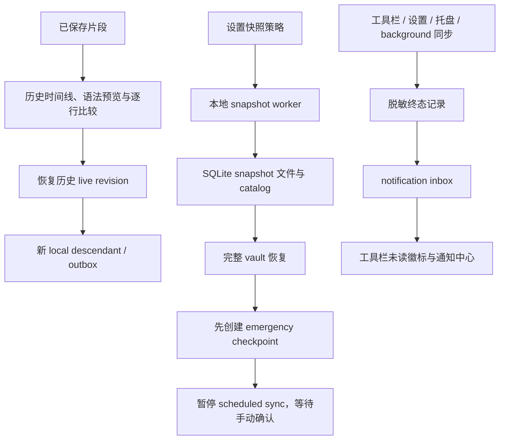

# SnipVault 功能扩展路线

> 本文把已实现的能力与规划中项目分开记录。除“当前行为”外，其他内容均不是当前支持承诺。

## 目标

SnipVault 已具备本地 SQLite、immutable revision/outbox、WebDAV v2、CodeMirror 和精选界面配色等基础能力。当前重点是把这些基础能力转化为高频捕获、整理、回访和可验证恢复体验，而不是扩展为云端账号或任意脚本执行平台。

## 当前行为：第一阶段 — 高频效率层

| 能力 | 用户价值 | 当前边界 |
|---|---|---|
| 快速捕获 | 从任意桌面应用显式保存剪贴板中的文本片段 | `Ctrl/Cmd+Shift+V` 与托盘入口；只读取文本，创建后仍由用户编辑/保存，快捷键注册失败不阻止应用启动 |
| 命令面板 | 用键盘快速访问已有动作 | `Ctrl/Cmd+K`、本地关键词过滤、键盘导航；复用既有新建/保存/同步/设置动作，不执行用户脚本 |
| 批量整理 | 高效整理当前已加载的片段 | 最多 200 项的选择、设为收藏、取消收藏和删除；批量写入全有或全无 |
| 最近使用 | 快速返回近期打开或复制过的片段 | 工具栏默认按最近修改排序，可切换“最近使用”按本机 usage 排序。usage 仅为本机元数据，不参与 WebDAV、导入导出或 revision/outbox |

第一阶段的实现和限制以[功能设计](feature-design.md)与[架构设计](architecture.md)为准。

## 当前行为：第二阶段 — 数据安全与可恢复性

| 能力 | 用户价值 | 当前边界 |
|---|---|---|
| 版本历史、比较与恢复 | 检视同一片段的 immutable 历史，在恢复前审阅精确代码变化 | 从主编辑器打开或复用独立原生工作区；分页只读紧凑时间线，live 预览以标题、language badge、受限 passive tag summary 和只读 favorite state 组成的紧凑 editor chrome 显示，不提供历史 mutation。live 对比使用编辑器同款语法颜色、原始行号和 Git/Beyond Compare 式两路逐行对齐。宽度至少 1200px 时使用弹性双栏；历史窗口最小宽度的 1000–1199px 区间使用已加载比较的“比较基线 / 所选版本”单 pane 切换，默认所选版本且不重新请求或计算 diff。代码不自动换行，不会产生布局强制的外层横向滚动；只有真实长行可在所属 source pane 内横向滚动，详细双栏比较只同步纵向滚动。选中版本保持中性编辑器 surface，以窄 marker 提示变化；本地字符/行数/matrix/时间上限超限时退回完整并排源代码；只能把历史 live revision 恢复为以当前 head 为 parent 的新 local descendant，因此历史对象不被改写且正常进入 outbox；tombstone 可检视/比较但不可恢复；恢复不会自动同步 |
| 本地 SQLite 快照与完整恢复 | 在此设备建立可验证的完整 vault checkpoint，并可安全回退 | 可手动创建或启用 daily/weekly 策略，保留值仅为 7/30/90；后端创建并验证 SQLite online snapshot，恢复前先创建 emergency checkpoint，并在活动连接中恢复；快照和恢复不包含 `settings.json` 或 OS 凭据 |
| 恢复后同步确认 | 防止旧 vault 状态被后台同步立即改写 | 完整恢复会暂停 scheduled WebDAV sync；只有工具栏、设置或系统托盘发起且成功的下一次手动同步才解除锁，不会自动同步 |
| 同步通知中心 | 追溯同步成功、pending、冲突、失败、busy 与恢复后注意事项 | 工具栏铃铛显示未读数；收件箱持久化去标识化终态记录，支持已读、关闭和可重试的 Sync now；与只保留成功技术记录的同步历史分离，background 仍保持非模态 |

第二阶段的交互与限制以[功能设计](feature-design.md)、[架构设计](architecture.md)和[已知限制](known-limitations.md)为准。

## 规划中：第三阶段 — 组织与复用

1. **参数化代码模板**：声明变量与默认值，在复制前渲染纯文本结果；不执行生成的命令或代码。
2. **集合/项目与保存视图**：在标签之外提供项目级组织、筛选与导出；需要单独设计 SQLite 迁移和同步 payload 兼容性。
3. **高级搜索与排序**：组合标签、时间、语言、收藏等筛选，按需提供保存搜索；任何相关性排序都必须保持 literal 搜索和 CJK fallback 正确性。
4. **单片段/多格式分享导出**：支持 Markdown、代码文件和其他受控格式，不暴露任意本地路径给 WebView。

## 规划中：第四阶段 — 多设备协作体验

1. **冲突解决中心**：展示同步冲突、双方和祖先差异，生成新的解决 revision；不改变既有 immutable remote objects。
2. **设备身份恢复向导**：帮助处理复制或完整恢复本地数据库导致的设备身份重复问题。
3. **版本化远端 GC/compaction**：仅在有完整协议、迁移、离线设备和并发兼容策略后考虑，不能手工删除远端 objects 或 tombstones。

## 明确不优先的方向

- 云端账号体系或将正文传给第三方服务。
- 任意用户脚本、宏或命令执行。
- 未经协议设计的远端 revision 清理。
- 全量嵌套文件夹系统、跨未加载结果的隐式批量删除。
- 应用内更新器、签名/公证等发布工程替代用户可见功能。

## 维护规则

路线图中的“规划中”事项在实施前必须完成独立设计：评估 SQLite 顺序迁移、revision/outbox/WebDAV v2、凭据与权限、可访问性、双语文案、真实 Tauri smoke 和文档影响。实现后必须将状态改为当前行为，并同步相关 Mermaid 数据流图。
